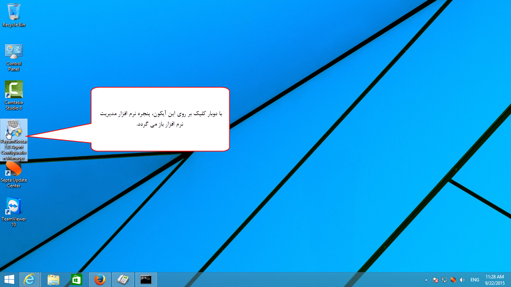

## مدیریت پشتیبان گیری

مشاهده سرویس های در حال اجرای پیام گستر، شناسایی GSM مودم، مسیر نصب و سریال نرم افزار و پشتیبان گیری از نرم افزار در برنامه Payamgostar Agent Configuration Manager که در سرور (جایی که نرم افزار نصب شده است) وجود دارد، قابل دسترسی است.

تنظیمات مربوط به پشتیبان گیری و یا همان بک آپ با از قسمت backup  انجام می شود .

قسمت مرتبط با<a href="back-up%2Fback-up.md" target="_blank"> نسخه پشتیبان </a>مطالعه کنید.