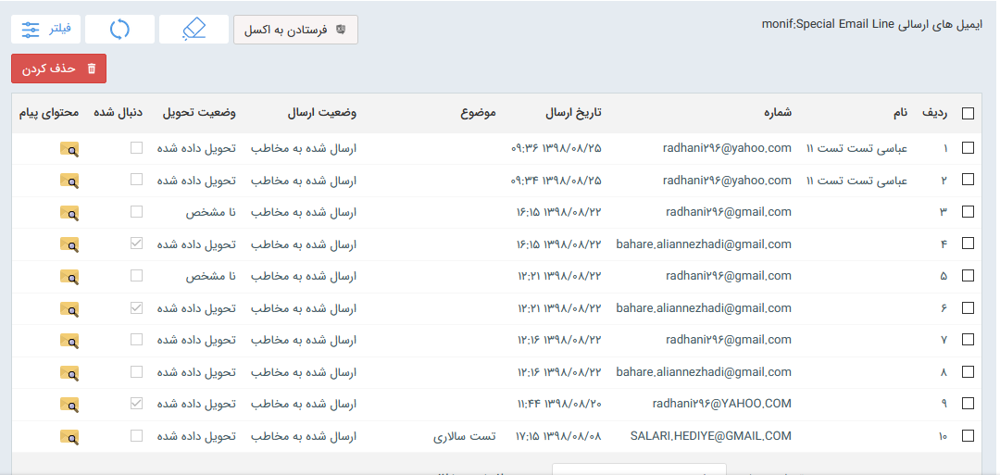

## ایمیل

با استفاده از این بخش، می توانید لیست ایمیل های ارسالی و دریافتی خطوط تعریف شده  را مشاهده  و در صورت نیاز خروجی اکسل تهیه کنید  ، پیام های مورد نظر را حذف کنید و وضعیت ارسال آنها را مشاهده کنید.

نکته: لطفا ابتدا قسمت [اطلاعات مشترک ابزارها ](https://github.com/1stco/PayamGostarDocs/blob/master/help%202.5.4/Marketing/moshtarak-abzar/moshtarak-abzar.md)را مطالعه کنید.

 در این قسمت، لیست خطوط عمومی (منظور از خطوط عمومی خطوطی هستن که به کاربر خاصی اختصاص داده نشده است، یعنی کاربر در این قسمت لیست خطوطی رو مشاهده میکند  که به خودش اختصاص داده شده و یا به هیچ کاربر دیگری اختصاص داده نشده ) در اختیار قرار میگیرد تا با انتخاب آن، لیست ایمیل های ارسالی و دریافتی را ببینید.

در جدول مشخص شده، اطلاعاتی مانند، آدرس مقصد و تاریخ ارسال به همراه وضعیت ارسال و موضوع قابل مشاهده می باشد

در رابطه با لیست دریافت هم اطلاعات ارسال کننده ، خط دریافت پیامک ، تاریخ دریافت و محتوای پیام قابل مشاهده است .

 درصورت نیاز می توان از لیست بالا، خروجی اکسل دریافت نمود.

