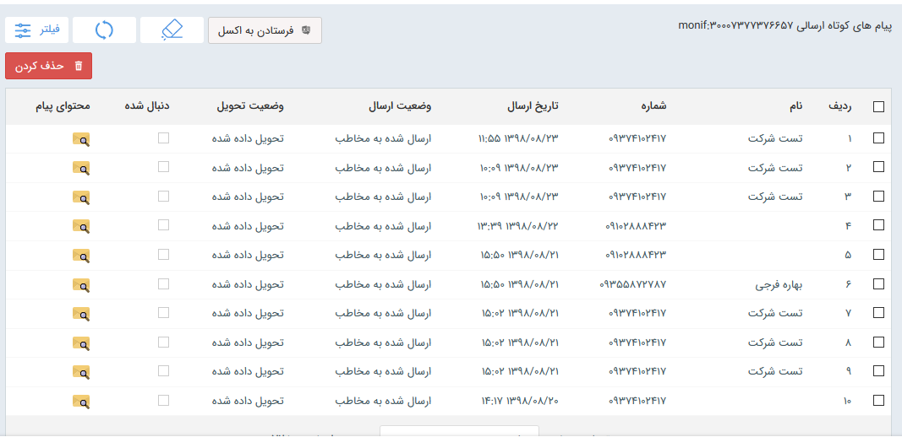

## پیام کوتاه

با استفاده از این بخش، می توانید لیست پیام کوتاه های ارسالی و در صورتی که خط مورد نظر امکان دریافت را هم داشته باشد، لیست پیام های دریافتی را نیز مشاهده و در صورت نیاز خروجی اکسل تهیه کرد  ، پیام های مورد نظر را حذف کنید و وضعیت ارسال آنها را مشاهده کنید

نکته: لطفا ابتدا قسمت<a href="file%3A%2F%2F%2FC%3A%5CUsers%5CH.abasi%5CDocuments%5CGitHub%5CPayamGostarDocs%5Chelp%202.5.4%5CMarketing%5Cmoshtarak-abzar%5Cmoshtarak-abzar.md" target="_blank"> اطلاعات مشترک ابزار ها </a>را مطالعه کنید.

در این قسمت، لیست  خطوط عمومی پیامک در اختیار قرار میگیرد (منظور از خطوط عمومی خطوطی هستن که به کاربر خاصی اختصاص داده نشده است، یعنی کاربر در این قسمت لیست خطوطی رو مشاهده میکند  که به خودش اختصاص داده شده و یا به هیچ کاربر دیگری اختصاص داده نشده ) در جدول مشخص شده، اطلاعاتی مانند، شماره دریافت کننده پیام و تاریخ ارسال به همراه وضعیت ارسال و وضعیت تحویل قابل مشاهده می باشد

 تا با انتخاب آن، لیست پیامک های ارسالی و دریافتی را ببینید.

