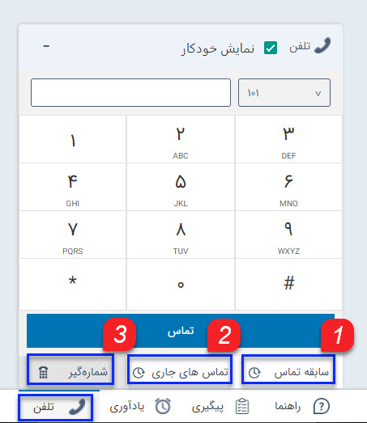
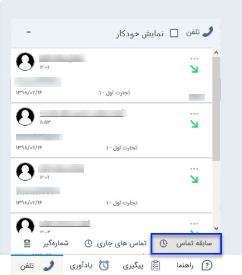
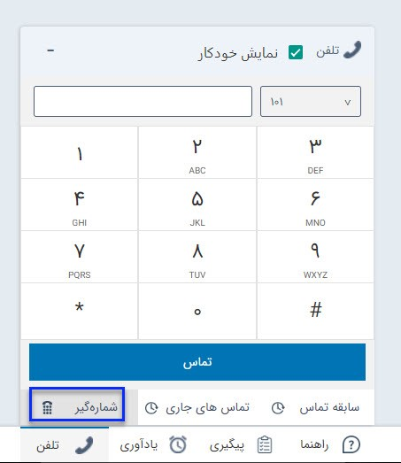

## تلفن

 با استفاده از این نوار ابزار می توانید لیست تماس های دریافتی را مشاهده کنید و همچنین با استفاده از شماره گیر می توانید با شماره مدنظر خود تماس بگیرید.
 
 
 
 
 با استفاده از این پنجره می توانید تماس های دریافتی خود را مدیریت کنید. اگر شماره تماس گیرنده قبلاً در یکی از پروفایل های بانک اطلاعاتی ذخیره شده باشد می توانید به راحتی به پروفایل آن دسترسی داشته باشید و یا سابقه جدیدی  مرتبط با آن  ثبت کنید. علاوه بر این می توانید شماره های ثبت نشده را به راحتی به پروفایل یکی از هویت ها اضافه کنید یا یک هویت جدید برای آن ایجاد کنید.  

الف) این شماره متعلق به یکی از مشتریان ثبت شده در سیستم باشد ولی با شماره جدیدی تماس گرفته   باشد. در این صورت از گزینه اضافه به...  استفاده می کنیم و با جستجوی پروفایل موردنظر و زدن دکمه انتخاب و بستن، شماره به پروفایل موردنظر اضافه می شود. در انتها دکمه ذخیره کردن را کلیک نمایید تا تغییر در پروفایل ثبت شود .

ب) در صورتی که این شماره تماس مربوط به شرکت یا شخص  جدیدی است، گزینه ذخیره هویت حقیقی   و یا ذخیره   هویت حقوقی   را انتخاب نمایید هویت مورد نظر را ایجاد و انتخاب و ذخیره نمایید .

> نکته: در صورتی که ماژول مخاطبان ناشناس را تهیه نموده باشید و از قسمت تنظیمات، تنظیمات کلی، مخاطبان ناشناس آن را فعال نموده باشید (برای اطلاعات بیشتر به لینک  مخاطبان ناشناس مراجعه نمایید). تماس هایی که از شماره های ناشناس صورت گیرد به صورت یک پروفایل در دسته بندی مشخص شده در تنظیمات  ثبت می شوند.

 سابقه تماس : می توانید لیست سوابق تماس های دریافتی (تماس های دریافتی خاتمه یافته) را از این قسمت مشاهده کنید.برای اطلاع از تنظیمات مربوط به تعداد تماس ها، به تنظیمات من  مراجعه  کنید
 
 
 
 تماس های جاری : می توانید لیست تماس های دریافتی جاری (تماس های در حال انجام) را از این قسمت مشاهده کنید.

شماره گیر: با استفاده از شماره گیر می توانید مستقیما از نرم افزار با شماره مدنظر خود تماس بگیرید.

> نکته : این قابلیت فقط در سیستم های ویپ قابل استفاده است .

> نکته : جهت استفاده از این قابلیت کاربر نیاز به مجوز برقراری تماس دارد و همچنین بایستی برای کاربر داخلی تعریف شده باشد.

    
    