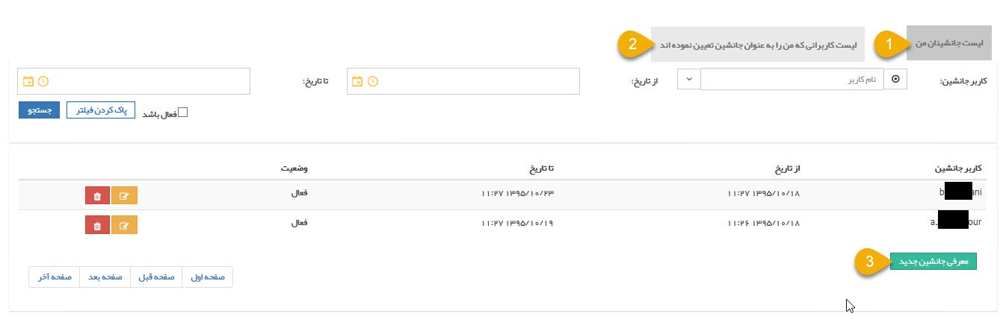
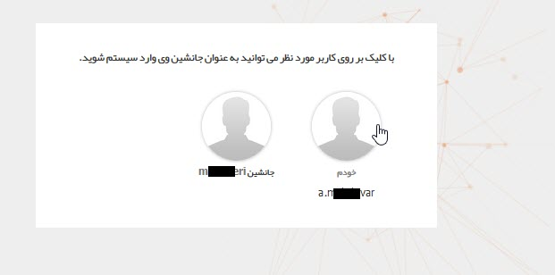
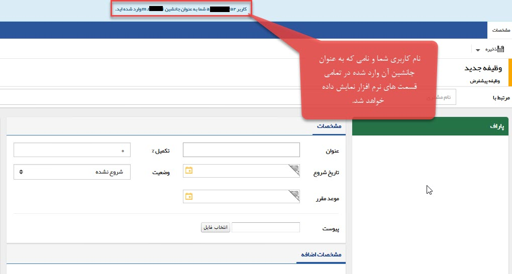

## مدیریت کاربران جانشین

هر کاربر می تواند برای مواقعی که امکان دسترسی به نرم افزار را ندارد، یک یا چند کاربر را به عنوان کاربر جانشین خود تعیین کند. زمانی که یک کاربر را به عنوان جانشین خود در نظر می گیرید، آن کاربر در هنگام ورود به نرم افزار می تواند انتخاب کند که با کاربری شما وارد شود. توجه کنید که جانشینی دارای بازه زمانی است و پس از پایان این بازه به صورت خودکار غیرفعال خواهد شد.

> نکته: در نظر داشته باشید که اگر جانشین شما، آیتمی را ذخیره، حذف یا ویرایش کند، آن تغییر به نام شما ثبت خواهد شد.

1. لیست جانشیان من: در این قسمت می توانید لیست کاربرانی که به عنوان جانشین خود تعیین کرده اید را مشاهده، ویرایش و حذف کنید.

2. لیست کاربرانی که من را به عنوان جانشین تعیین نموده اند : در این قسمت می توانید مشاهده کنید که تا کنون چه کاربرانی در چه بازه های زمانی شما را به عنوان جانشین خود تعیین کرده اند. 

3. معرفی جانشین جدید: با استفاده از این کلید می توانید یک کاربر جانشین را برای خود تعیین کنید.

کاربری که بعنوان جانشین انتخاب شده است هنگام ورود به نرم افزار  تصویر زیر را مشاهده خواهد کرد  و کاربر می تواند انتخاب کند که با کاربری خودش وارد شود یا با کاربری که دسترسی جانشین بودن آن را دارد.

همچنین در تمامی قسمت های نرم افزار ، هشدار اینکه به عنوان جانشین شخص دیگری در نرم افزار وارد شده اید نمایش داده خواهد شد.

