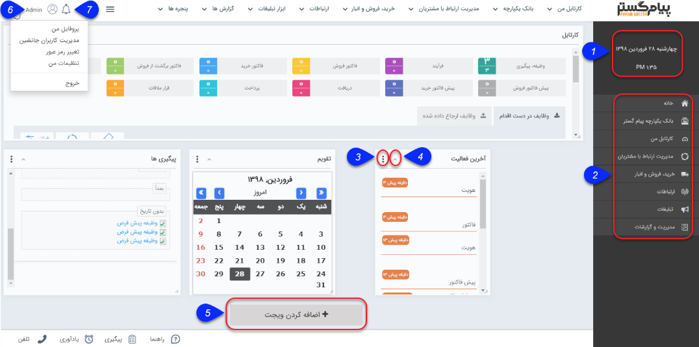
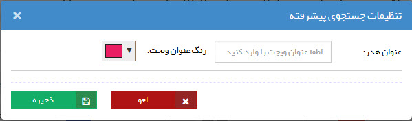

## خانه

در هر بخش از نرم افزار که باشید، با کلیک بر آیکون «خانه» یا لوگوی پیام گستر به این صفحه منتقل می شوید. می توانید با استفاده از ویجت (Widget) های مختلفی که در این صفحه اضافه می شوند، داشبورد دلخواه خود را ایجاد کنید.

 *  نوار ابزار نرم افزار، در این صفحه همواره نمایش داده می شود و شما می توانید به تنظیمات و راهنما و سایر موارد به راحتی دسترسی داشته باشید.

 

1.  در این قسمت تاریخ و ساعت نمایش داده می شود. (این ساعت بر اساس ساعت سرور پیام گستر تعیین می گردد.)

2. قسمت های مختلف نرم افزار از طریق این پنل قابل دسترسی هستند.

3. با استفاده از این دکمه می توانید تنظیمات ویجت مورد نظر را انجام دهید یا در صورت نیاز آن را حذف کنید.

> نکته: رنگ و عنوان هر ویجت را می توانید به صورت دلخواه تعیین کنید.

4. ویجت انتخاب شده را کوچک (Minimize) می کند.

5. ویجت های مختلف را میتوانید به این صفحه اضافه کنید.

6. تنظیمات کاربری: قسمت های ذیل را مطالعه کنید.    

<a href="file%3A%2F%2F%2FC%3A%5CUsers%5CH.abasi%5CDocuments%5CGitHub%5CPayamGostarDocs%5Chelp%202.5.4%5Chome%5Cedit-password%5Cedit-password.md" target="_blank">تغییر رمز عبور</a>

<a href="file%3A%2F%2F%2FC%3A%5CUsers%5CH.abasi%5CDocuments%5CGitHub%5CPayamGostarDocs%5Chelp%202.5.4%5Chome%5CSubstitute-users%5CSubstitute-users.md" target="_blank">مدیریت کاربران جانشین</a>

<a href="file%3A%2F%2F%2FC%3A%5CUsers%5CH.abasi%5CDocuments%5CGitHub%5CPayamGostarDocs%5Chelp%202.5.4%5Chome%5Cmy-setting%5Cmy-setting.md" target="_blank">تنظیمات من</a>

<a href="file%3A%2F%2F%2FC%3A%5CUsers%5CH.abasi%5CDocuments%5CGitHub%5CPayamGostarDocs%5Chelp%202.5.4%5Chome%5Cmy-profile%5Cmy-profile.md" target="_blank">پروفایل من</a>

7. پیام های سیستمی، لیست پیام هایی که در نرم افزار برای کاربری شما ایجاد شده است را نمایش می دهد. این پیام ها بر اساس رخدادهایی مانند تخصیص وظیفه ، تنظیم شدن قرار ملاقات، تایید و رد آیتم مالی و ... برای شما ایجاد می شوند. برای فعال کردن و یا تغییر محتوای این پیام ها قسمت مدیریت پیام های سیستم را مطالعه کنید.