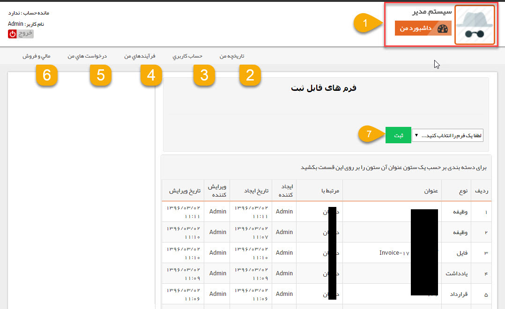

## پروفایل من

این صفحه داشبورد مرتبط با کاربری شما است. مشتریان در باشگاه مشتریان این صفحه را به عنوان تنها دسترسی خود به نرم افزار خواهند 

> نکته: توضیحات ارائه شده در این قسمت به صورت مختصر می باشد، برای توضیحات تکمیلی و اطلاع از جزئیات هر بخش از باشگاه مشتریان به[ داشبورد مشتریان ](https://github.com/1stco/PayamGostarDocs/tree/master/help%202.5.4/Supplementary-modules/customer-club/Customer-dashboard)مراجعه کنید.

1. تصویر و نام کاربری شما در این قسمت نمایش داده می شود.

2. تاریخچه من: در این قسمت مشتریان می توانند سوابق مرتبط شده با پروفایل خود (سوابق ثبت شده برای خود) را مشاهده کنند.

3. حساب کاربری: مشتریان می توانند اطلاعات حساب کاربری از قبیل رمز عبور و تصویر را در این منو ویرایش نمایند.

4. فرآیند های من: مشتریان می توانند سوابق تحت فرایندی که به پروفایل شان متصل شده اند(سوابق تحت فرآیند ثبت شده برای خود)  را به همراه وضعیت کنونی فرایند هر کدام از سوابق را مشاهده نمایند.

5. درخواست های من: مشتریان می توانند در این قسمت لیست درخواست های مرتبط شده با پروفایل خود را مشاهده کنند و یا درخواست جدید ثبت نمایند.

6. مالی و فروش:  مشتریان می توانند در این قسمت  فاکتورها، پیش فاکتور ها، قراردادها و سایر اطلاعات مالی مربوط به خود را در این قسمت مشاهده نمایند و یا پرداخت آنلاین انجام دهند. 

7. فرم های قابل ثبت: در این قسمت مشتریان می توانند سوابقی که مجوز ایجاد توسط مشتریان را برای آن ها فعال کرده باشید، برای پروفایل خود ایجاد کنند.

> نکته: توجه داشته باشید که سوابق در صورتی برای مشتریان قابل مشاهده است که در تنظیمات آن سابقه در قسمت شخصی سازی، مجوز مشاهده برای مشتریان را فعال کرده باشید.

