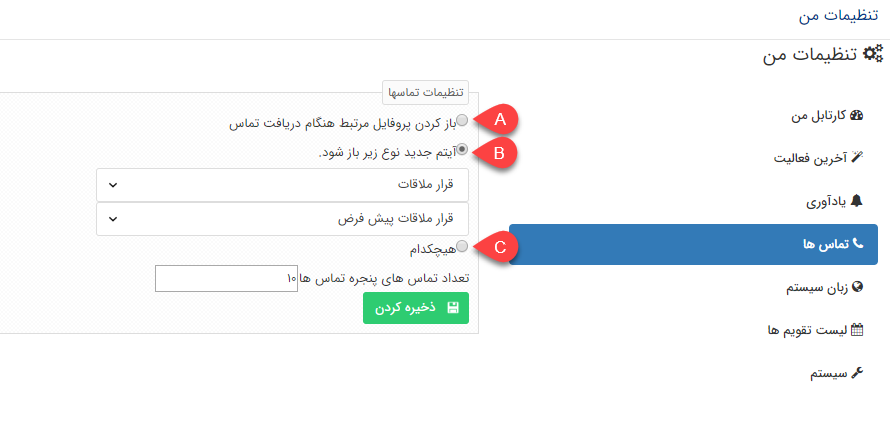

## تنظیمات تماس کاربر

> مسیر دسترسی:  **تنظیمات من** >**تماس‌ها ** 

در این بخش می توانید تعیین کنید که هنگام دریافت یک تماس روی داخلی خود یکی از  سه حالت زیر اتفاق بیافتد

A. پروفایل هویت مرتبط به صورت خودکار برای شما باز شود..

> نکته: توجه داشته باشید که برای نمایش داده شدن پروفایل در هنگام تماس، باید در تنظیمات مرورگر خود Pop-up Blocking را غیر فعال کرده باشید.

B. می توانید انتخاب کنید که هنگام دریافت تماس، کدام آیتم مرتبط با هویت به منظور ایجاد به صورت خودکار باز شود. ابتدا نوع آیتم سپس زیر نوع آیتم را مشخص کنید و ذخیره کنید.

> نکته: کاربر برای ایجاد آیتم باز شده ، باید مجوز "ذخیره اولیه" را روی آیتم انتخاب شده در این قسمت  داشته باشد

C. هنگام دریافت تماس هیچ پروفایل یا آیتمی باز نشود.

تعداد تماس های نمایش داده شده در  نوار تلفن   را هم می توانید تعیین کنید

