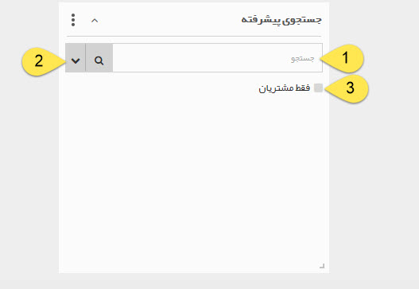

## جستجو پیشرفته

>  مسیر دسترسی:  **خانه** >**اضافه کردن ویجت** > **جستجو پیش‌رفته** 

 با استفاده از این ویجت امکان جستجوی  هویت مورد نظر فراهم می شود .
 
 
 
 1. عبارت جستجوی خود را وارد کنید.

 
> نکته: توجه کنید که این عبارت تنها نام هویت ها و یا شماره مشتری را جستجو می کند، نه سایر فیلدها (فیلدهای آدرس، ایمیل و ...)

> نکته: در حین وارد کردن عبارت نرم افزار لیستی از هویت های نزدیک به عبارت را به شما نمایش می دهد. (Autocomplete)

2. میتوانید در صورت نیاز با استفاده از این دکمه بر اساس نام مدیر، موبایل یا ... جستجو را انجام دهید.

3. در صورت فعال کردن این گزینه جستجو تنها از میان هویت هایی که دارای شماره مشتری هستند انجام خواهد شد.

> نکته : می توانید به صفحه جستجوی پیش رفته منتقل شوید . (در این ویجت فقط تعداد 10 پروفایل را نمایش می دهد و اولویت نمایش با پروفایل هایی است که شماره مشتری دارند)

