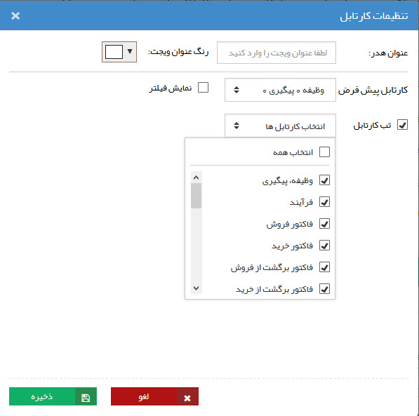

## کارتابل من

 در این قسمت کارهای ارجاع شده به کاربر(تایید آیتم های مالی،فرآیندهاو ... )  در دسته بندی های ذیل نمایش داده می شوند.
 
 > نکته: عددی که رو به روی هر کارتابل نمایش داده می شود نشانگر نسبت تعداد کارهایی است که  امروز (از 12:01 بامداد) وارد آن کارتابل شده (عدد بالایی) به کل کارهایی که در اون کارتابل وجود دارد .

تب های مختلف این کارتابل بر اساس میزان دسترسی کاربر به قسمت های مختلف نرم افزار ممکن است تغییر پیدا کنند.

1.وظیفه - پیگیری

2.فرآیندها

3.آیتم های مالی (پیش فاکتور، فاکتور و ... ).

4قرار ملاقات

5.تراکنش های انبار

 

در صورت نیاز می توانید در تنظیمات این ویجت، کارتابل پیشفرض و کارتابل های مختلفی که نمایش داده می شوند را انتخاب کنید.

