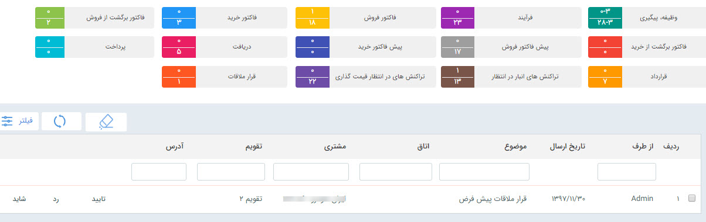

## کارتابل قرار ملاقات

در صورتی که ماژول قرار ملاقات پیشرفته را تهیه کرده باشید، می توانید برای هرکدام از مدعوین در هنگام ثبت قرار ملاقات، درخواست تایید حضور ارسال کنید، این درخواست در کارتابل قرارملاقات های کاربر نمایش داده می شود و می تواند از یکی از گزینه های تایید، رد و شاید استفاده کند

> نکته: وضعیت تایید حضور کاربر می تواند به هماهنگ کننده قرار ملاقات اطلاع داده شود، برای تنظیم متن پیام مرتبط با این اطلاع رسانی به مدیریت پیام های سیستم مراجعه کنید

> نکته: در صورتی که کاربری درخواست حضور را تایید نکند، می توان آن کاربر را در قرار ملاقات دیگری در همان زمان دعوت کرد

