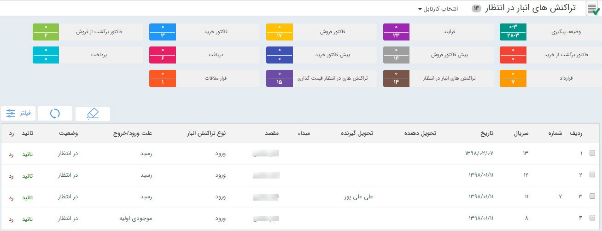
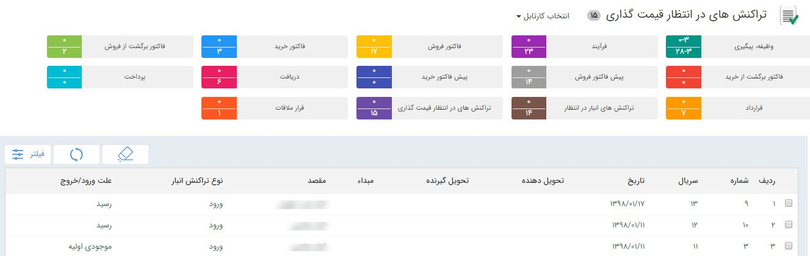

## کارتابل تراکنش های انبار در انتظار و تراکنش های در انتظار قیمت گذاری

> مسیر دسترسی:  **کارتابل من** >**تراکنش‌های انبار در انتظار/تراکنش‌های در انتظار قیمت گذاری** 

در صورتی که از سیستم انبارداری پیشرفته پیام گستر استفاده می کنید، تراکنش های انبار(رسید موجودی اولیه، رسید و حواله) نیاز به تایید و قیمت گذاری دارند . در صورتی که مجوز تایید هر کدام از زیرنوع های تراکنش انبار را داشته باشید و در تنظیمات آن تراکنش در قسمت شخصی سازی، گزینه ی "نیاز به تایید دارد" را فعال کرده باشید، پس از صدور هر تراکنش می توانید آن را در قسمت تراکنش های انبار در انتظار مشاهده کرده و آن را تایید یا رد کنید.

> نکته : برای اینکه بتوانید یک تراکنش انبار صادر شده را تایید کنید، باید مجوز تایید آن زیر نوع تراکنش (منظور از زیر نوع تراکنش برای مثال حواله انبار پیش فرض)  در قسمت مدیریت مجوزها و همچنین مجوز تایید آن نوع تراکنش (حواله) در قسمت مدیریت انبار ، مدیریت  مجوزهای انبار  مربوطه را داشته باشید

 با دو بارکلیک بر روی هر کدام از تراکنش های موجود در کارتابل می توانید آن را مشاهده کنید، هر تراکنش پس از تایید برای قیمت گذاری در کارتابل تراکنش های در انتظار قیمت گذاری مشاهده خواهد شد

توجه داشته باشید که این قیمت گذاری برای تعیین موجودی ریالی است و می تواند با قیمت خرید یا فروش شما متفاوت باشد 

با دو بار کلیک بر روی هرکدام از تراکنش ها می توانید آن را مشاهده کرده و قیمت گذاری را انجام دهید. توجه داشته باشید که برای قیمت گذاری رسید انبار ابتدا باید برای هر ردیف محصول قیمت گذاری را انجام دهید و سپس از دکمه قیمت گذاری در نوار ابزار استفاده کنید. اما قیمت گذاری حواله های انبار بر اساس فی میانگین موجودی ریالی انبار شما محاسبه خواهد شد و برای قیمت گذاری حواله ها صرفا باید دکمه قیمت گذاری را بزنید

