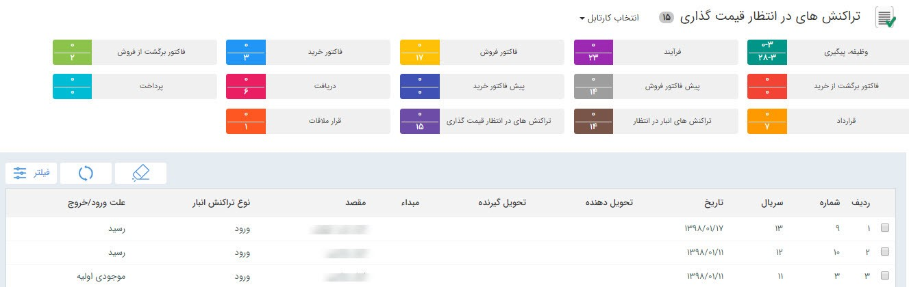

## قیمت‌گذاری تراکنش‌های انبار 

> مسیر دسترسی:  **کارتابل من** >**تراکنش‌های در انتظار قیمت گذاری** 

هر تراکنش پس از تایید برای قیمت گذاری در کارتابل تراکنش های در انتظار قیمت گذاری مشاهده خواهد شد

توجه داشته باشید که این قیمت گذاری برای تعیین موجودی ریالی است و می تواند با قیمت خرید یا فروش شما متفاوت باشد 

با دو بار کلیک بر روی هرکدام از تراکنش ها می توانید آن را مشاهده کرده و قیمت گذاری را انجام دهید. توجه داشته باشید که برای قیمت گذاری رسید انبار ابتدا باید برای هر ردیف محصول قیمت گذاری را انجام دهید و سپس از دکمه قیمت گذاری در نوار ابزار استفاده کنید. اما قیمت گذاری حواله های انبار بر اساس فی میانگین موجودی ریالی انبار شما محاسبه خواهد شد و برای قیمت گذاری حواله ها صرفا باید دکمه قیمت گذاری را بزنید