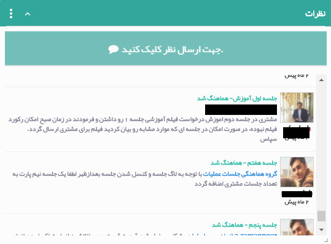
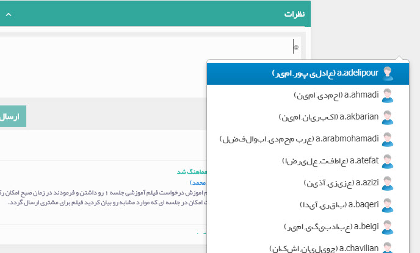
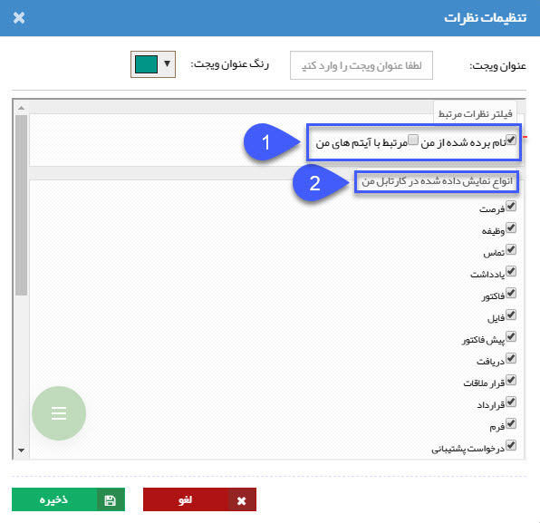

## نظرات 

لیست نظرات ثبت شده روی آیتم های مختلف که مرتبط با کاربری شما هستند (برای مثال در فاکتور فروشی بعنوان فروشنده انتخاب شده باشید) ،نظرات ثبت شده توسط کاربری شما، نظراتی که در آنها نام کاربری شما ذکر شده باشد و نظراتی که روی آیتم های ایجاد شده توسط شما ثبت گردند را میتوانید در این ویجت مشاهده کنید و همچنین می توانید نظر جدیدی در همین ویجت ثبت نمایید، توجه داشته باشید نظر ثبت شده در این ویجت مرتبط با هیچ آیتمی نمی باشد و صرفا در همین ویجت قابل مشاهده خواهد بود

> نکته: اگر در نظر خود نام کاربر/گروه خاصی را ذکر کنید (به اصطلاح کاربر دیگری را Mention کنید)، نظر ثبت شده تنها توسط همان کاربر(ها) قابل مشاهده خواهد بود و در غیر اینصورت، این نظر به عنوان یک نظر عمومی تلقی شده و توسط تمام کاربران در ویجت نظرات قابل مشاهده است.

نکته : اگر قصد اشاره به کاربر/گروه خاصی را در نظر خود دارید، کافی است علامت «@» را درج کنید. نرم افزار به صورت خودکار نام کاربران دیگر را در یک لیست نمایش می دهد که با کلیک بر روی هرکدام از اسامی می توانید نام آن کاربر را انتخاب نمایید.  و همچنین امکان انتخاب کاربران مسئول پروفایل  و با کاربرانی که آیتمی به آن ها تخصیص پیدا کرده است (برای مثال فروشنده در فاکتورها/پیش فاکتورها) بصورت (@کاربران مرتبط) وجود دارد .

با استفاده از تنظیمات این ویجت می توانید فیلترهایی را جهت نحوه نمایش نظرات اعمال کنید

1- فیلتر نظرات مرتبط 

نام برده شده از من: با غیر فعال کردن این گزینه نظرهایی که در آن نام کاربری شما ذکر شده، در این ویجت نمایش داده نخواهد شد.

مرتبط با آیتم های من: با غیر فعال کردن این گزینه نظرات ثبت شده روی آیتم های ایجاد شده توسط کاربری شما نمایش داده نخواهد شد.

2-انواع نمایش داده شده در کارتابل من

در این قسمت می توانید نظرات نمایش داده شده در این ویجت را بر اساس آیتم های مختلف فیلتر کنید، به طور مثال اگر گزینه وظیفه را غیرفعال کنید، نظرات ثبت شده روی آیتم های از نوع وظیفه در این ویجت نمایش داده نخواهند شد.