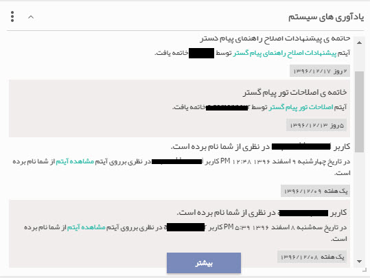
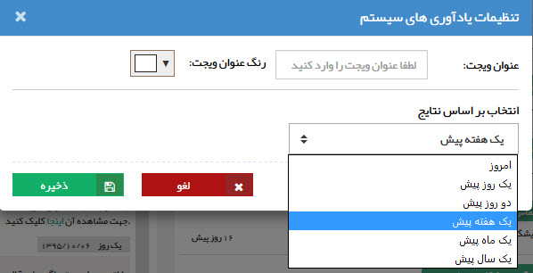

## یادآورهای سیستم 

در این ویجت، اعلان هایی که توسط نرم افزار برای کاربر شما ایجاد شده است نمایش داده می شود. (ارجاع وظیفه، فرآیندها و ... پیام های مختلفی برای کاربران ایجاد می کنند.)

برای ویرایش متن پیام مرتبط با هر کدام از رخدادها به قسمت مدیریت پیام های سیستم  مراجعه کنید

در تنظیمات این ویجت می توانید بازه زمانی نمایش یادآورهای سیستم را تعیین کنید.

