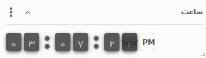
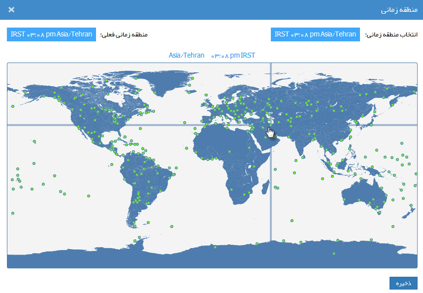

## ساعت 

>  مسیر دسترسی:  **خانه** >**اضافه کردن ویجت** > **ساعت**  

یک ساعت بروی صفحه خانه نمایش می دهد.

در تنظیمات این ویجت می توانید منطقه زمانی ساعت نمایش داده شده را انتخاب کنید. (بر فرض مثال ساعت به وقت لندن را می توان انتخاب کرد)

