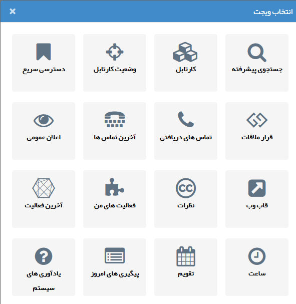

## (Widget) ویجت

ویجت­ها جهت دسترسی سریع تر به برخی از قسمت های نرم افزار می­توانند مورد استفاده قرار گیرند، همچنین برخی از ویجت­ها مانند اعلان عمومی و قاب وب امکاناتی در اختیارتان قرار می­دهند که صرفاً از طریق ویجت قابل انجام است.  هر کاربر بنا بر نیاز می­تواند ویجت های مورد نظر خود را به صفحه اصلی کاربری خود در نرم افزار اضافه نماید.

انواع ویجت های پیام گستر به شرح زیر می باشند:

جستجوی پیشرفته

کارتابل

وضعیت کارتابل

دسترسی سریع

قرار ملاقات

آخرین تماس ها

اعلان عمومی

قاب وب

نظرات

فعالیت های من

آخرین فعالیت

ساعت

تقویم

پیگیری های امروز

یادآوری های سیستم

چارت

محتوای HTML