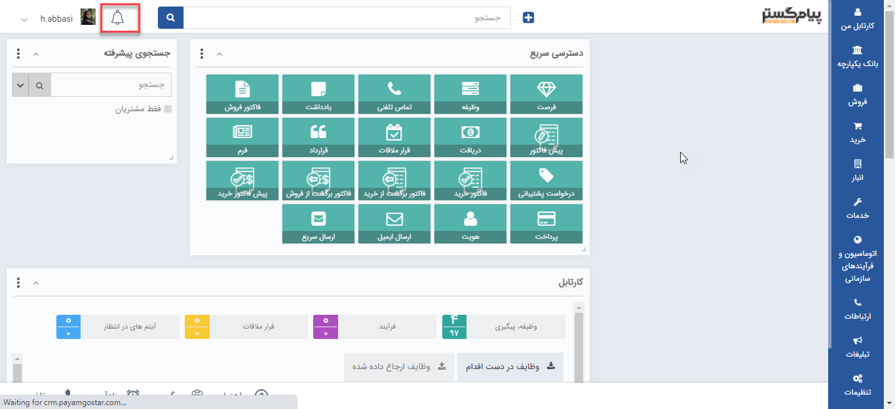

## مدیریت یادآوری‌های سیستم

1.  هر کاربر هنگام دریافت پیام های سیستمی، به تعداد پیام های خوانده نشده عددی را در کنار آیکون زنگوله در صفحه بالای نرم افزار مشاهده می نماید. با کلیک بروی آیکون مورد نظر صفحه ای نمایش داده می شود و می توانید متن کامل پیام ها را مشاهده نمایید .

2. حذف کردن: می توانید تمامی پیام های سیستمی انتخاب شده را حذف کنید.

