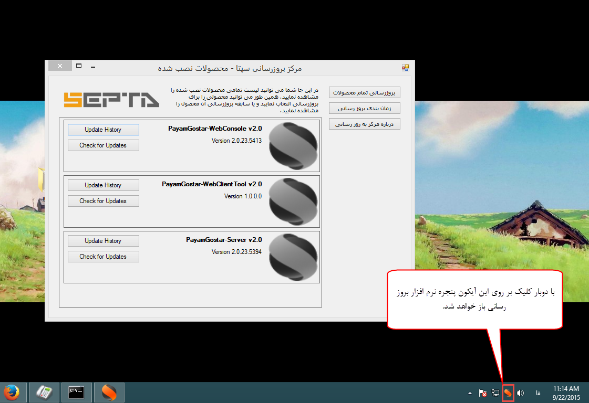
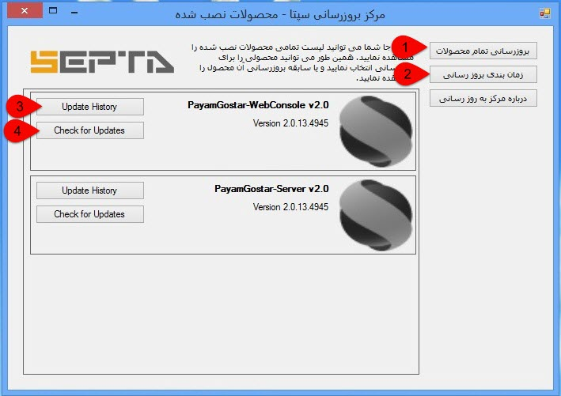
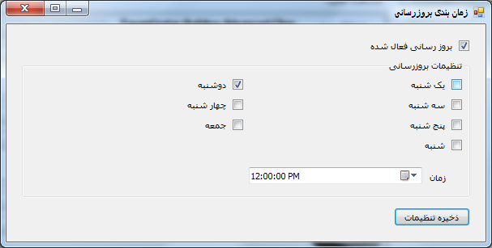

## بروزرسانی

با توجه به اهمیت بالای اطلاعات دقیق در اثربخشی برنامه های تبلیغاتی، پرتال تجارت الکترونیک اول محتوای اطلاعات فهرست مشاغل اول را بطور پیوسته و هر روز بروز رسانی می کند. کاربران پیام گستر می توانند پس از اتصال به شبکه اینترنت، اطلاعات شغلی و همچنین اطلاعات عملکردی نرم افزار را به صورت دستی یا برنامه زمانی معین از روی پرتال اول بروز رسانی کنند 

برای انجام عملیات بروزرسانی باید از طریق نرم افزار Septa Update Center که در هنگام نصب پیام گستر بر روی سیستم سرور نصب می شود، اقدام نمایید. با کلیک بر آیکون این برنامه پنجره زیر باز می شود .

1. بروز رسانی تمامی محصولات:با انتخاب برنامه و زدن کلید بروزرسانی محصولات عملیات بروزرسانی پیام گستر آغاز خواهد شد .

2. زمان بندی بروزرسانی: این دکمه به شما این  امکان می دهد زمان بروز رسانی را انتخاب کنید. نرم افزار در روز و ساعت مشخص شده وجود بروزرسانی جدید را بررسی کرده و در صورت وجود بسته بروزرسانی جدید، آنها را بارگیری (دانلود) و نصب خواهد کرد.

> نکته: بهتر است این زمان در هنگام استفاده نشدن از نرم افزار (اوقات غیر اداری) تنظیم گردد.

3. با زدن کلید  Update History می توانید تاریخچه بروزرسانی هایی که تا به حال برای هر محصول صورت گرفته است مشاهده نمایید.

4. با زدن کلید Check for updates نرم افزار با اتصال به سرور بروزرسانی لیست بسته های موجود را دریافت کرده، سپس آنها را بارگیری و نصب خواهد کرد.

  بروزرسانی بانک اطلاعاتی

در صورتی که بسته بروزرسانی اطلاعات موجود باشد، می توانید وارد SeptaUpdateCenter شوید و بسته بروزرسانی اطلاعات را با بروزرسانی محصول Payamgostar-Server V2.0  دریافت نمایید.

> نکته: تا اتمام بروزرسانی از استفاده از نرم افزار خودداری نمایید. در صورتی که تمایل به بروزرسانی نداشته باشید، می توانید در زمان دیگری مراجعه نمایید.

