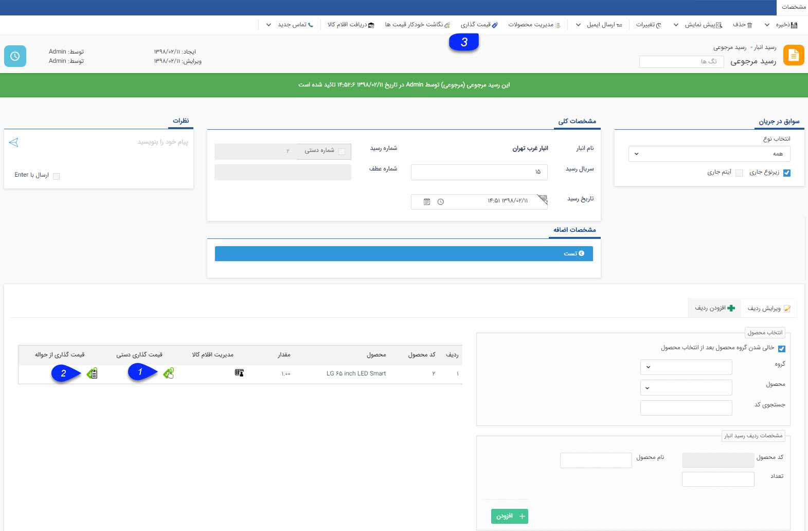
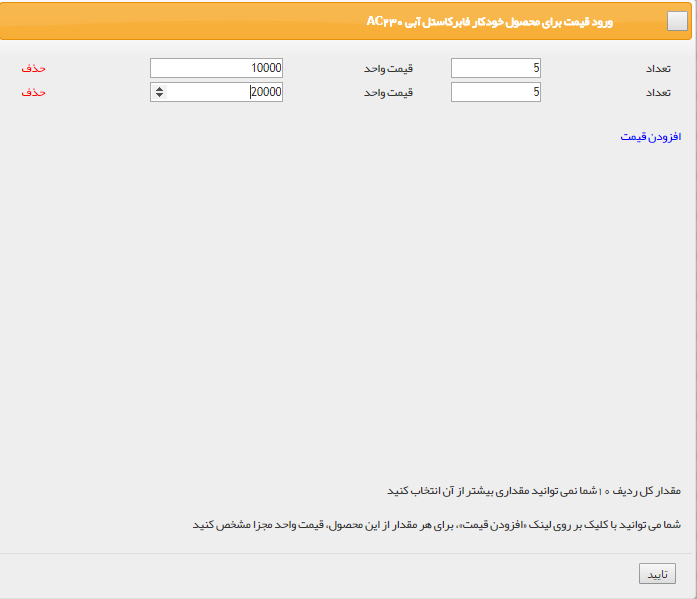
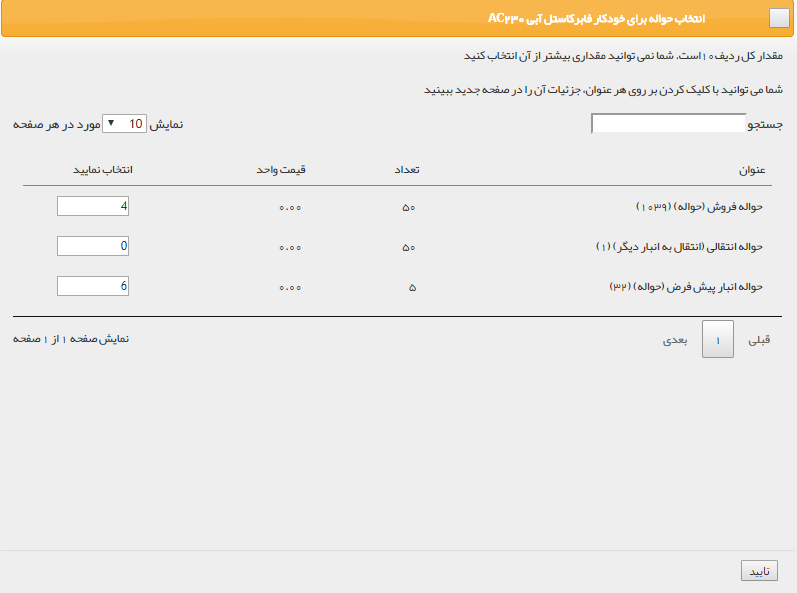
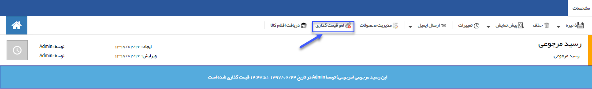

## قیمت گذاری رسید مرجوعی

برای وارد کردن کالای برگشت از فروش به انبار، از رسید مرجوعی استفاده می شود.

قیمت گذاری: به صورت دستی و یا از روی حواله فروش انجام میشود.

1. قیمت گذاری دستی: در هر ردیف تعداد کالا و قیمت آن را تعیین کنید.

2. قیمت گذاری از حواله: از بین لیست حواله های قیمت گذاری شده که شامل این محصول هستند، می توانید انتخاب کنید که اقلام موجود در این رسید مرجوعی مرتبط با کدام حواله ها است.

3. دکمه قیمت گذاری: پس از قیمت گذاری برای تمام ردیف های کالا، با کلیک بر روی این علامت قیمت گذاری روی رسید انجام میشود.

 پس از انجام قیمت گذاری، می توانید با استفاده از دکمه لغو قیمت گذاری، تراکنش را به حالت قیمت گذاری نشده برگردانید.
 
 
 
 