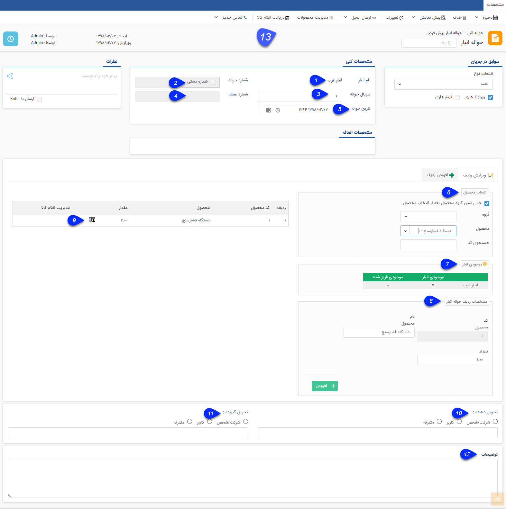

## اطلاعات مشترک ثبت رسید/حواله

در این قسمت فیلدهای ثبت یک حواله یا رسید توضیح داده شده است، برای مثال این قسمت رسید موجودی اولیه (که هنوز تایید نشده است) انتخاب گردیده است.

1. نام انبار: نام انباری که این تراکنش در آن ثبت شده است، نمایش داده میشود.

2. شماره رسید/حواله: شماره رسید یا حواله را مشخص می کند. (این شماره مختص این نوع تراکنش در تمامی انبار هاست، یعنی برای مثال شماره این نوع حواله (حواله انبار پیش فرض بین حواله های هم نوع خود در تمامی انبارها). شماره رسید/حواله پس از تایید تراکنش به صورت خودکار درج خواهد شد، اما در صورت داشتن مجوز مربوطه می توانید به صورت دستی آن را واردکنید.

3. سریال رسید/ حواله: سریال این رسید یا حواله را مشخص می کند. (سریال این سند را بین تمامی انواع حواله ها/رسیدها مشخص می کند). شماره سریال پس از ثبت تراکنش به صورت خودکار توسط سیستم درج خواهد شد، اما ممکن است پس از تایید تغییر کند (در صورت متفاوت بودن ترتیب صدور و ترتیب تایید تراکنش های انبار)

مثال: تصور کنید دو نوع حواله به نام های حواله نوع1 و حواله نوع2 در شخصی سازی تراکنش های انبار ایجاد کرده اید. اگر یک حواله از نوع1 ثبت کنید شماره 1 و سریال 1 برای آن درج خواهد شد. سپس اگر یک حواله نوع2 ثبت کنید، شماره 1 و سریال 2 برای آن درج خواهد شد. (توجه داشته باشید که سریال تراکنش های انبار ممکن است پس از تایید تغییر کند، این اتفاق در صورتی می افتد که ترتیب صدور تراکنش با ترتیب تایید آن متفاوت باشد یا شماره سریال را به صورت دستی وارد کرده باشید)

> نکته: توجه داشته باشید که تراکنش های انبار بر اساس نوع (رسید یا حواله) منبع  سریال جداگانه دارند (یعنی نمی توان دو تراکنش از یک نوع -مثلا حواله - با شماره سریال مشابه ثبت کرد، اما در صورت متفاوت بودن زیرنوع آن ها، می توانند شماره مشابه داشته باشند). اما بر اساس زیرنوع (زیرنوع های ساخته شده در مدیریت تراکنش های انبار) منبع شماره جداگانه دارند. به طور خلاصه هر نوع از تراکنش انبار یک منبع برای ثبت سریال و هر زیرنوع از تراکنش انبار یک منبع برای ثبت شماره دارد. علاوه بر این نحوه ثبت سریال یا شماره ارتباطی با صدور تراکنش در انبارهای مختلف ندارد، یعنی ترتیب شماره دهی بر اساس انبار تغییر نخواهد کرد.

4. شماره عطف:شماره عطف رسید/حواله را نمایش می دهد. در صورتی که شماره سریال به صورت دستی تغییر کند یا ترتیب صدور تراکنش ها با تایید آن ها متفاوت باشند، شماره سریال پیشین در شماره عطف درج خواهد شد. به طور مثال فرض کنید یک رسید انبار صادر می کنید و پس از ذخیره، سریال 5 برای آن درج گردد، سپس رسید دیگری صادر کنید و شماره 6 برای آن درج گردد. در صورتی که ابتدا رسید با سریال 6 را تایید کنید، شماره سریال آن به 5 تغییر کرده و شماره 6 در فیلد شماره عطف درج خواهد شد. همچنین اگر سریال را به صورت دستی در هنگام ثبت وارد کنید، در هنگام تایید، شماره سریال بر اساس ترتیب سریال دهی سیستم تغییر کرده و شماره وارد شده توسط شما در فیلد شماره عطف درج خواهد شد. توجه داشته باشید که امکان درج یا تغییر شماره عطف به صورت دستی وجود ندارد و صرفاً جهت اطلاع رسانی سریال پیشین تراکنش می باشد. خالی بودن این فیلد به معنی تغییر نکردن سریال می باشد.

5. تاریخ رسید/حواله : تاریخ ثبت حواله یا رسید در این قسمت به صورت خودکار درج می گردد اما می توانید بر اساس تاریخ صدور واقعی تراکنش، آن را به صورت دستی تغییر دهید. 

6. انتخاب محصول: نام محصول را از دسته بندی های محصولات یا با استفاده از کد آن انتخاب کنید.

> نکته: توجه داشته باشید در این قسمت تنها محصولاتی را می توانید انتخاب کنید که در قسمت مدیریت انبارها به عنوان محصول مجاز این انبار تعیین شده باشند.

7. موجودی انبار: پس از انتخاب محصول، می توانید در این قسمت موجودی این محصول را در انبارهای مختلف (انبارهایی که این محصول برای آنها به عنوان محصول مجاز تعریف شده باشند) مشاهده کنید.

8. مشخصات ردیف: نام محصول انتخاب شده نمایش داده میشود و باید مقدار آن را تعیین کنید و از کلید "اضافه کردن" استفاده کنید.

9. مدیریت اقلام کالا: با استفاده از این علامت می توانید سریال اقلامی که در حواله/رسید درج کرده اید را وارد کنید. برای اطلاع از نحوه وارد کردن سریال ها، مدیریت اقلام کالا را مطالعه کنید.

> نکته: اگر به اندازه مقدار انتخاب شده از کالا سریال وارد نکنید به این معنی است که تعدادی از محصولاتی که در رسید/حواله هستند، بدون سریال میباشند.(برای مثال کالا فله ای است یا هنوز سریال گذاری نشده است.)

10. تحویل دهنده: فرد یا شرکتی که کالاهای موجود در این رسید/حواله را تحویل می دهد انتخاب کنید.

انتخاب این فیلد از سه راه امکان پذیر است:

الف) شرکت/شخص: از بین مخاطبان ثبت شده در نرم افزار یک مخاطب انتخاب می شود.

ب) کاربر: از بین کاربران فعال در نرم افزار یک فرد انتخاب می شود.

ج) متفرقه: نام شخص یا شرکت نوشته می شود.

> نکته: در صورتی که در یک رسید انبار، نام یک هویت را به عنوان تحویل دهنده وارد کنید، آن رسید در سوابق هویت مرتبط نمایش داده خواهد شد.

11. تحویل گیرنده: فرد یا شرکتی که کالاهای موجود در این رسید/حواله را تحویل می گیرد را انتخاب کنید.

> نکته: در صورتی که در یک حواله انبار، نام یک هویت را به عنوان تحویل گبرنده وارد کنید، آن حواله در سوابق هویت مرتبط نمایش داده خواهد شد.

12. توضیحات: در صورت نیاز می توان توضیحات اضافی مرتبط با رسید/حواله را در این قسمت وارد کرد.

13. دریافت اقلام کالا: با استفاده از این دکمه می توانید سریال اقلام کالای وارد شده در این تراکنش را در قالب یک فایل اکسل دریافت کنید.