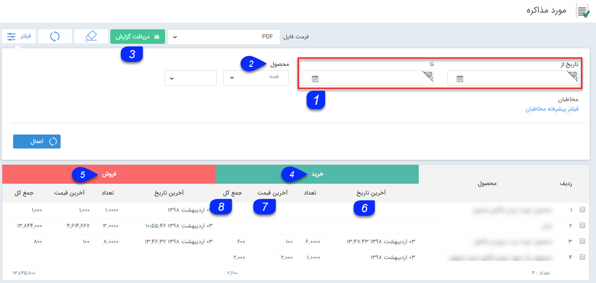

## مورد مذاکره

در این قسمت لیست تمامی کالاهایی که در پیش فاکتورها (خرید و فروش) هستند و احتمال فروش آنها هست را می توانید مشاهده کنید.

اقلام مورد مذاکره برای هر مخاطب در قسمت معاملات سوابقش قابل مشاهده است.

1. فیلتر تاریخ: با استفاده از این فیلتر می توانید براساس تاریخ صدور فیلتر نمایید .

2. فیلتر محصول: می توانید یک گروه محصول یا یک محصول مشخص را از بین محصولات تعریف شده در قسمت مدیریت محصولات برای نمایش فیلتر کنید .

3. دریافت گزارش: پس از اعمال فیلترهای مورد نظر خود، می توانید با استفاده از این دکمه یک گزارش با فرمت فایل  (pdf،excel،html1،html2) دریافت نمایید.

4. خرید: در این قسمت جزئیات اطلاعات مرتبط با خرید این محصول (اطلاعات مرتبط با پیش فاکتورهای خرید) نمایش داده می شود.

5. فروش: در این قسمت جزئیات اطلاعات مرتبط با فروش این محصول (اطلاعات مرتبط با پیش فاکتورهای فروش) نمایش داده می شود.

6. آخرین تاریخ: در این ستون، تاریخ آخرین  صدور پیش فاکتور خرید/فروش که این محصول در آن درج شده است نمایش داده می شود.

7. آخرین قیمت: در این ستون برای هر محصول آخرین قیمت واحد ثبت شده در آخرین پیش فاکتور فروش/خرید   براساس تاریخ صدور نمایش داده می شود.

8. جمع کل: در این ستون جمع مبلغ کل موجود در پیش  فاکتور های خرید/فروش هر محصول نمایش داده می شود.

