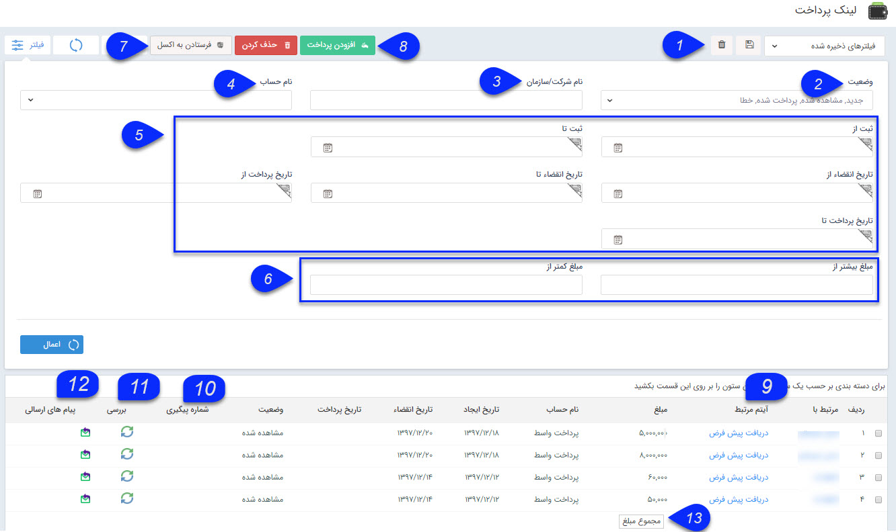

## لینک های پرداخت

در این قسمت تمامی لینک های پرداخت ایجاد شده در سیستم توسط کاربران نمایش داده می شود و می توانید جزئیات مربوط به هرکدام را مشاهده کنید، با استفاده از پارامترهای مختلف لینک پرداخت مورد نظر خود را جستجو کنید و یا لینک پرداخت جدیدی ایجاد کنید.

1. نوع فیلتر: میتوانید فیلترهای اعمال شده را به عنوان یک فیلتر اختصاصی خود ذخیره کنید.

2. وضعیت:     از بین حالت های ممکن، وضعیت مورد نظر خود برای جستجو را وارد کنید. انواع وضعیت های لینک پرداخت به شرح زیر می باشند

جدید: لینک پرداخت ارسالی به مخاطب، هنوز باز نشده است.
مشاهده شده: لینک ارسالی توسط مخاطب مشاهده و باز شده، اما هنوز عملیات پرداخت را انجام نداده است.
پرداخت شده: مبلغ توسط مخاطب از طریق لینک پرداخت شده است.
منقضی شده: تاریخ انقضای لینک گذشته و مبلغ توسط مخاطب پرداخت نشده است.
3. نام شرکت/سازمان: نام یا بخشی از نام مخاطبی که لینک برای او ارسال شده است را برای جستجو وارد کنید.

4. نام حساب:  نام حسابی که در هنگام ایجاد لینک پرداخت برای واریز وجه مشخص کرده ا ید را برای جستجو انتخاب کنید . حساب ها از اطلاعات پایه قسمت مدیریت حساب های مالی تعریف

می شود و در لینک پرداخت فقط حساب هایی قابل استفاده است که قابلیت پرداخت آنلاینشون فعال باشد و دارای API باشند .

5. بازه زمانی ثبت، انقضا و پرداخت: می توانید یک حد پایین و یک حد بالا برای زمان ثبت (ایجاد لینک پرداخت در نرم افزار)، انقضا و پرداخت (پرداخت مبلغ توسط مخاطب) در نظر بگیرید.

6. حدود مبلغ: می توانید یک حد پایین و یک حد بالا برای مبلغ وارد شده در لینک پرداخت در نظر بگیرید.

7. فرستادن به اکسل: با استفاده از این دکمه می توانید از جزئیات لینک پرداخت های فیلتر شده، خروجی اکسل دریافت کنید.

8. افزودن پرداخت: با استفاده از این دکمه می توانید یک لینک پرداخت جدید ایجاد کنید.

9. آیتم مرتبط:لینک آیتمی (پیش فاکتور، قرارداد ، دریافت و ...) که لینک پرداخت با آن مرتبط شده است در این قسمت نمایش داده می شود و می توانید با کلیک بر روی آن، صفحه مرتبط با آیتم را مشاهده کنید.

10. شماره پیگیری: در صورتی که مبلغ توسط مخاطب از طریق لینک پرداخت شده باشد، شماره پیگیری مربوط به این تراکنش مالی در این قسمت نمایش داده می شود.

11. بررسی: با کلیک بر روی آیکون نمایش داده شده در این ستون، می توانید وضعیت این لینک پرداخت را بروزرسانی کنید.

12. پیام های ارسالی:کلیک بر روی این دکمه می توانید پیام ارسالی حاوی این لینک پرداخت و جزئیات ارسال را مشاهده کرده و در صورت نیاز پیام را مجدد ارسال کنید.

13. مجموع مبلغ:مجموع مبلغ لینک های پرداخت فیلتر شده نمایش داده می شود .

