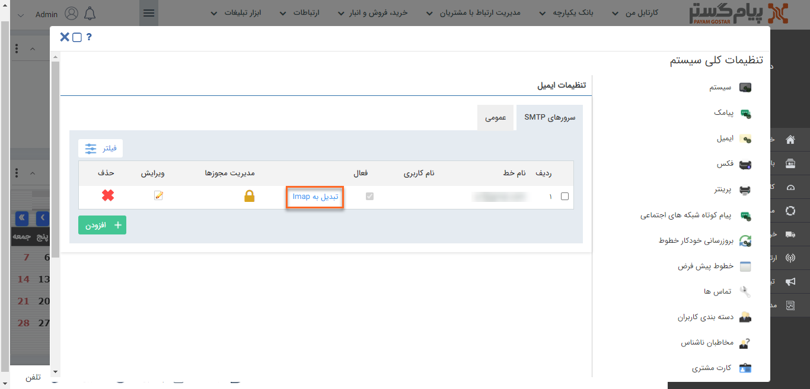

# ارسال ایمیل از دو طریق انجام می‌شود
1)   **Smtp :** می توانید از کلیه ارائه دهندگان سرویس SMTP استفاده کنید. 

2)   **خطوط پرتال اول :**  قابلیت ارسال ایمیل هوشمند از طریق پرتال اول را دارید.

## تنظیمات ایمیل‌های smtp

کاربران دارای دسترسی : **مدیرسیستم**/کاربر با **مجوز مدیریت تنظمیات**(برای مطالعه بیشتر به بخش [تعیین مجوزها](https://github.com/1stco/PayamGostarDocs/blob/master/help2.5.4%20new/Getting-Started/Manage%20groups%20and%20users/Determine%20the%20level%20of%20access.md) مراجعه کنید.)

1)  در منوی **تنظیمات**، بخش **تنظیمات‌کلی، ایمیل** را انتخاب کنید**.**

2)  در لیست خطوط ایمیل‌ امکان **ویرایش** و **حذف آن‌ها** و یا **تعیین مجوزهای** کاربران بر روی خط وجود دارد.

3)  برای تعیین **مجوز** با کلیک بر روی **مدیریت مجوزها،** می‌توانید کاربر موردنظر و **سطح دسترسی** او را مشخص کنید.

**نکته:** در صورت عدم تعیین مجوز، آن خط بصورت عمومی لحاظ می‌گردد و همه کاربران به آن دسترسی دارند.

4)   در صورتی که سرور دریافت ایمیلی در نرم افزار به صورت pop3 تعریف شده باشد، می‌توانید آن را به  **Imap** **تبدیل** کنید.

**نکته:**توجه کنید که سرور pop3 امکان تبدیل به Imap دارد اما سرور های Imap به pop3 تبدیل نمی شوند

