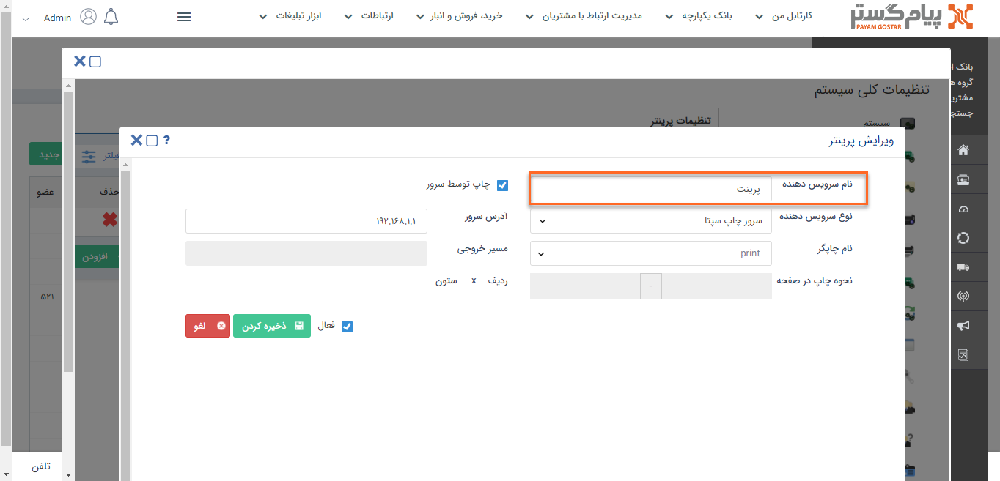
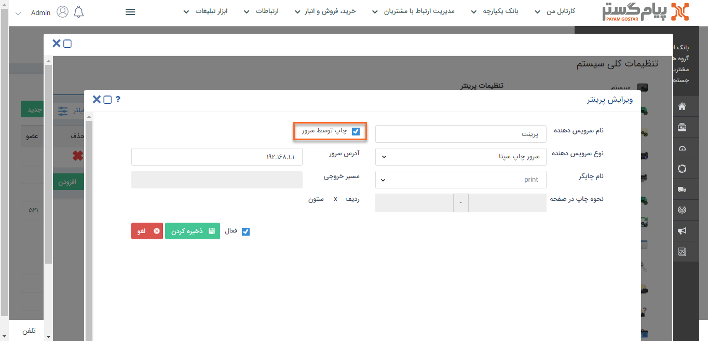
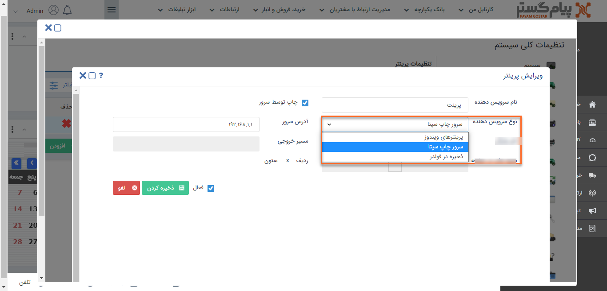
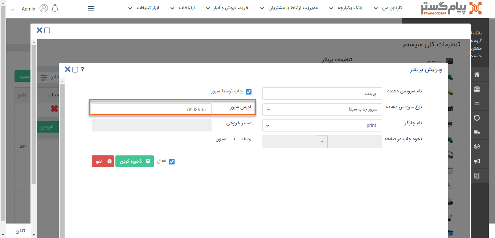
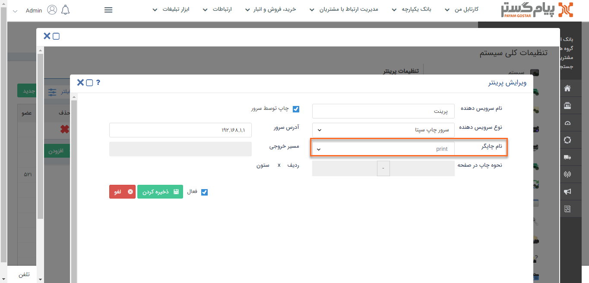
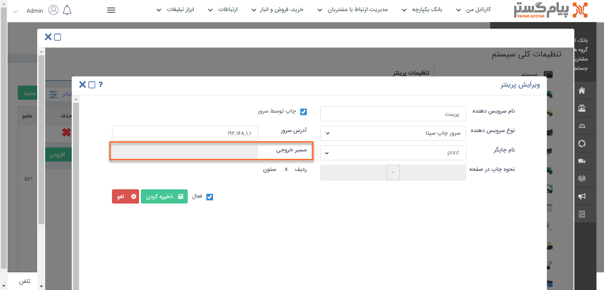
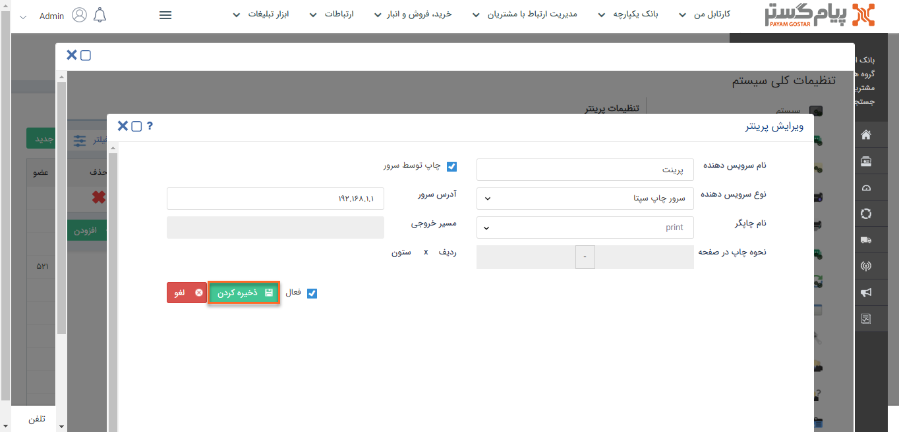

# نحوه‌ی تنظیم پرینترها

برای تعریف پرینتر جدید ابتدا تنظیمات مربوط به پرینت از طریق برنامه Septa Print Server Configuration باید انجام شود.

1)  از بخش **تنظیمات کلی**، قسمت **ایمیل**، **smtp** را انتخاب کنید.

2)   بر روی **افزودن** کلیک کنید.

3)  **نام دلخواهی** برای پرینتر خود تعریف کنید.

4)  برای چاپ از طریق سرور چک‌باکس **چاپ توسط سرور** را فعال کنید.

5)  **نوع سرویس دهنده** چاپ را با توجه به امکان چاپ به دو صورت صفحه‌ای و چاپ چندتایی، انتخاب کنید.

شما می‌توانید از چاپ چندتایی در یک صفحه، برای مواردی مانند چاپ لیبل ( Label) استفاده کنید،

6)   آدرس سرور پرینتر و یا IP آن را در این بخش بصورت printserver و یا 192.168.1.1 وارد کنید.

7)  پرینتر موردنظر که در septaprint  تعریف کردید را در این بخش انتخاب کنید.

8)  مسیر خروجی 

9)  برای عدم استفاده از این آدرس ایمیل می‌توانید آن را **غیرفعال** کنید.

10) در انتها بر روی **ذخیره کردن** کلیک کنید

