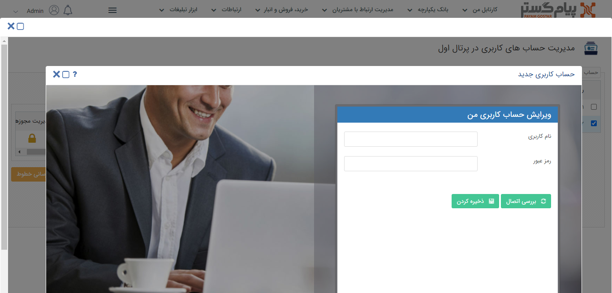

# نحوه‌ی تعریف خطوط پرتال اول 

پس از ثبت نام در 1st.ir ، فعالسازی و شارژ کردن نام کاربری خود می توانید از خطوطی که در اختیار شما قرار می گیرد ارسال پیامک انجام دهید، در صورت نیاز هم می توانید خط مورد نیاز خود را از این سایت خریداری نمایید.

کاربران دارای دسترسی: **مدیرسیستم** / کاربر با مجوز **مدیریت حساب‌های کاربری پرتال اول**(برای مطالعه بیشتر به  بخش[ تعیین مجوزها](https://github.com/1stco/PayamGostarDocs/blob/master/help2.5.4%20new/Getting-Started/Manage%20groups%20and%20users/Determine%20the%20level%20of%20access.md) مراجعه کنید.)

1)  از منوی 1st.ir، **مشخصات کاربری** را انتخاب کنید.

2)  بر روی **افزودن** کلیک کنید.

3)  **نام کاربری** و **رمز عبور** سایت 1st.ir خود را وارد کنید.

4)  با **بررسی اتصال**، صحیح بودن اطلاعات خود را بررسی و سپس این کاربری را **ذخیره** کنید.

5)  پس از ذخیره کاربری با **بروزرسانی خطوط** می‌توانید خط‌های پیام‌کوتاه،ایمیل و همچنین موجودی خود را مشاهده کنید. 

6)  **سطح دسترسی** کاربران به هر کدوم از خطوط را از طریق **مدیریت مجوزها** تعیین کنید.

