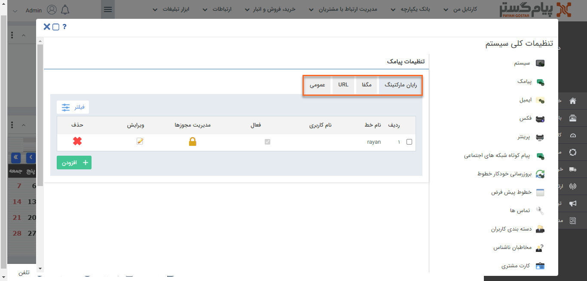

# اپراتورهای قابل پشتیبانی  پیامک 

- ​    [رایان مارکتینگ ](https://github.com/1stco/PayamGostarDocs/blob/master/help2.5.4%20new/Getting-Started/General%20settings/Line%20settings/sms/%D9%86%D8%AD%D9%88%D9%87%20%D8%AA%D8%B9%D8%B1%DB%8C%D9%81%20%D8%AE%D8%B7%D9%88%D8%B7%20%D8%B1%D8%A7%DB%8C%D8%A7%D9%86%20%D9%85%D8%A7%D8%B1%DA%A9%D8%AA%DB%8C%D9%86%DA%AF.md):  اپراتور ارائه کننده **خطوط ثابت** 

-    [مگفا](https://github.com/1stco/PayamGostarDocs/blob/master/help2.5.4%20new/Getting-Started/General%20settings/Line%20settings/sms/%D9%86%D8%AD%D9%88%D9%87%20%D8%AA%D8%B9%D8%B1%DB%8C%D9%81%20%D8%AE%D8%B7%D9%88%D8%B7%20%D9%85%DA%AF%D9%81%D8%A7.md) : اپراتور ارائه کننده خطوط اینترنتی با سرشماره 3000

- [ url](https://github.com/1stco/PayamGostarDocs/blob/master/help2.5.4%20new/Getting-Started/General%20settings/Line%20settings/sms/%D9%86%D8%AD%D9%88%D9%87%20%D8%AA%D8%B9%D8%B1%DB%8C%D9%81%20%D8%AE%D8%B7%D9%88%D8%B7%20url.md) : ارسال پیامک از سایر اپراتورها از طریق url 

- ​    خطوط عمومی

- ​    [پرتال اول ](https://github.com/1stco/PayamGostarDocs/blob/master/help2.5.4%20new/Getting-Started/General%20settings/Line%20settings/sms/%D9%86%D8%AD%D9%88%D9%87%20%D8%AA%D8%B9%D8%B1%DB%8C%D9%81%20%D8%AE%D8%B7%D9%88%D8%B7%20%D9%BE%D8%B1%D8%AA%D8%A7%D9%84%20%D8%A7%D9%88%D9%84.md): اپراتور ارائه دهنده خطوط با سرشماره‌ی 3000 و خط‌های 8 رقمی متناظر با خطوط ثابت 

## تنظیمات خطوط پیامک 

کاربران دارای دسترسی: **مدیرسیستم** / کاربر با **مجوز مدیریت تنظیمات**(برای مطالعه بیشتر به بخش تعیین مجوزها مراجعه کنید.)

1)  در منوی **تنظیمات** بخش **تنظیمات‌کلی،**  **پیامک** را انتخاب کنید**.**

2)  **اپراتور** موردنظر خود را انتخاب کنید.

3)  در لیست خطوط امکان **ویرایش** و **حذف آن‌ها** و یا **تعیین مجوزهای** کاربران بر روی خط وجود دارد.

4)  برای تعیین **مجوز** کاربران با کلیک بر روی **مدیریت مجوزها،** می‌توانید کاربر موردنظر و سطح دسترسی او را مشخص کنید.

**نکته:** در صورت عدم تعیین مجوز، آن خط بصورت **عمومی** لحاظ می‌گردد و همه کاربران به آن دسترسی دارند.

