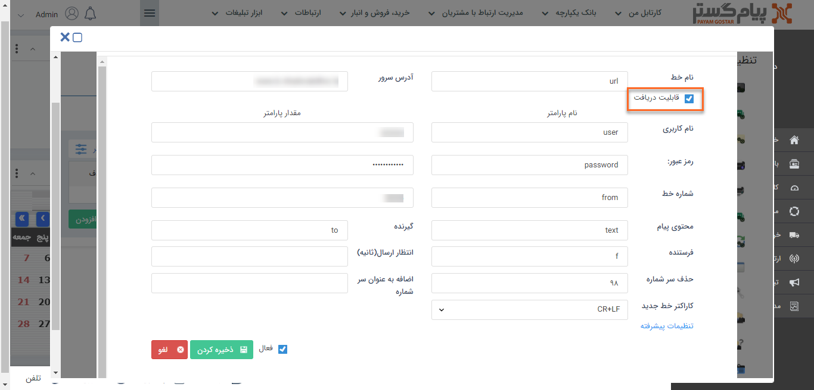
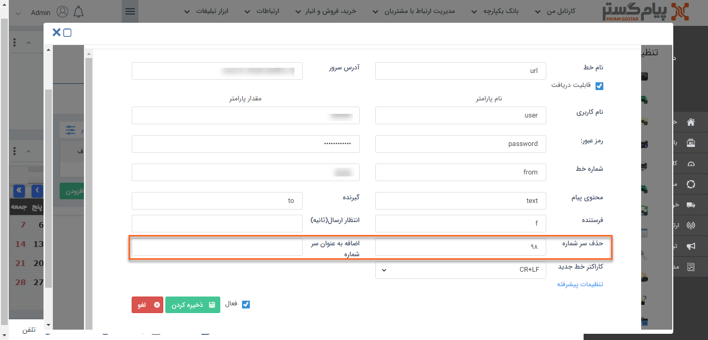

# نحوه‌ی تعریف خطوط url

1)  در بخش **پیامک**>**url** بر روی **افزودن** کلیک کنید.

2)  **نام** دلخواهی برای خط خود انتخاب کنید.

3)  **اطلاعات** خط موردنظر را در این بخش وارد کنید.(این اطلاعات باید از اپراتور ارائه دهنده آن بصورت یک url که به شکل query string می‌باشد، دریافت شود.)

4)  در صورتی که این خط قابلیت دریافت دارد و می‌خواهید پیام‌های دریافتی را در پیام‌گستر مشاهده کنید، چک باکس "**قابلیت دریافت**" را فعال کنید.

5)  امکان افزودن پیشوند بصورت ثابت و حذف پیش شماره‌ی مشخص از شماره مخاطب در این بخش وجود دارد.

**نکته**: لازم به ذکر است اگر مقداری در فیلد حذف سرشماره تعریف گردد، بصورت خودکار + از سرشماره‌ی مخاطب حذف می گردد.

6) برای عدم استفاده از این آدرس ایمیل می‌توانید آن را **غیرفعال** کنید

7) اطلاعات خط خود را **ذخیره** کنید.