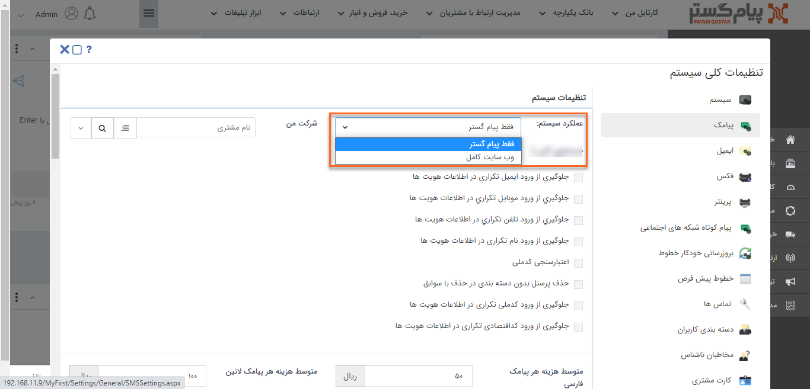
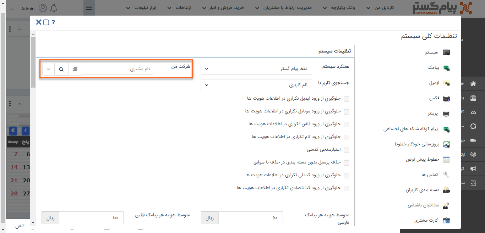
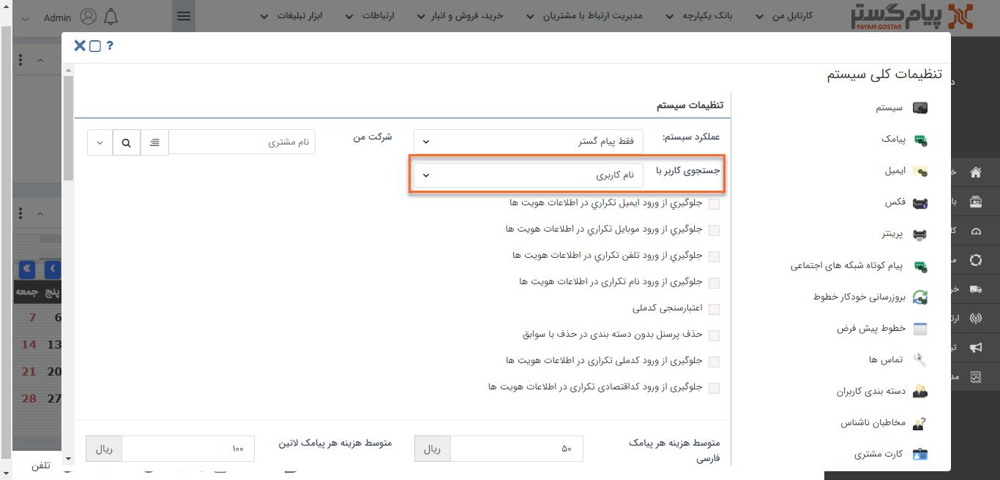
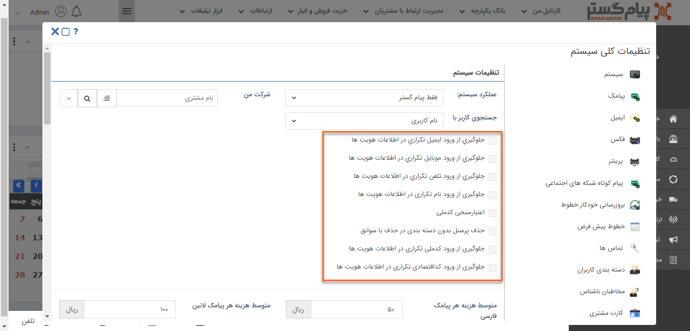
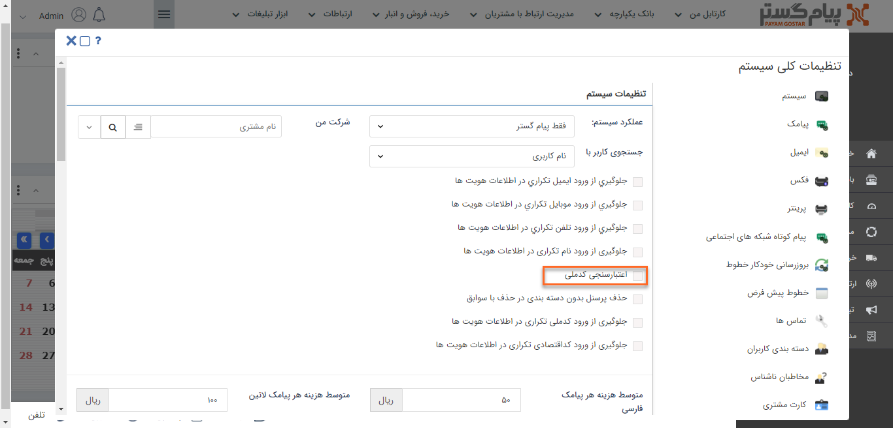
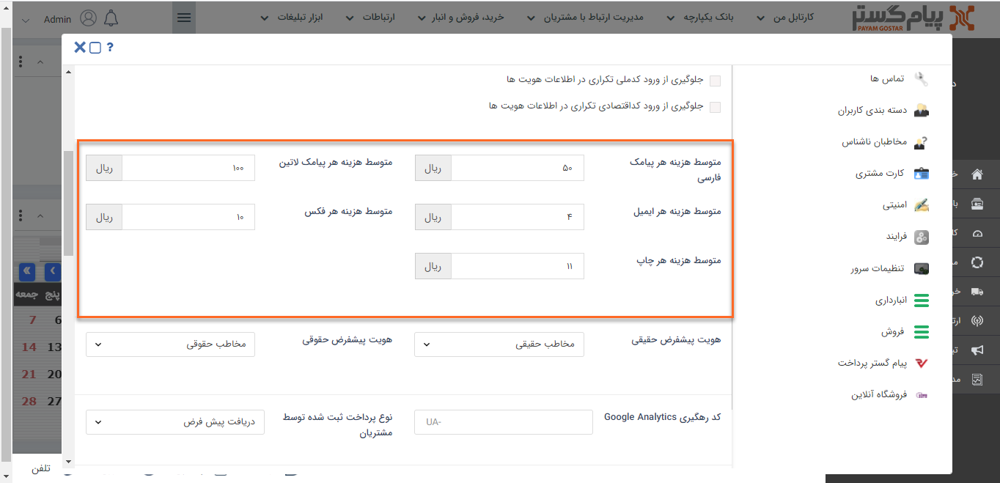
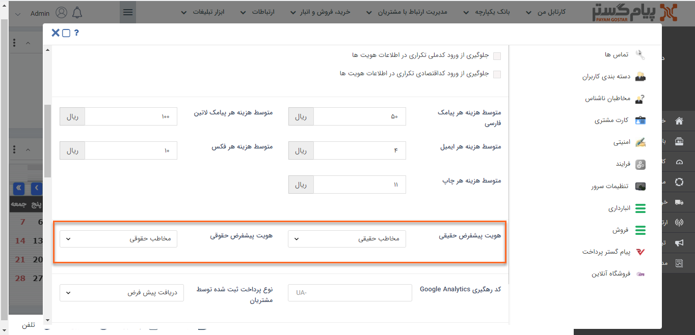
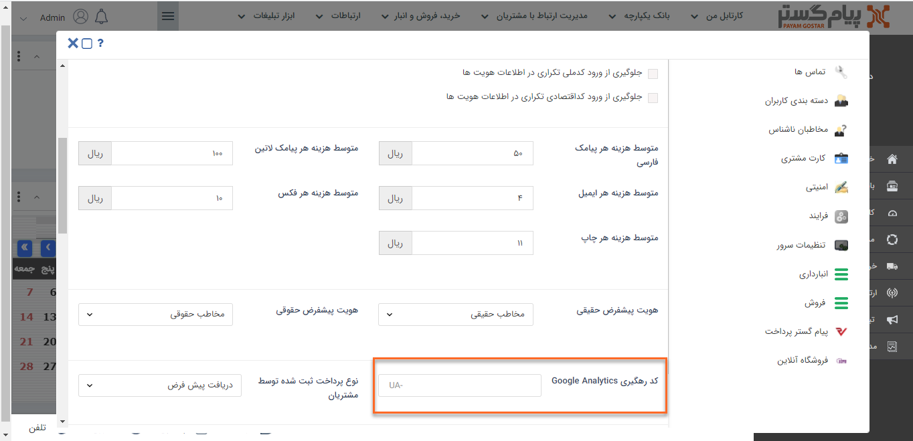
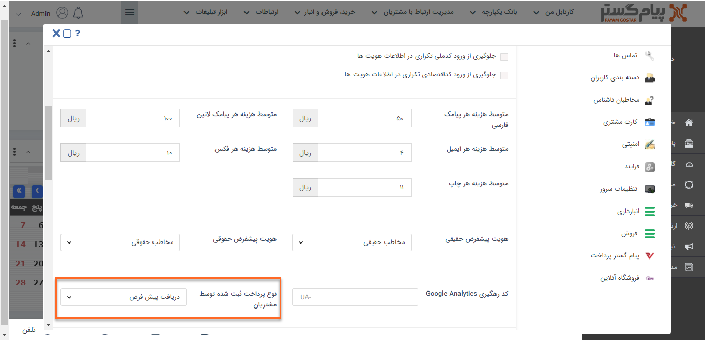
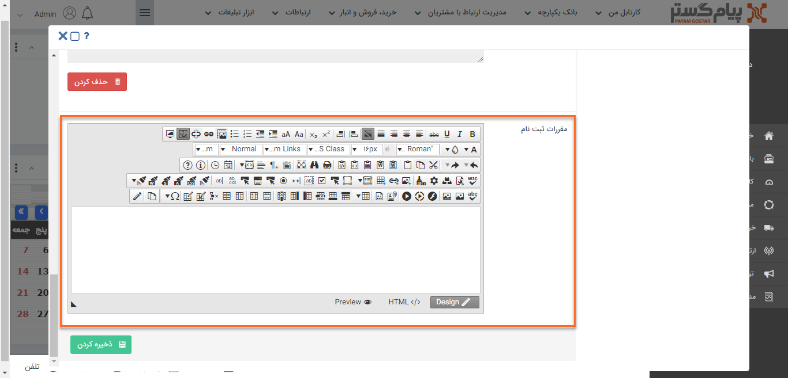

 # تنظیمات سیستم 

کاربران دارای دسترسی: **مدیر سیستم**/کاربر با **مجوز مدیریت تنظیمات**(برای مطالعه بیشتر به بخش[ تعیین مجوزها](https://github.com/1stco/PayamGostarDocs/blob/master/help2.5.4%20new/Getting-Started/Manage%20groups%20and%20users/Determine%20the%20level%20of%20access.md) مراجعه کنید.)

1)   از منوی **تنظیمات**، بخش **تنظیمات کلی**، **سیستم** را انتخاب کنید.

2)   **عملکرد سیستم:** با انتخاب **وب‌سایت کامل** به عنوان عملکرد سیستم،  نمای ورودی نرم افزار خود را به صورت سایت کامل تنظیم کنید. (برای مطالعه‌ی بیشتر به بخش **سایت‌ساز** مراجعه کنید.)

3)   **شرکت من:** می‌توانید شرکت خود را از بین هویت‌های موجود در بانک اطلاعاتی انتخاب کنید تا نام آن در گزارشات و فرم ثبت‌نام باشگاه نمایش داده شود.

**4)**   **جستجوی کاربر:** انتخاب کنید که در نرم‌افزار، کاربران با **نام کاربری** نمایش داده شوند و یا **نام و نام‌خانوادگی**

5)   **جلوگیری از ورود اطلاعات تکراری:** می‌توانید تعیین کنید که امکان ذخیره هویت با اطلاعات تکراری از جمله تلفن، ایمیل، کداقتصادی و ... وجود نداشته باشد.

6)   **اعتبار سنجی کد ملی:** با فعال بودن این گزینه، کدملی هایی که در سیستم ثبت می شوند اعتبار سنجی می‌شود.

7)   **حذف پرسنل بدون دسته‌بندی در حذف با سوابق:** در صورت فعال بودن این گزینه، عملیات "حذف با سوابق" برای هویت هایی که پرسنل آن ها **زمینه فعالیتی** ندارند، قابل اجراست.

8)   **متوسط هزینه ها:** متوسط هزینه هر کدام از رسانه های ارتباطی نرم افزار را می توانید در این بخش با در نظر گرفتن تمامی هزینه ها (از جمله هزینه پنل، کاغذ، جوهر، اپراتور و ...) 
​      تعیین کنید و بر میزان هزینه های خود از طریق گزارشات نرم افزار نظارت داشته باشید.

 

9)   **هویت های پیشفرض:** هویت پیش‌فرض برای **ایجاد کاربر باشگاه‌مشتریان** از هویت‌های بانک اطلاعاتی و یا از طریق باشگاه را در این بخش انتخاب کنید.

10) **کد رهگیری Google Analytics :** اگر از ابزار Google Analytics استفاده می کنید، می توانید لینک Feed دریافت شده از این ابزار را در این فیلد وارد کنید تا داده های مربوط به بازدید کاربران از باشگاه مشتریان نرم افزار پیام گستر از طریق آن به این ابزار ارسال گردد.

11) **نوع پرداخت ثبت شده توسط مشتریان:** نوع پرداخت که باید در صورت **پرداخت آنلاین مشتریان** در باشگاه مشتریان ایجاد شود را از بین انواع پرداخت های تعریف شده در بخش **شخصی سازی** **crm** انتخاب کنید.

12) **مقررات ثبت نام:** در هنگام ثبت‌نام از طریق باشگاه مشتریان قوانین و مقرراتی به صورت لینک در اختیار مشتریان قرار داده می شود که می توانند با کلیک روی لینک به صفحه مربوطه وصل شوند. متن مورد نظر برای نمایش در این بخش تنظیم می‌شود.

13) در انتها بر روی  **ذخیره** کلیک کنید. 