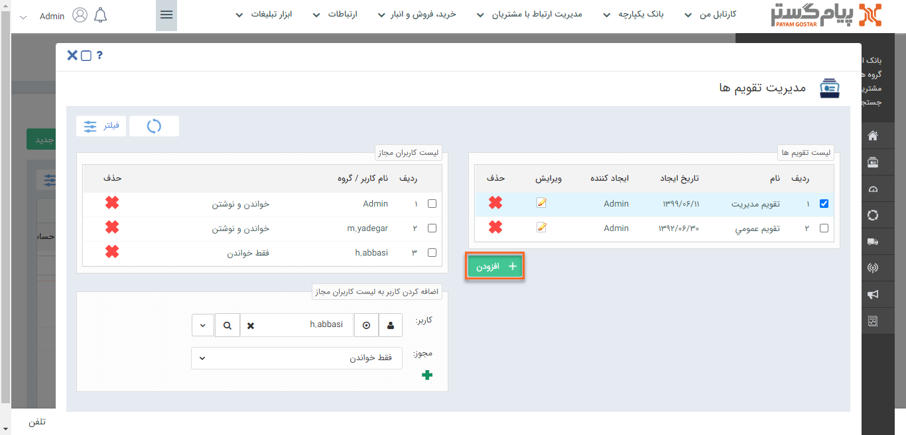
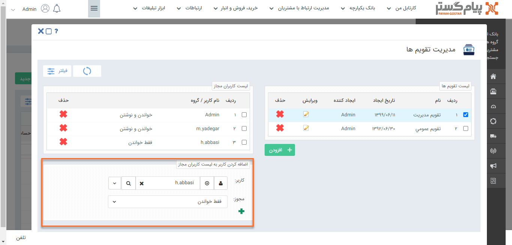

# تقویم‌های متعددی برای خود و کاربرانتان ایجاد کنید.

با تعریف تقویم‌های متعدد در پیام‌گستر، می‌توانید در هنگام تنظیم قرارملاقات، تقویم مورد نظر خود را انتخاب و قرارملاقات‌ را در تقویم مرتبط با آن ذخیره کنید و کاربران می‌توانند براساس دسترسی‌های خود بر روی تقویم‌ها، قرارملاقات‌ها را مشاهده و تنظیم کنند.

کاربران دارای دسترسی: **مدیر سیستم**/کاربر با مجوز **مدیریت تقویم‌ها**(برای مطالعه بیشتر به بخش تعیین مجوزها مراجعه کنید.)

1)   از منوی **اطلاعات پایه**، بخش **مدیریت تقویم‌ها** را انتخاب کنید.

2) برای ایجاد تقویم جدید بر روی **افزودن** کلیک کنید.

3)   با انتخاب نام و رنگ ، تقویم جدید را **ذخیره** کنید. 

با **تخصیص رنگ** به هر تقویم، می‌توانید انواع قرارملاقات‌های تنظیم شده را در **تقویم کاری** به راحتی تفکیک کنید.

4)   با انتخاب هر تقویم می‌توانید **مجوز** کاربران بر روی آن تقویم را مشاهده و تعریف کنید. 

مجوز "خواندن" امکان مشاهده قرارملاقات‌های ایجاد شده بر روی تقویم و مجوز "خواندن و نوشتن" امکان مشاهده  و ثبت قرارملاقات جدید را به کاربر می‌دهد.

5)   با انتخاب **کاربر** و **مجوز** موردنظر و کلیک بر روی **+** آن کاربر را به لیست کاربران مجاز تقویم اضافه کنید.

