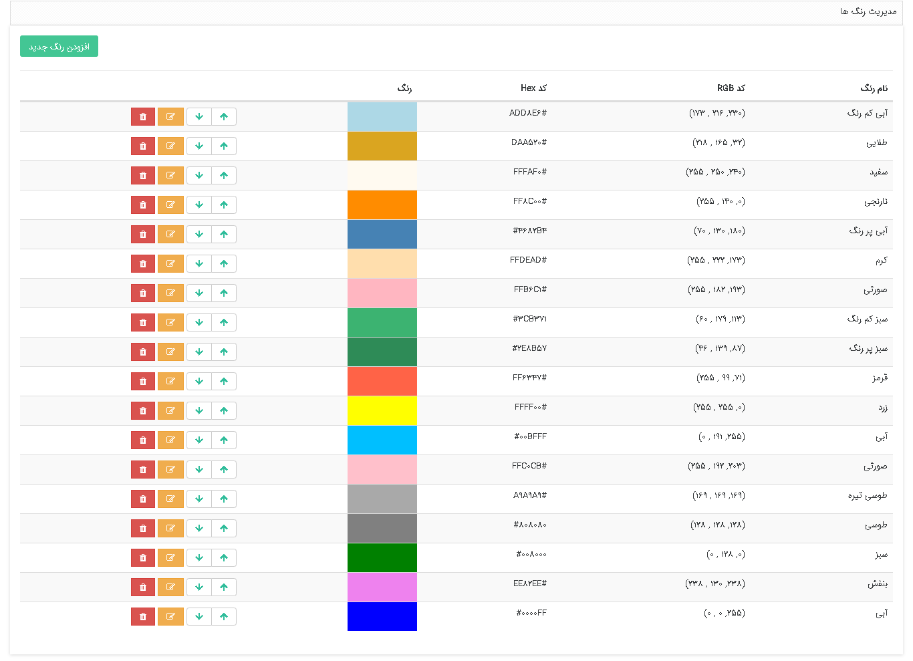

در **مدیریت رنگ‌ها** امکانات زیر وجود دارد : 

-    **تعریف رنگ جدید** 
- ​    **ویرایش و حذف رنگ‌ها** 

شما می‌توانید برای رنگ‌بندی تقویم‌ها، هویت‌ها ،اقدامات فرآیندهای کاری و ... از رنگ‌های موجود در این بخش استفاده کنید. 

کاربران دارای دسترسی: **مدیرسیستم**/کاربر با مجوز **مدیریت رنگ‌ها**(برای مطالعه بیشتر به بخش [تعیین مجوزها ](https://github.com/1stco/PayamGostarDocs/blob/master/help2.5.4%20new/Getting-Started/Manage%20groups%20and%20users/Determine%20the%20level%20of%20access.md)مراجعه کنید.)

1)  از منوی **اطلاعات‌پایه**، **مدیریت رنگ‌ها** را انتخاب کنید.

2)  بر روی **افزودن رنگ جدید** کلیک کنید.

3)  برای رنگ مورد نظر **عنوان** و **توضیحاتی** (که بصورت متن راهنما نمایش داده‌خواهد شد) وارد نمایید.

4)  می‌توانید **رنگ جدید** را براساس **نام رنگ**، **انتخاب رنگ** و یا **کد رنگ** موردنظر ایجاد کنید.

5)  بر روی **ذخیره تغییرات** کلیک کنید.

6)   **ترتیب نمایش** رنگ‌ها در لیست را می‌توانید تعیین کنید.

**نکته:**  توجه داشته‌باشید در صورتی که از رنگ موردنظر استفاده کرده باشید، امکان حذف آن را ندارید.