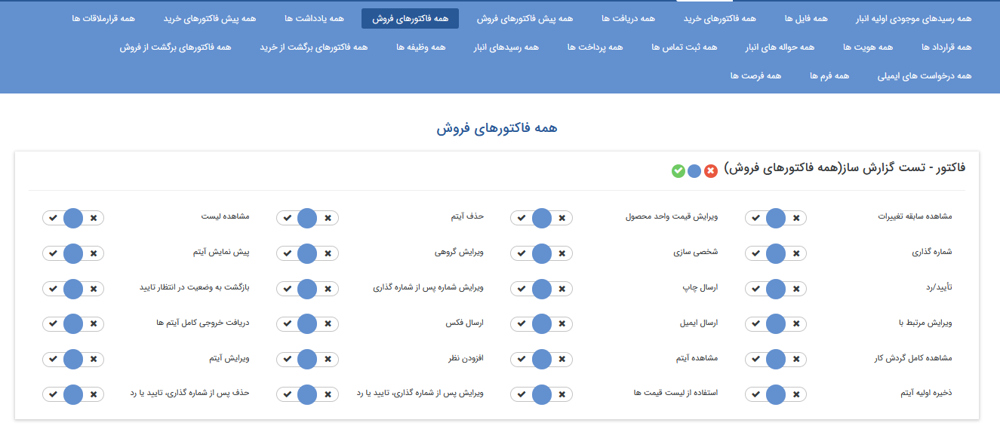
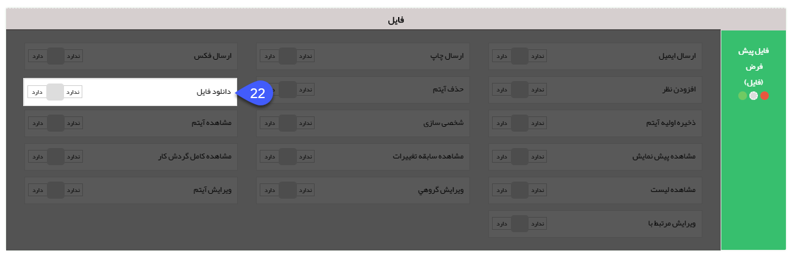
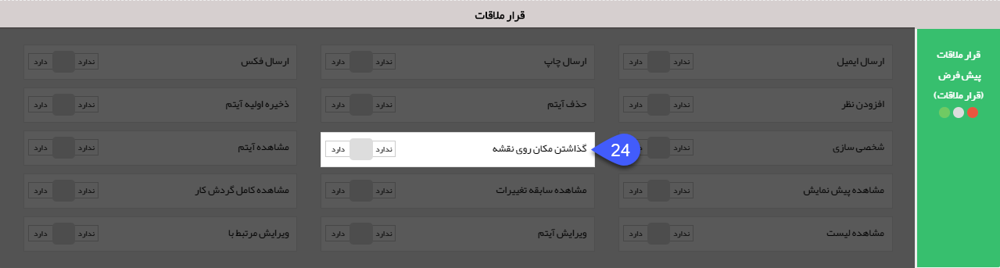
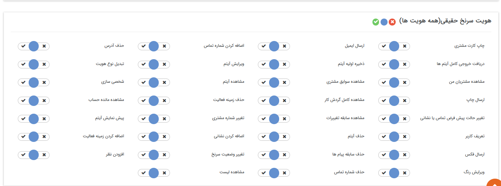
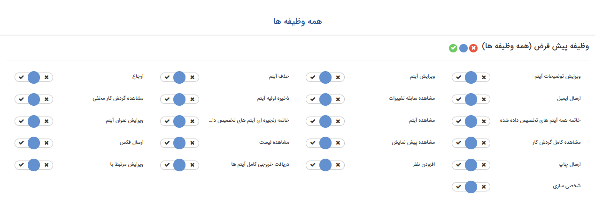

# تعیین سطح دسترسی موجودیت‌ها

پیام‌گستر دارای موجودیت‌هایی می‌باشد که سوابق مشتری توسط آن‌ها ثبت می‌شود، مانند فرم، فرصت، انواع فاکتورها و ... 

سطح دسترسی کاربر به هریک از این موجودیت‌ها را می‌توانید از این بخش تعیین کنید:

 برخی از مجوزها بین همه آیتم ها مشترک هستند و هر آیتم ممکن است مجوزهای مخصوص به خود را داشته باشد.

به عنوان نمونه "فاکتور فروش" برای توضیح مجوزهای مشترک و مجوزهای آیتم های دارای قابلیت تایید و شماره گذاری در نظر گرفته شده است.

## پیش فاکتور فروش

**نکته:** توجه داشته باشید که مجوز **مشاهده آیتم** پیش نیاز برخی از مجوز ها مانند ارسال ایمیل یا افزودن نظر برای آن آیتم است.

**نکته:** اغلب مجوزها بصورت یک قابلیت نمایش داده می‌شود، برای مثال اگر کاربر مجوز پیش نمایش آیتم را نداشته‌باشد، کلید پیش نمایش را در آن آیتم مشاهده نمی‌کند.

1. **ارسال ایمیل:** امکان ارسال **قالب چاپ آیتم** از طریق ایمیل

2. **ارسال چاپ:** امکان ارسال **قالب چاپ این آیتم** از طریق چاپ 

3. **ارسال فکس:** اجازه ارسال **قالب چاپ این آیتم** از طریق فکس 

4. **استفاده از لیست قیمت:** امکان انتخاب **لیست قیمت** برای پیش فاکتور و یا فاکتور

5. **افزودن نظر:** امکان اضافه کردن **نظر** روی این آیتم 

6. **پیش نمایش آیتم:** امکان **پیش نمایش** گرفتن از قالب چاپ آیتم

7. **تایید/ رد:** دسترسی به ت**ایید و رد** آیتم  

8. **حذف آیتم:** امکان **حذف** آیتم

**نکته:** در آیتم های دارای قابلیت تایید/رد کاربر با داشتن این مجوز تنها قبل از تایید/رد آیتم می تواند آن را حذف کند.

9. **حذف پس از شماره گذاری، تایید یا رد :** امکان **حذف آیتم‌ پس از تایید و یا شماره گذاری** 

این مجوز مخصوص آیتم‌های دارای قابلیت تایید و شماره گذاری می‌باشد

10. **ذخیره اولیه آیتم:** امکان **ایجاد آیتم**

11. **شخصی سازی:** دسترسی به **شخصی سازی آیتم** در بخش تنظیمات

12. **شماره گذاری:** این آیتم را برای **شماره گذاری** در کارتابل کاربر نمایش می دهد

14. **مشاهده سابقه تغییرات:** امکان مشاهده **تغییراتی** که بر روی آیتم انجام شده 

15. **مشاهده کامل گردش کار:** امکان مشاهده چگونگی **گردش آیتم** در کارتابل کاربران(در صورت فعال بودن فرآیند بر روی آیتم)

16. **مشاهده لیست:** امکان **مشاهده تمامی آیتم‌های از این نوع**

**نکته:** به صورت پیش فرض هر کاربر در لیست های آیتم‌ها، تنها آیتم هایی که خود ایجاد کرده است را مشاهده خواهد کرد. این مجوز دسترسی مشاهده آیتم هایی که کاربران دیگر ذخیره کرده اند را به کاربر می دهد

17. **ویرایش آیتم:** امکان **ویرایش آیتم** 

18. **ویرایش پس از شماره گذاری، تایید یا رد :** امکان **ویرایش آیتم پس از تایید و شماره‌گذاری**

**نکته:** مجوز ویرایش آیتم، پیش نیاز این مجوز می‌باشد.

21. ویرایش مرتبط با: امکان **ویرایش هویت مرتبط با آیتم** 

22. **دریافت خروجی کامل آیتم ها:** امکان **مشاهده کلیه اطلاعات آیتم** در خروجی اکسل (در صورت نداشتن مجوز، فقط فیلدهایی قابل مشاهده می‌باشد که برای نمایش در لیست انتخاب شده باشد.)

 (برای اطلاعات بیشتر به بخش تنظیمات مشترک آیتم‌های سیستم مراجعه کنید.)

## **آیتم فایل**

22. **دانلود فایل:** امکان **دانلود فایل ذخیره شده** 

## آیتم دریافت/پرداخت

23. **تعیین نوع دریافت/پرداخت:** امکان ثبت دریافت/پرداخت از نوع **نقدی، چکی و اعتباری** با توجه به مجوز داده شده.

## آیتم قرارملاقات

24. **گذاشتن مکان روی نقشه:** امکان **تعیین محل قرارملاقات** بر روی نقشه

## آیتم هویت (سرنخ یا مخاظب حقوقی/حقیقی)

25. **اضافه کردن زمینه فعالیت:** امکان **انتخاب دسته بندی جدید** برای هویت

28. **تبدیل نوع هویت:** امکان **تبدیل مخاطب/سرنخ حقیقی به حقوقی یا بالعکس** 

30. **تعریف کاربر:** امکان **تعریف هویت به عنوان کاربر باشگاه مشتریان**

31. **تعیین رابط:** امکان تعریف یکی از پرسنل تعریف شده برای هویت های حقوقی به عنوان رابط 

32. **تعیین مدیر:** امکان تعریف یکی از پرسنل تعریف شده برای هویت های حقوقی را به عنوان مدیر 

34. **تغییر شماره مشتری:** امکان **ویرایش شماره مشتری** 

35. **تغییر وضعیت سرنخ:** امکان **تبدیل سرنخ به مخاطب** یا ت**غییر وضعیت سرنخ های نامعلوم به عدم کفایت** یا بالعکس (مخصوص هویت از نوع سرنخ می باشد)

36. **چاپ کارت مشتری:** امکان **صدور کارت** برای هویت (برای تغییر قالب چاپی کارت مشتری به **تنظیمات کلی**  مراجعه کنید)

40. **حذف سابقه پیام ها:** امکان **حذف پیام‌های ارسالی و دریافتی** از سوابق هویت

42. **مشاهده سوابق مشتری:** امکان **مشاهده تمامی سوابق** ثبت شده برای مشتری

**نکته:** توجه داشته باشید کاربر حتی در صورت داشتن مجوز مشاهده سوابق مشتری، فقط می تواند لیست سوابق ایجاد شده را در سربرگ سوابق مشاهده نماید و برای باز کردن و مشاهده جزئیات هریک از سوابق باید مجوز مشاهده آیتم مربوطه را داشته باشد. 

44. **ویرایش رنگ:** امکان **تخصیص و یا تغییر رنگ هویت** 

## آیتم وظیفه

 

45. **ارجاع:** امکان **ارجاع وظیفه** به کاربران دیگر 

46. **خاتمه زنجیره ای آیتم های تخصیص داده شده:** امکان **خاتمه‌ی زنجیره‌ای** ارجاعات بعد از خود

47. **خاتمه همه آیتم های تخصیص داده شده:** امکان خاتمه وظیفه برای همه کاربرانی که این وظیفه را در کارتابل خود دارند.

48. **مشاهده کامل گردش کار:** از آنجایی که آیتم وظیفه قابلیت ارجاع دارد، گردش کار این آیتم با گردش کار سایر آیتم ها (که روال فرایند طی شده را نمایش می دهد) متفاوت است، به صورت پیشفرض در قسمت "مشاهده گردش کار" وظیفه، تمامی ارجاعات مرتبط با کاربر (ارجاعات قبل و بعد) که در قسمت پاراف نیز نمایش داده می شوند، قابل مشاهده است، اما کاربر با داشتن این مجوز می تواند تمامی ارجاعات وظیفه (حتی ارجاعات از نوع رونوشت مخفی) را مشاهده نماید.

**نکته:** توجه داشته باشید حتی با داشتن این مجوز، در قسمت پاراف باز هم ارجاعات مرتبط با کاربر نمایش داده می شود و در قسمت مشاهده گردش کار، می توان گردش کار کامل را مشاهده نمود.

49. **مشاهده گردش کار مخفی:** امکان م**شاهده ارجاعات از نوع "رونوشت مخفی"** در قسمت پاراف و مشاهده گردش کار

50. **ویرایش عنوان آیتم:** امکان **ویرایش عنوان آیتم** (در صورت نداشتن این مجوز، عنوان وظیفه برای کاربر به صورت غیرفعال نمایش داده می شود و نمی تواند آن را ویرایش کند.)

**نکته:** در صورتی که کاربر مجوز های **ویرایش توضیحات آیتم**/ویرایش عنوان آیتم را نداشته باشد، در هنگام ذخیره وظیفه می تواند عنوان/توضیحات دلخواه خود را وارد نماید، اما پس از ذخیره امکان ویرایش آن وجود ندارد.

