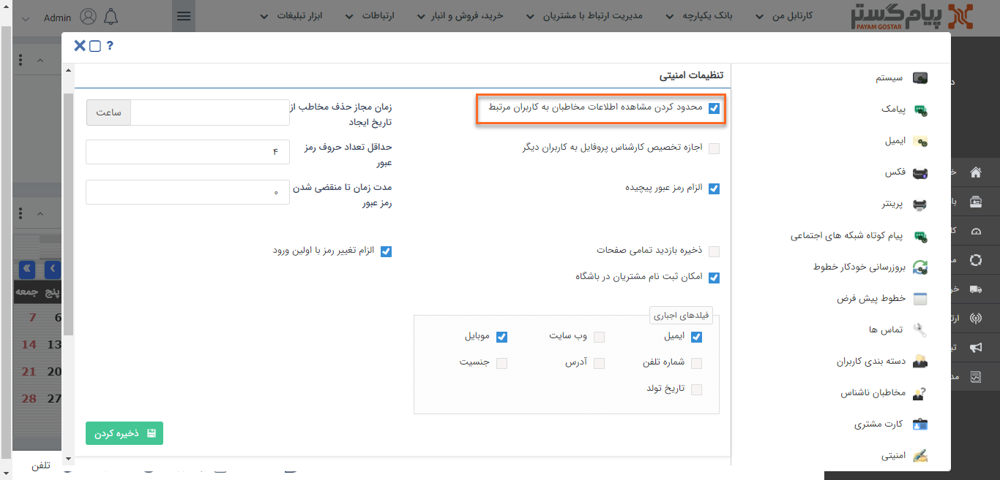
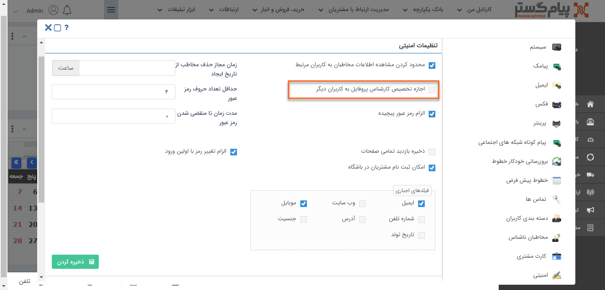
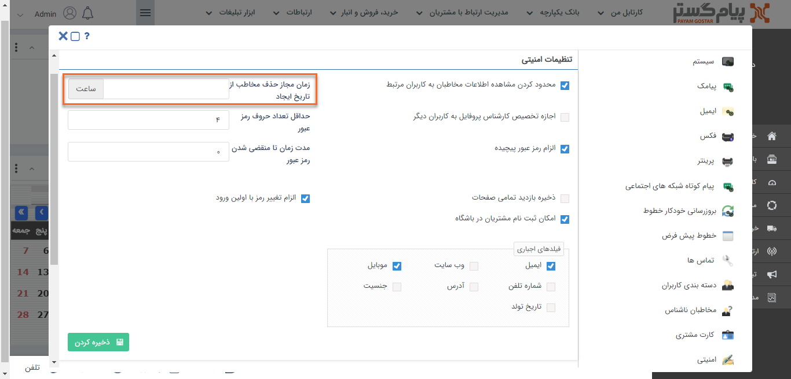
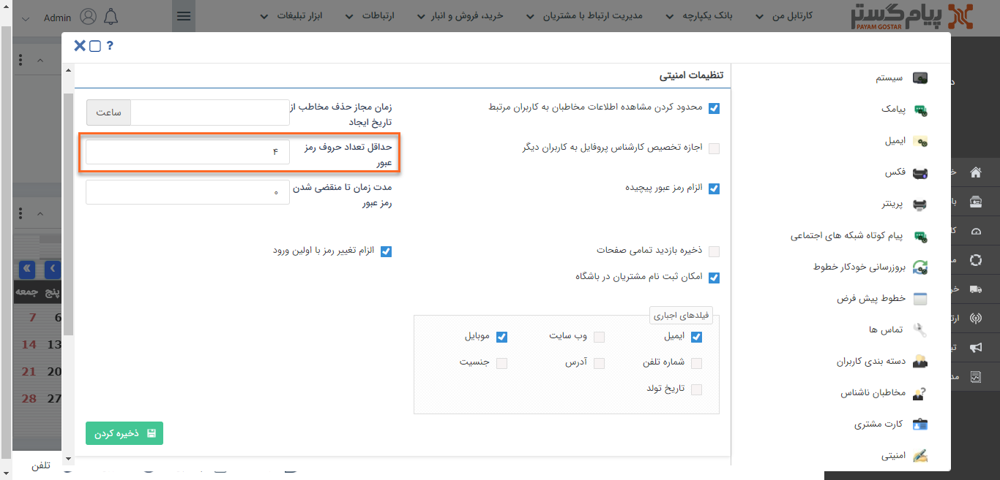
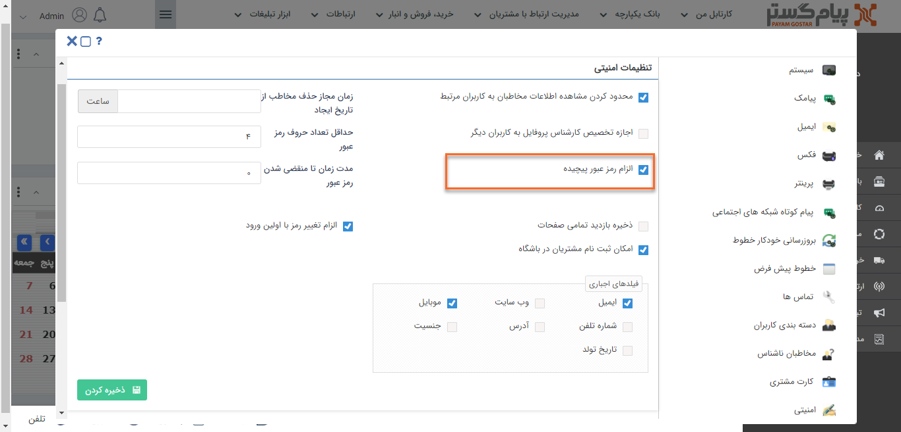
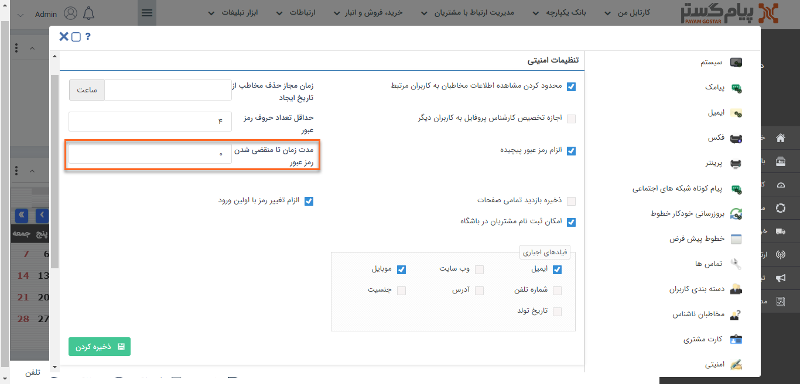
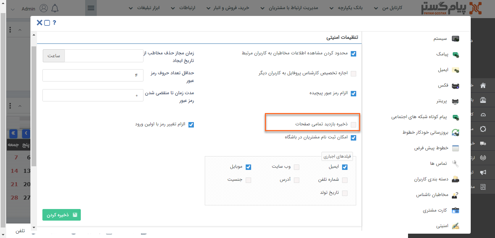
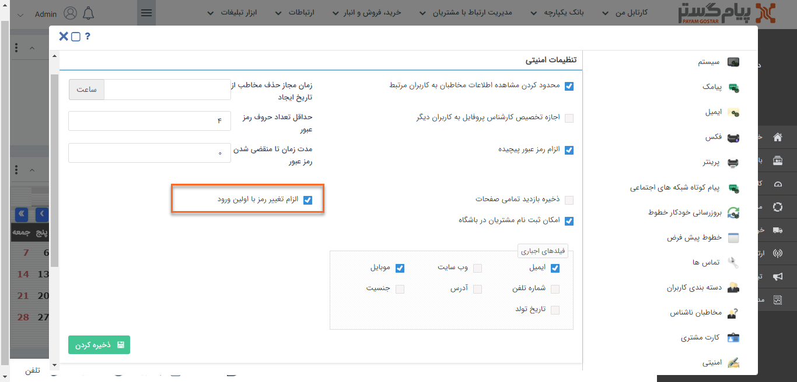
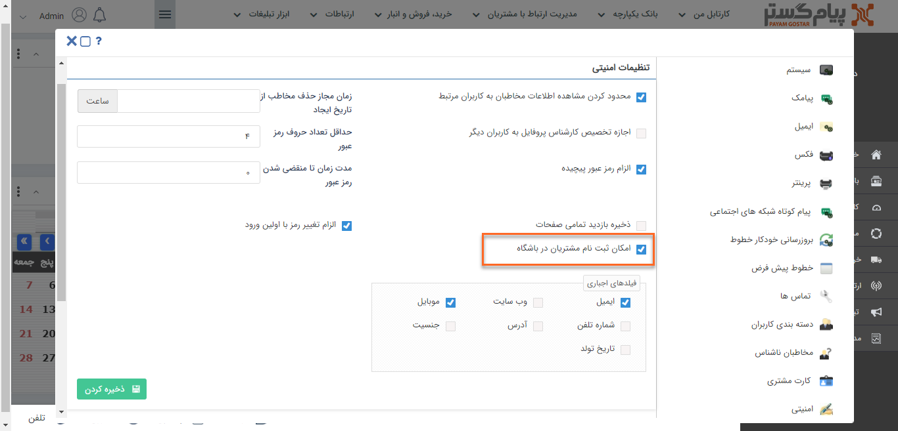
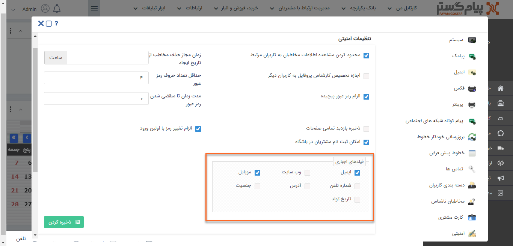

# تنظیمات امنیتی 

کاربران دارای دسترسی: **مدیر سیستم**/کاربر با مجوز **مدیریت تنظیمات**(برای مطالعه بیشتر به بخش **تعیین مجوزها** مراجعه کنید.)

1)   از منوی **تنظیمات**، بخش **تنظیمات کلی**، **امنیتی** را انتخاب کنید.

2)   محدود کردن مشاهده به کاربران مرتبط: برای عدم دسترسی کاربران به اطلاعات هویت‌های بانک اطلاعاتی، می‌‍توانید مشاهده هویت‌ها را به کاربرانی که به عنوان **مسئول** برای آن‌ها انتخاب شدند، محدود کنید.

منظور از مسئول پروفایل همان مسئول فروش، پشتیبانی و متفرقه است. 

3)   اجازه تخصیص کارشناس پروفایل به کاربران دیگر: با فعال کردن این گزینه مسئول پروفایل می‌تواند کاربر دیگری را به عنوان **جایگزین** برای خود انتخاب کند.

4)   زمان مجاز حذف مخاطب از تاریخ ایجاد: می‌توانید برای کاربرانی که مجوز حذف هویت را دارند محدودیتی براساس ساعت از زمان ایجاد هویت تعیین کنید به این صورت که بعد از این زمان دیگر امکان حذف هویت وجود ندارد.

5)   حداقل تعداد حروف رمز عبور: حداقل تعداد کاراکترهای موردنیاز برای تعریف رمزعبور کاربر را مشخص کنید.

6)   الزام رمز عبور پیچیده: در صورت فعال کردن این گزینه، رمز عبور کاربران باید حداقل شامل یک حرف بزرگ، یک حرف کوچک و عدد باشد. (توجه داشته باشید به محض فعال شدن این گزینه تمامی کاربرانی که از این لحظه وارد نرم افزار می شوند باید رمز عبور خود را به حالت رمز عبور پیچیده تغییر دهند.)

7)   مدت زمان تا منقضی شدن رمز عبور: درصورت این که می‌خواهید رمز عبور کاربران پس از مدتی منقضی شود، آن مقدار را براساس روز در این قسمت وارد کنید.

در صورت 0 قرار دادن این فیلد، محدودیتی برای کاربر در نظر گرفته نخواهد شد.

8)   ذخیره بازدید تمامی صفحات: در صورت فعال نمودن این گزینه، می‌توانید سابقه‌ی مشاهده آیتم‌ها توسط کاربران را در تاریخچه تغییرات آیتم مشاهده کنید.

9)    قابلیت الزام تغییر رمز با اولین ورود: در صورت فعال نمودن این گزینه، کاربران باید در اولین ورود خود به نرم افزار، رمزعبور خود را تغییر دهند.

10)  امکان ثبت نام مشتریان در باشگاه: در صورت فعال نمودن این گزینه، لینک ثبت نام در صفحه ورود به نرم افزار نمایش داده می شود و مشتریان می توانند برای دریافت کاربری باشگاه مشتریان، ثبت نام کنند.

11)  فیلدهای اجباری فرم ثبت نام: فیلدهایی که می‌خواهید در هنگام ثبت‌نام مشتری، بصورت الزامی باشند در این قسمت انتخاب کنید.

 

12) در انتها بر روی **ذخیره** کلیک کنید.