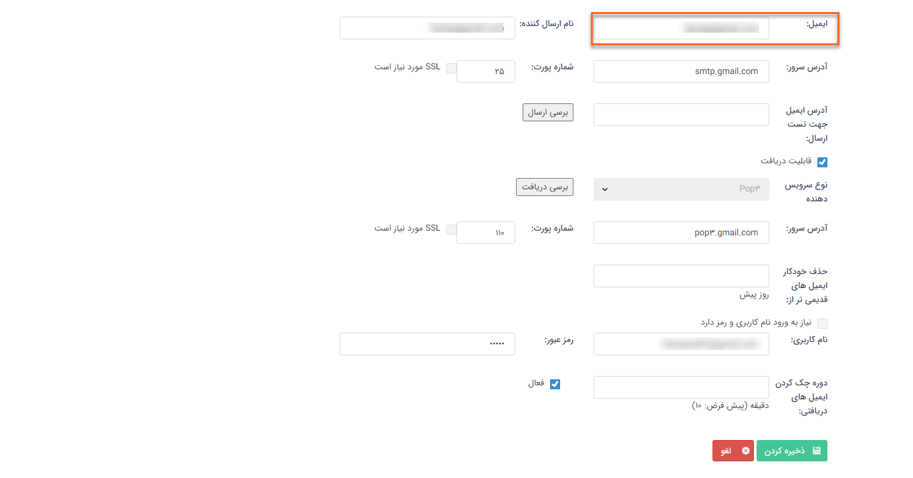
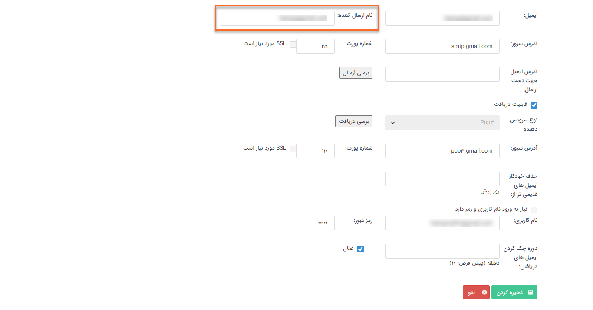
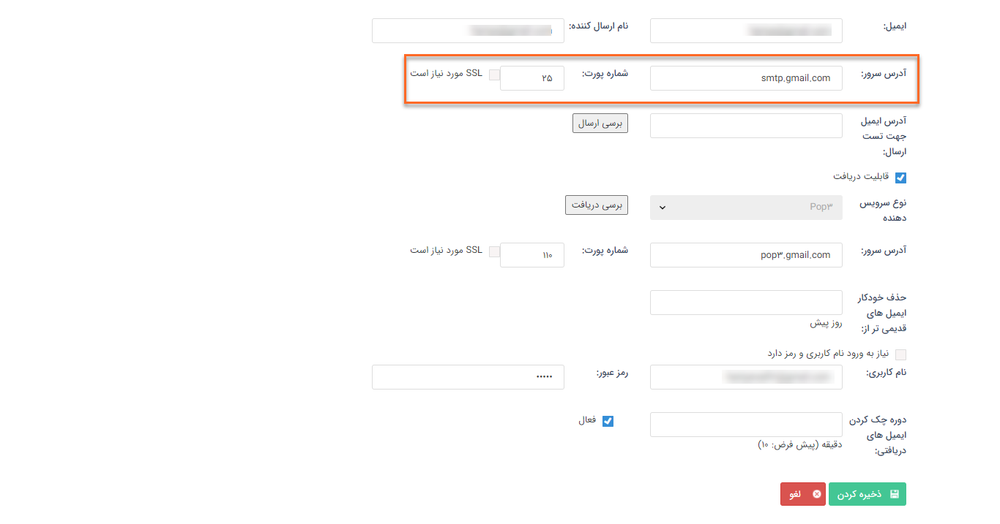
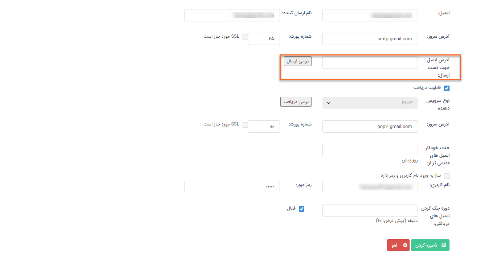
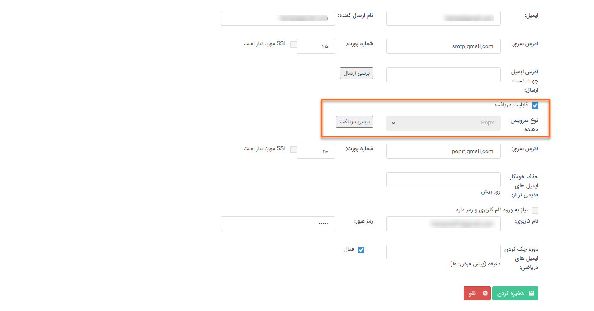
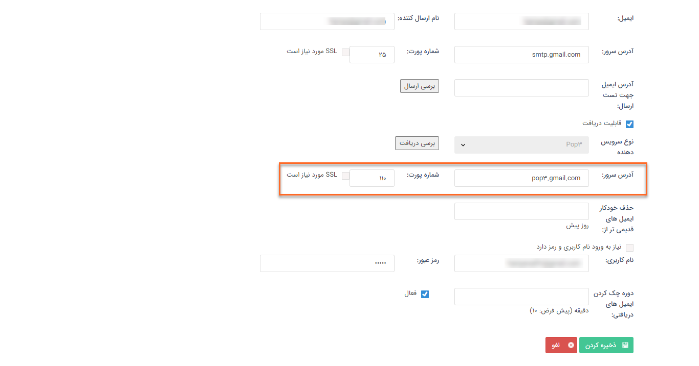
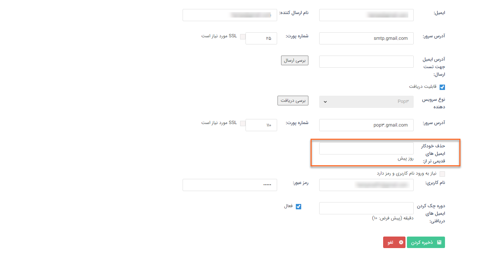
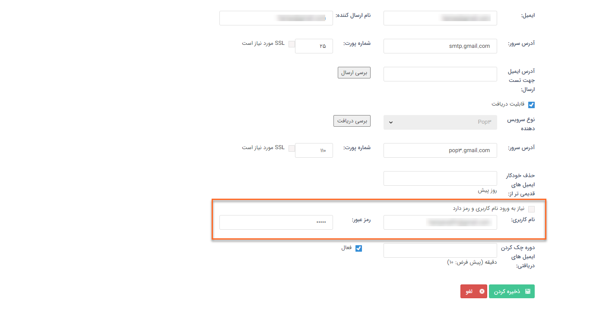
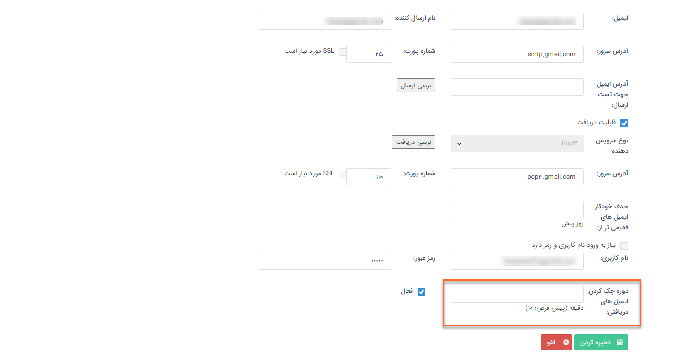
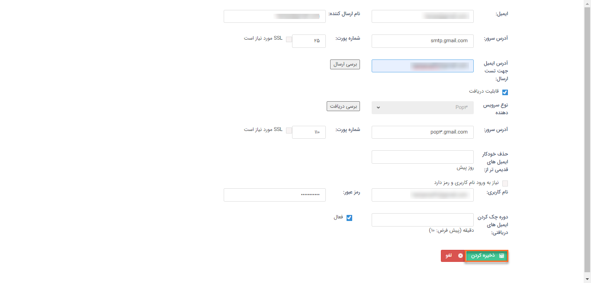

تعریف ایمیل‌های smtp

اگر می خواهید ایمیل های خود را از طریق [Gmail](http://www.gmail.com/) شخصی و یا شرکت خود ارسال نمایید، کافیست با ایجاد یک خط جدید و درج تنظیمات مربوطه، ایمیل های خود را ارسال کنید.

1)  از بخش **تنظیمات کلی**، قسمت **ایمیل**، **smtp** را انتخاب کنید.

2)   بر روی **افزودن** کلیک کنید.

3)  **نام دلخواهی** برای ایمیل خود تعریف کنید.

4)  با تعریف **نام ارسال کننده**، ایمیل ها در صندوق دریافت (Inbox) مخاطب با این عنوان نمایش داده می شود. 

                                                                                                                                                                                                                                                                     

5)  **آدرس سرور ارسال** Smtp و **شماره پورت** که سرویس دهنده ایمیل شما از آن استفاده می‌کند را تعریف کنید.

در صورت اینکه پروتکل ایمیل‌ شما ssl است ، چک باکس **ssl** **مورد نیاز است** را فعال کنید.

6)  برای بررسی صحت اطلاعات وارد شده، آدرس ایمیلی را در این بخش وارد کرده و **بررسی ارسال** را انجام دهید.

 

7)  برای دریافت ایمیل، گزینه **قابلیت دریافت** را فعال کنید و نوع **سرویس دهنده‌ی دریافت** مرتبط با ایمیل خود را انتخاب کنید.

**نکته:** تغییر سرور از pop3 به imap از لیست ایمیل ها با کلیک روی "تبدیل به imap" امکان پذیر است.

از **بررسی دریافت** برای بررسی صحت اطلاعات وارد شده استفاده کنید.

 

8)  **آدرس** دریافت ایمیل از طریق ارائه دهنده ایمیل و **شماره پورتی** که سرویس دهنده ایمیل شما برای دریافت از آن استفاده می‌کند را تعریف کنید.

در صورت اینکه پروتکل ایمیل‌ شما ssl است ، چک باکس **ssl** **مورد نیاز است** را فعال کنید.

9)  تعیین کنید که ایمیل‌‌های قدیمی بعد از چند روز **حذف** شوند.

 

10)   **نام کاربری** و **رمز عبور** ایمیل خود را وارد کنید.

 

11)    در این قسمت **مدت زمان** مورد نظر برای **بروزرسانی لیست ایمیل های دریافتی** (inbox) در نرم‌افزار را تعیین کنید.

12)  برای عدم استفاده از این آدرس ایمیل می‌توانید آن را **غیرفعال** کنید.

13)  در انتها بر روی **ذخیره کردن** کلیک کنید.

​                               

 

 