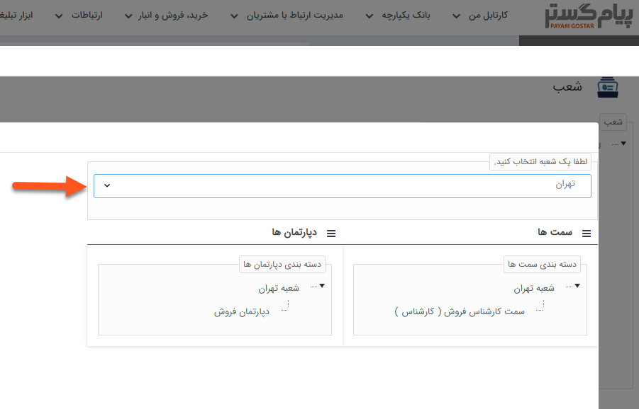

# چارت سازمانی خود را در پیام‌گستر تعریف کنید

کاربران دارای دسترسی‌: **مدیر سیستم** / افراد با مجوز **مدیریت شعب و دفاتر** (برای مطالعه بیشتر به بخش **تعیین مجوزها** مراجعه کنید.)

1)   از منوی  **اطلاعات پایه** ، بخش **مدیریت شعب، دپارتمان و سمت‌** را انتخاب کنید.

2)   با راست کلیک بر روی لیست شعب و انتخاب کلید **اضافه** می‌توانید شعبه جدیدی را ایجاد کنید.

 برای برقراری ارتباط از طریق وب سرویس، **کلیدی** برای شعبه خود تعریف کنید.

3)   با راست کلیک بر روی هر شعبه می‌توانید سطح دسترسی، دپارتمان، سمت‌های مرتبط با آن شعبه را مشخص  و شعب زیرمجموعه‌ای برای آن ایجاد کنید.

4)   همچنین برای تغییر سمت‌ها و دپارتمان‌های شعبه موردنظر می‌توانید **نام شعبه** را از این بخش انتحاب کنید.

5)   با راست کلیک بر روی هر **دپارتمان** و **سمت** نیز می‌توانید سطح دسترسی و زیر مجموعه‌ای برای آن‌ها تعریف و یا آن‌ها را **غیرفعال** کنید.

**نکته:** توجه داشته باشید در صورتی که سمت موردنظر را به کاربری اختصاص داده باشید، امکان **غیرفعال** کردن آن وجود ندارد.

**نکته:** در صورت تعیین مجوز برای یک سمت و یا دپارتمان، کاربری که آن سمت به او اختصاص داده شده و یا کاربری  که یک سمت فعال در آن دپارتمان داشته باشد، مجوزهای تعیین شده را به ارث خواهد برد.

