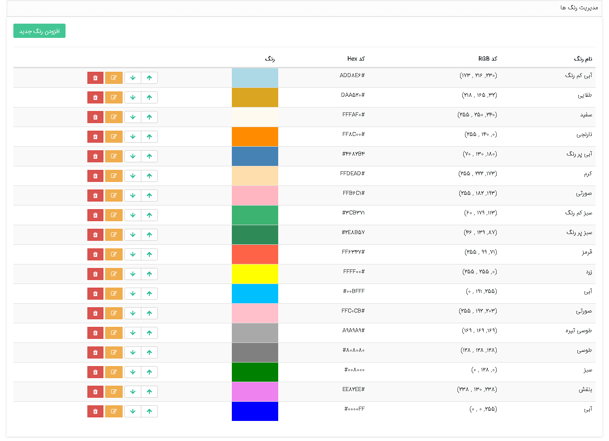

در **مدیریت رنگ‌ها** امکانات زیر وجود دارد : 

-    **تعریف رنگ جدید** 
- ​    **ویرایش و حذف رنگ‌ها** 

شما می‌توانید برای رنگ‌بندی تقویم‌ها، هویت‌ها ،اقدامات فرآیندهای کاری و ... از رنگ‌های موجود در این بخش استفاده کنید. 

کاربران دارای دسترسی: **مدیرسیستم**/کاربر با مجوز **مدیریت رنگ‌ها**(برای مطالعه بیشتر به بخش **[تعیین مجوزها](file%3A%2F%2F%2FC%3A%5CUsers%5CH.abasi%5CDocuments%5CGitHub%5CPayamGostarDocs%5Chelp2.5.4%20new%5CGetting-Started%5C%D9%85%D8%AF%DB%8C%D8%B1%DB%8C%D8%AA%20%DA%AF%D8%B1%D9%88%D9%87%E2%80%8C%D8%A7%20%D9%88%20%DA%A9%D8%A7%D8%B1%D8%A8%D8%B1%D8%A7%D9%86%5C%D8%AA%D8%B9%DB%8C%DB%8C%D9%86%20%D8%B3%D8%B7%D8%AD%20%D8%AF%D8%B3%D8%AA%D8%B1%D8%B3%DB%8C.md)** مراجعه کنید.)

1)  از منوی **اطلاعات‌پایه**، **مدیریت رنگ‌ها** را انتخاب کنید.

2)  بر روی **افزودن رنگ جدید** کلیک کنید.

3)  برای رنگ مورد نظر **عنوان** و **توضیحاتی** (که بصورت متن راهنما نمایش داده‌خواهد شد) وارد نمایید.

4)  می‌توانید **رنگ جدید** را براساس **نام رنگ**، **انتخاب رنگ** و یا **کد رنگ** موردنظر ایجاد کنید.

5)  بر روی **ذخیره تغییرات** کلیک کنید.

6)   **ترتیب نمایش** رنگ‌ها در لیست را می‌توانید تعیین کنید.

نکنه: توجه داشته‌باشید در صورتی که از رنگ موردنظر استفاده کرده باشید، امکان حذف آن را ندارید.