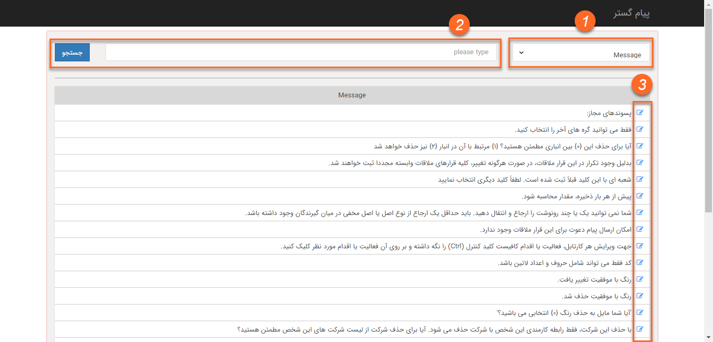

# ویرایش عبارت‌ها 

کاربران دارای دسترسی: **مدیر سیستم** 

 از منوی **اطلاعات پایه**، بخش **مدیریت زبان‌ها**، **ویرایش عبارت‌ها** را انتخاب کنید.

1)  نوع عبارت‌های مورد نظر برای مشاهده در لیست را انتخاب کنید.

2)  همچنین با وارد کردن **کلید متناظر با هر عبارت**، می‌توانید عبارت موردنظر خود را فیلتر کنید.

توجه داشته باشید نیازی به وارد کردن کلید به صورت کامل نیست، با وارد کردن قسمتی از کلید هم می توانید عبارت موردنظر خود را پیدا کنید.

3)  **معادل عبارت** را، در زبان مورد نظر وارد کرده و تغییرات را ذخیره کنید.