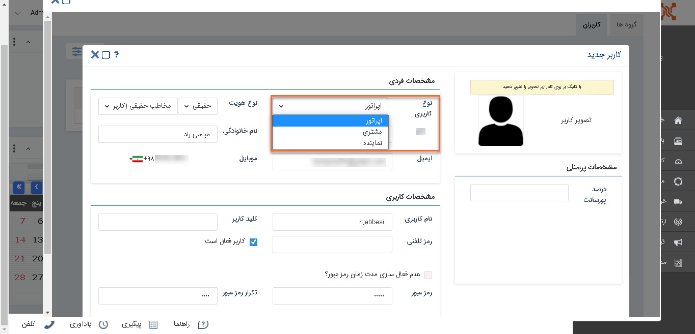
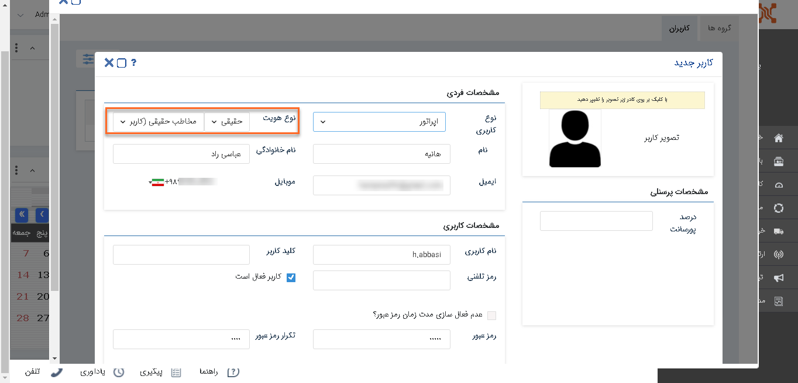
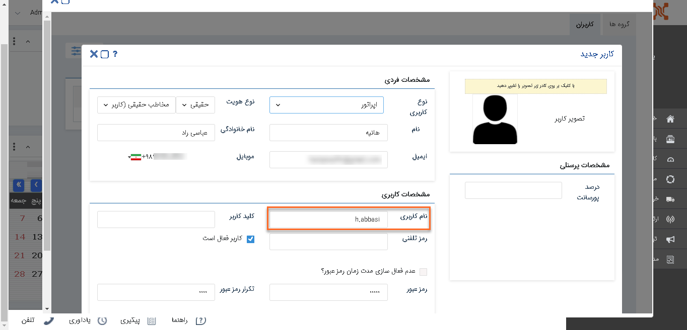
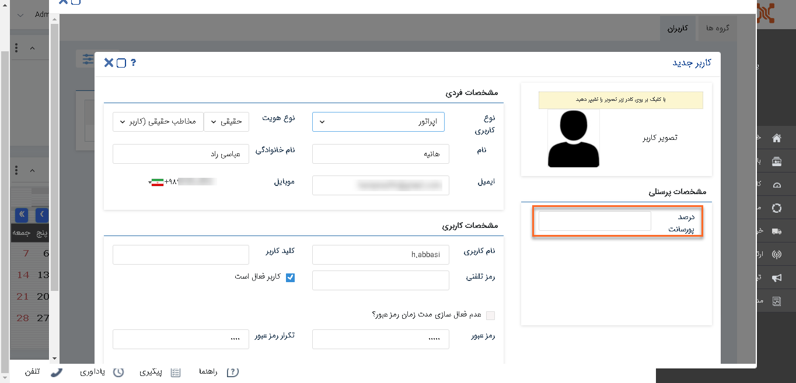
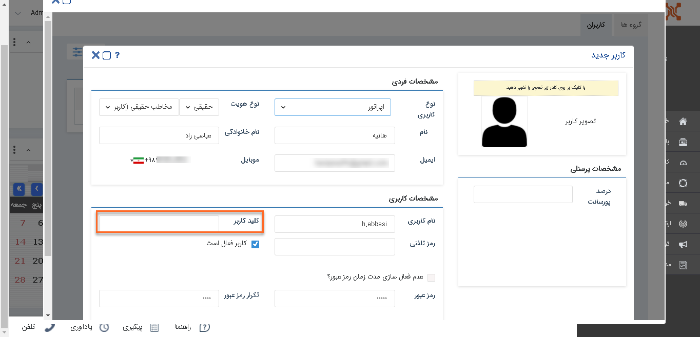
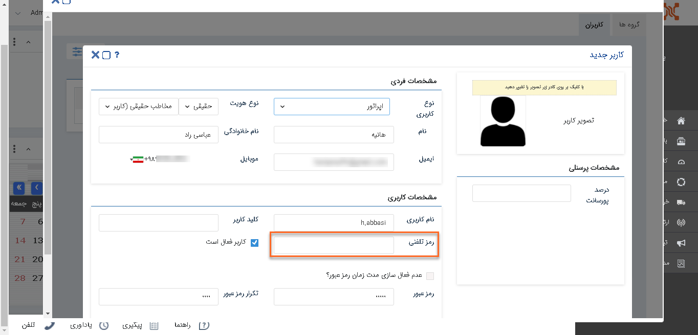
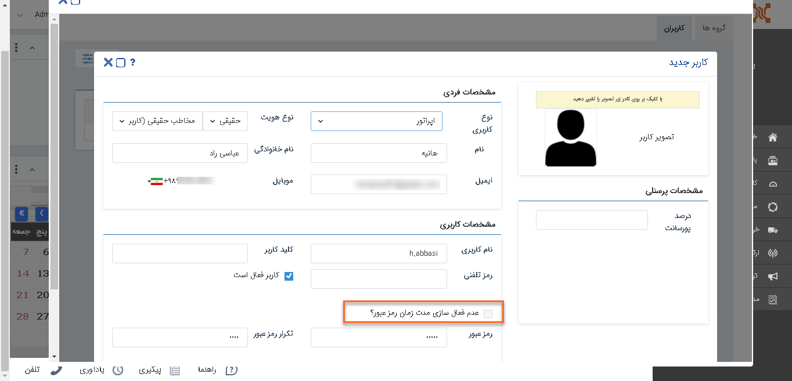
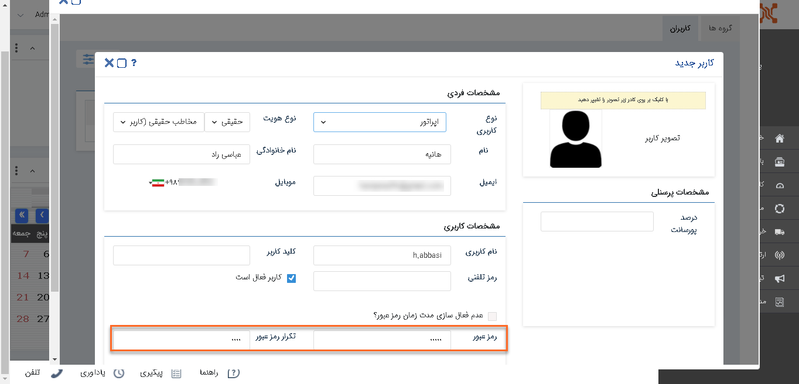
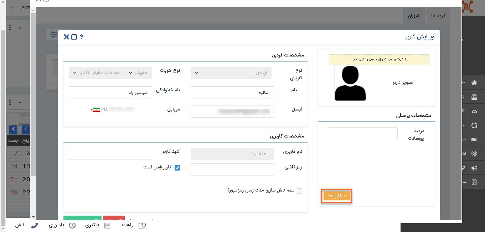

# کاربر جدید ایجاد کنید

بصورت معمول می‌توانید 3 کاربر در نرم‌افزار تعریف کنید و در صورت نیاز باید به تعداد موردنظر بسته کاربری خریداری کنید.

کاربران دارای دسترسی:**مدیر سیستم** / کاربر با **مجوز مدیریت کاربران** (برای مطالعه بیشتر به بخش **[تعیین مجوزها](%D8%AA%D8%B9%DB%8C%DB%8C%D9%86%20%D8%B3%D8%B7%D8%AD%20%D8%AF%D8%B3%D8%AA%D8%B1%D8%B3%DB%8C.md)** مراجعه کنید.)

1)   از منوی **تنظیمات**، بخش **مدیریت گروه‌ها و کاربران** را انتخاب کنید.

2)   بر روی **کاربر جدید** کلیک کنید.

3)	**مشخصات فردی** و **کاربری**، کاربر جدید را وارد کنید.

4)  **نوع کاربری:** در پیام‌گستر سه نوع حساب کاربری می‌توانید ایجاد کنید:

 **اپراتور:** کاربر عادی نرم‌افزار می‌باشد که با توجه به مجوزهایش به بخش‌های مختلف نرم‌افزار دسترسی دارد.

**نماینده:** نماینده نیز همانند کاربر  می‌باشد که می‌تواند نماینده فروش و یا ... شما در خارج سازمان باشد.

**مشتری:** می‌توانید برای مشتریان به منظور دسترسی به پنل باشگاه مشتریان حساب کاربری ایجاد کنید.(مشتری جزو کاربران فعال شما محسوب نمی‌شود.)

5) **نوع هویت:** حقیقی و یا حقوقی بودن کاربر را انتخاب و **اطلاعات فردی** کاربر را تکمیل کنید.

6) **نام کاربری**: **نام‌کاربری** باید به زبان انگلیسی و حداقل شامل 5 کاراکتر باشد.(توجه داشته باشید پس از ایجاد کاربر، نام کاربری او قابل ویرایش نیست.)

7) **درصدپورسانت:** اگر قرار باشد کاربر پورسانتی از فروش‌هایی که انجام می دهد (فاکتورها و قراردادهایی که در پیام گستر با نام او ثبت می شود) را دریافت کند، آن **درصد پورسانت** را در این بخش تعریف کنید.

8) **کلیدکاربر:** برای ارتباط با سایر نرم‌افزارها کلید کاربر تعریف کنید.

9) **رمزتلفنی:** در صورت استفاده از **سیستم تلفنی ویپ** می توانید رمز تلفنی تعریف کنید تا در صورت تماس کاربر و ی مشتری با شرکت، رمز را وارد کند و توسط سیستم این رمز بررسی گردد.(برای نمونه می توان مشخص کرد در صورت درست بودن رمز تلفنی، تماس مشتری به پشتیبانی متصل شود.)

10) **عدم فعالسازی مدت زمان رمز عبور :**اگر میخواهید رمز عبور کاربر هیچ‌گاه منقضی نشود، باید این گزینه را فعال کنید.

11) برای تنظیم مقدار پیشفرض **زمان منقضی شدن رمز عبور**، بخش  تنظیمات امنیتی را مطالعه کنید.

**رمزعبور :** رمز عبور پیش‌فرضی برای کاربر تعریف کنید.(کاربر در اولین ورود باید این رمز عبور را تغییر دهد.)

12)   روی **ذخیره** کلیک کنید.

پس از ذخیره کاربر جدید، هویتی مرتبط با آن در بانک اطلاعاتی ایجاد می‌گردد که مسیر ذخیره آن هویت از **تنظیمات دسته بندی کاربران** مشخص می‌شود، با کلیک بر روی **جزئیات** می‎‌توانید اطلاعات این هویت را مشاهده کنید.

13) **داخلی‌ها:** پس از ذخیره کاربر در صورت استفاده از سیستم‌های تلفنی، می‌توانید **داخلی** مرتبط با کاربر را در این بخش انتخاب کنید.

توجه داشته باشید که کاربر در صورت **فعال** بودن می‌تواند با نام کاربری و رمزعبور خود وارد نرم‌افزار شود.
