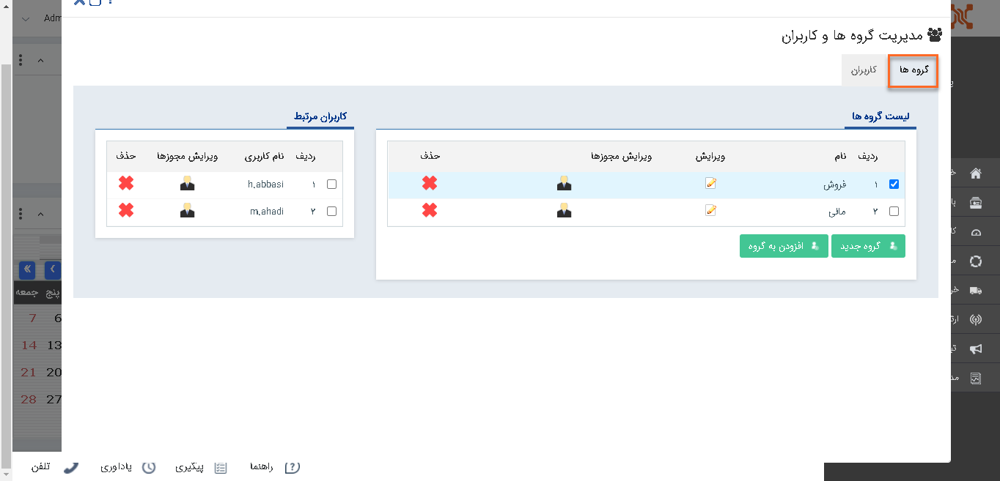
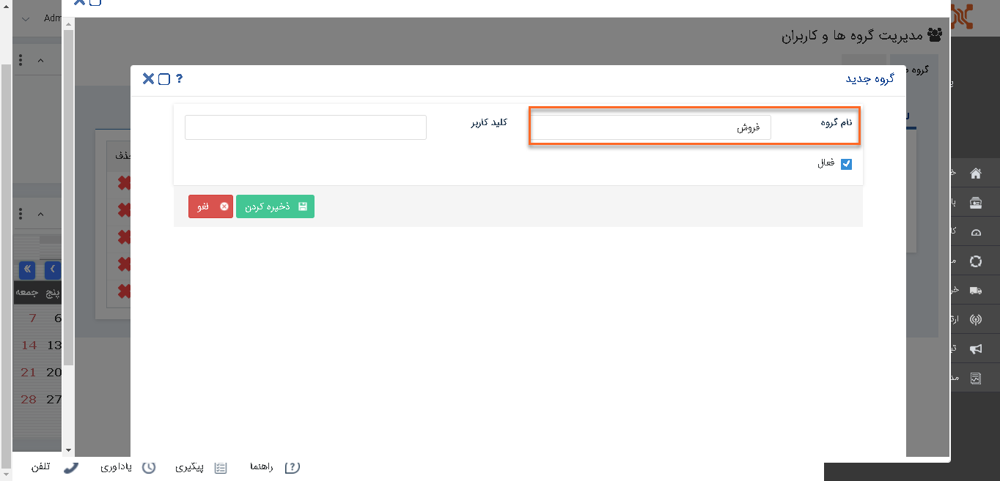
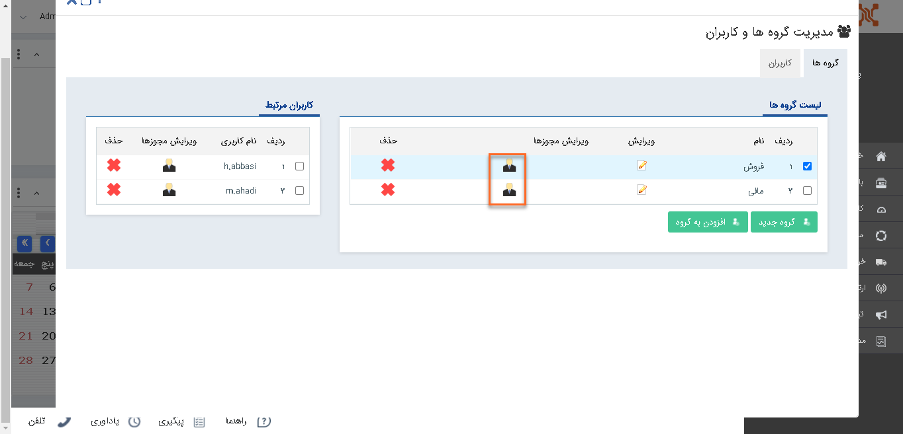

# برای کاربران خود گروه کاربری تشکیل دهید

کاربران دارای دسترسی: **مدیر سیستم**/کاربران با **مجوز مدیریت کاربر** (برای مطالعه بیشتر به بخش **[تعیین مجوزها](%D8%AA%D8%B9%DB%8C%DB%8C%D9%86%20%D8%B3%D8%B7%D8%AD%20%D8%AF%D8%B3%D8%AA%D8%B1%D8%B3%DB%8C.md)** مراجعه کنید.)

1)   از منوی **تنظیمات**، بخش **مدیریت گروه‌ها و کاربران** را انتخاب کنید.

2)   در این بخش**، تب گروه‌ها** را انتخاب کنید.

3)   بر روی **گروه جدید** کلیک کنید.

4)   با انتخاب نام برای گروه مورد نظر، آن گروه را **ذخیره** کنید.

5)   پس از ذخیره گروه می توانید با انتخاب گروه و  کلیک بر روی **افزودن به گروه**، کاربر موردنظر را به آن گروه اضافه کنید.

6)   با استفاده از **ویرایش مجوزها** می‌توانید سطح دسترسی این گروه کاربری را تعیین کنید.

