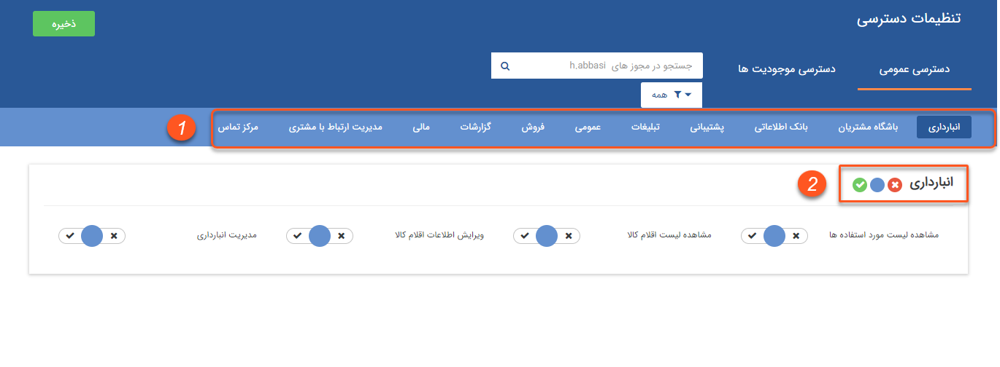


# تعیین سطح دسترسی 

تعیین سطح دسترسی کاربر به نرم‌افزار می‌تواند بصورت فردی، از طریق گروهی که کاربر عضو آن می‌باشد، شعبه، دپارتمان و یا سمتی که به کاربر اختصاص داده شده، انجام شود.(برای تخصیص سمت به کاربر بخش **مدیریت حکم‌های پرسنلی** را مطالعه کنید.)

در شخصی سازی crm  هم امکان تعریف مجوز بر روی آیتم های نرم افزار وجود دارد. برای مطالعه بیشتر به بخش **شخصی سازی-مجوزهای آیتم** مراجعه کنید.

**نکته:** بدلیل اینکه می‌توانید  مجوزها را از چند طریق به کاربران اختصاص دهید، در نظر داشته باشید که  مجوزها به این صورت کار میکند : مجوزی که به خود کاربر اختصاص داده شده باشد، ارجعیت بالاتری از سایر مجوزها دارد و  همچنین مجور"ندارد" بر مجوز "دارد" ارجعیت دارد.

**نکته :** توجه داشته‌باشید در صورت اعمال مجوز بر روی سمت‌ها، الویت مجوزها به عنوان نمونه بصورت زیر می‌باشد:

 در صورتی که سمت A  زیرمجموعه سمت B باشد، تمامی مجوزهای سمت A به کاربر دارای مجوز سمت B اختصاص می یابد.

کاربران دارای دسترسی: **مدیر سیستم** / کاربر با **مجوز مدیریت کاربران** 

1) از منوی **تنظیمات**، بخش **مدیریت گروه‌ها و کاربران**، **ویرایش مجوز** کاربر مورد نظر را انتخاب کنید.

2) **[دسترسی عمومی:](%D8%AA%D8%B9%DB%8C%DB%8C%D9%86%20%D9%85%D8%AC%D9%88%D8%B2%D9%87%D8%A7%DB%8C%20%D8%B9%D9%85%D9%88%D9%85%DB%8C.md)** در این قسمت دسترسی‌ کاربر به **بخش‌های عمومی** نرم‌افزار را تعیین کنید.

3) **[دسترسی موجودیت‌ها](%D8%AA%D8%B9%DB%8C%DB%8C%D9%86%20%D9%85%D8%AC%D9%88%D8%B2%D9%87%D8%A7%DB%8C%20%D9%85%D9%88%D8%AC%D9%88%D8%AF%DB%8C%D8%AA%E2%80%8C%D9%87%D8%A7.md):** برای تعیین دسترسی کاربر بر روی **موجودیت های نرم افزار** (اعم از فاکتور، پیش فاکتور، فرم، مخاطبان، سرنخ ها و ...)  از این بخش استفاده کنید.

4)	با کلیک بر روی هر **بخش** میتوانید مجوزهای مربوط به آن را مشخص کنید. ( برای مثال اگر روی انبارداری کلیک کنید، مجوزهای مربوط به انبارداری نمایش داده می‌شود.)

5) میتوانید مجوزهای هر بخش را **بصورت گروهی** تغییر دهید.

کلید آبی مجوزهای هر بخش را بصورت خنثی در می‌آورد، و حالت خنثی به معنی نداشتن اون مجوز می‌باشد، مگر این که کاربر این مجوز را از روش دیگری دریافت کند.
