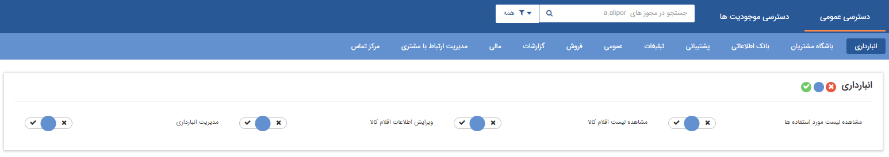
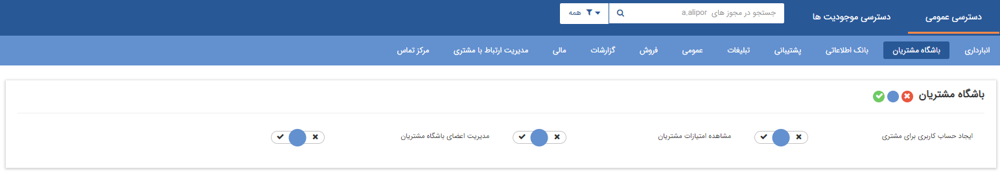
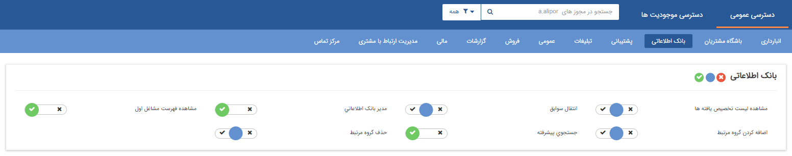
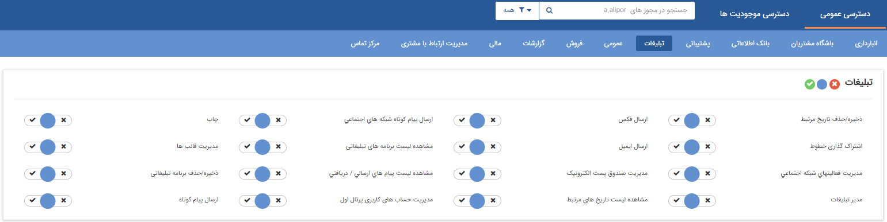
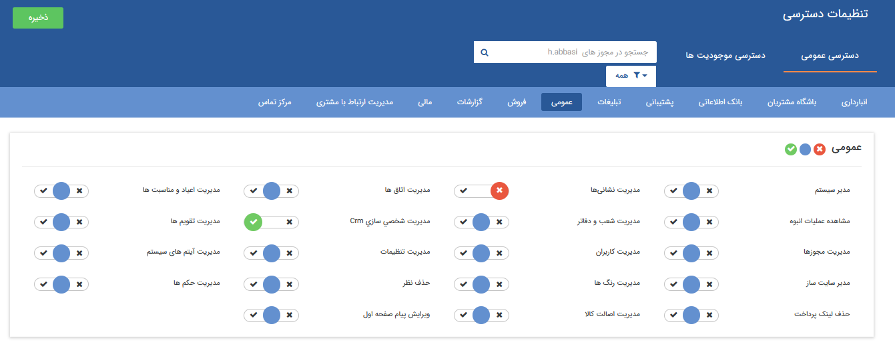
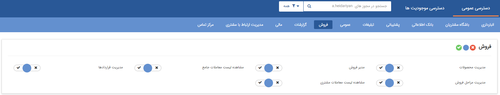
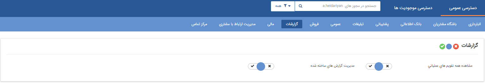
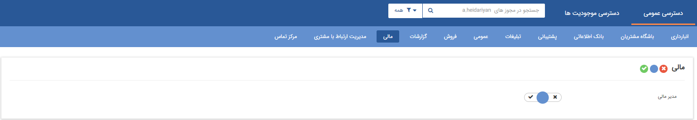
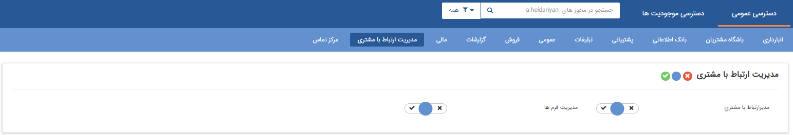
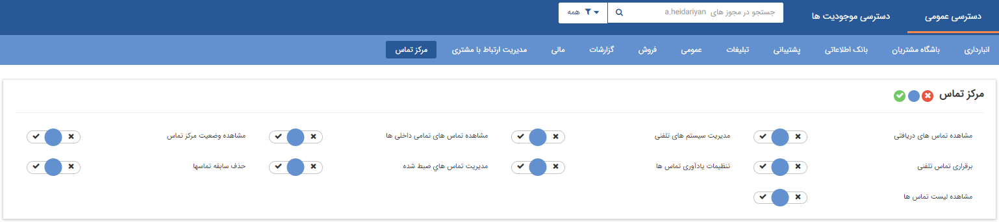

# تعیین دسترسی کاربران به بخش‌های عمومی 

عملکرد مجوزهای **قسمت عمومی** به شرح ذیل است:

## انبارداری

•	**مدیریت انبارداری:**  دسترسی به منوی  مدیریت انبارها و  گزارشات انبار 

•	**مشاهده لیست اقلام کالا:** حالت آزمایشی است.

•	**مشاهده لیست مورد استفاده ها:** حالت آزمایشی است.

•	**ویرایش اطلاعات اقلام کالا:**  دسترسی به صفحه  ویرایش قلم کالا

## باشگاه مشتریان

•	**ایجاد حساب کاربری برای مشتری:** حالت آزمایشی است.

•	**مدیریت اعضای باشگاه مشتریان:** دسترسی به منوی  مدیریت اعضای باشگاه مشتریان 

•	**مشاهده امتیازات مشتریان:** دسترسی به صفحه‌ی امتیازات مشتری در هویت‌ها و امکان ثبت تراکنش جدید

## بانک اطلاعاتی

•	**انتقال سوابق:** دسترسی به کلید انتقال سوابق موجود در هویت

•	**جستجوی پیشرفته:** دسترسی به منوی  جستجوی پیشرفته در  بانک یکپارچه  

•	**مدیر بانک اطلاعاتی:** امکان دریافت خروجی اکسل از هویت‌های بانک اطلاعاتی، مشاهده دسته بندی‌های اختصاصی شده توسط کاربران

•	**مشاهده فهرست مشاغل اول:** امکان مشاهده بانک فهرست مشاغل اول (یکی از بانک های اطلاعاتی قابل تهیه در نرم افزار)  و همچنین مشاهده تمام دسته بندی های موجود در بانک یکپارچه 

•	**مشاهده لیست تخصیص یافته ها:** دسترسی به منوی تخصیص یافته ها  در مدیریت ارتباط با مشتری  

## پشتیبانی

•	**مدیر پشتیبانی:** امکان مشاهده  گزارش های CRM 

•	**مدیریت درخواست ها:** امکان مشاهده لیست  درخواست ها در مدیریت درخواست ها 

## تبلیغات

o	**ارسال ایمیل:**  امکان ارسال ایمیل از طریق خطوطی که کاربر دسترسی دارد.

o	**ارسال پیام کوتاه:** امکان ارسال پیامک از طریق خطوطی که کاربر دسترسی دارد.

o	**ارسال فکس:** اجازه ارسال فکس از طریق خطوطی که کاربر دسترسی دارد.

o	**اشتراک گذاری خطوط:** امکان به اشتراک گذاری خطوط پیام‌کوتاه، ایمیل، فکس و چاپ با سایر کاربراندر نظر داشته باشید تعریف و یا ویرایش خطوط نیازمند مجوز مدیریت تنظیمات می‌باشد.

o	**چاپ:** امکان پرینت از طریق خطوطی که کاربر دسترسی دارد.

o	**ذخیره/حذف برنامه تبلیغاتی:** امکان ایجاد و ویرایش کمپین در بخش تبلیغات>مدیریت کمپین‌ها

o	**ذخیره/حذف تاریخ مرتبط:** امکان ذخیره یک تاریخ مرتبط در قسمت تاریخ های مهم هویت

o	**مدیر تبلیغات:** امکان مشاهده گزارشهای مرتبط با تبلیغات مانند گزارش های تحلیلی(غیر از گزارش نمودار وضعیت فروش)، مشاهده لیست تمام برنامه های تبلیغاتی، همچنین کاربر در صورت داشتن مجوز "مدیریت تنظیمات" در مجوز های عمومی به همراه این مجوز می تواند در بخش تنظمیات کلی، تمام خطوط پیامکی،ایمیل و فکس  تعریف شده در نرم افزار را مشاهده کند، در صورت نداشتن این مجوز فقط می تواندخطوطی که روی آن مجوز دارد را مشاهده کند .

o	**مدیریت حساب های کاربری پرتال اول:**دسترسی به مشخصات کاربری در منوی 1st.ir 

o	**مدیریت صندوق پست الکترونیک:** دسترسی منوی صندوق پست الکترونیک 

o	**مدیریت قالب ها:** دسترسی به منوی مدیریت پیام های الگو

o	**مشاهده لیست های ارسالی/دریافتی:** امکان مشاهده‌ی لیست های ارسال/دریافت رسانه های مختلف

o	**مشاهده لیست برنامه های تبلیغاتی:** امکان مشاهده تمامی برنامه های تبلیغاتی و همچنین امکان مشاهده صفحه مدیریت کمپین های تبلیغاتی 

o	**مشاهده لیست تاریخ های مرتبط:** دسترسی به منوی تاریخ های مرتبط در مدیریت ارتباط با مشتریان 

## عمومی

•	**حذف نظر:**  امکان حذف نظرات ثبت شده توسط کاربران

•	**مدیر سیستم:** به عنوان راهبر نرم افزار تعیین می شود و به تمامی قسمت های نرم افزار دسترسی دارد.

 اجازه حذف و یا ویرایش تمامی آیتم ها و دسترسی به تمامی منو ها (توجه داشته باشید که مدیر انبارها به صورت جداگانه در منوی مدیریت انبارها تعیین می شود.)

•	**مدیریت تقویم ها:** دسترسی به منوی  مدیریت تقویم ها 

•	**مدیریت شخصی سازی CRM:** دسترسی به منوی شخصی سازی CRM در بخش نمای کلی و امکان ویرایش موجودیت های اصلی و اضافه کردن زیر نوع موجودیت 

•	 **مدیر سایت ساز:** دسترسی به امکانات سایت ساز 

•	**مدیریت آیتم های سیستم:** دسترسی به مدیریت آیتم های سیستم 

•	**مدیریت اتاق ها:** دسترسی به  مدیریت اتاق ها  

•	**مدیریت اصالت کالا:** دسترسی به  مدیریت اصالت کالا 

•	 **مدیریت اعیاد و مناسبت ها:** دسترسی به  مدیریت اعیاد و مناسبت ها 

•	**مدیریت تنظیمات:**دسترسی به تنظیمات کلی  

•	**مدیریت حکم ها:** دسترسی به  مدیریت حکم های پرسنلی  

•	**مدیریت رنگ ها:** دسترسی به  مدیریت رنگ ها  

•	**مدیریت شعب و دفاتر:** دسترسی به  مدیریت شعب - دپارتمان و سمت  

•	**مدیریت فیلدها:** ***حالت آزمایشی است.***

•	**مدیریت کاربران:** دسترسی به  مدیریت گروه ها و کاربران  

•	**ویرایش پیام صفحه اول:** امکان ویرایش پیام ویجت اعلان عمومی 

•	**مدیریت نشانی ها :**  دسترسی به  مدیریت نشانی ها 

## فروش

•	**مدیر فروش:** امکان مشاهده‌ی گزارشات مرتبط با فروش مانند  گزارشات تحلیلی ،  گزارشات فروش و دسترسی به  مدیریت فاکتورها  

•	**مدیریت قراردادها:** دسترسی به   مدیریت قراردادها  

•	**مدیریت محصولات:** دسترسی به  مدیریت محصولات 

•	**مشاهده لیست معاملات جامع:** امکان دسترسی به  بخش مورد معامله  و مورد مذاکره 

•	 **مشاهده لیست معاملات مشتری:** دسترسی به بخش معاملات هویت

## گزارشات 

•	**مدیریت گزارش های ساخته شده:** امکان تهیه گزارش از تمامی آیتم‌ها، حذف و ویرایش گزارشات ایجاد شده در بخش دسته‌بندی گزارش‌ها

•	**مشاهده همه تقویم های عملیاتی:** حالت آزمایشی است.

## مالی

•	**مدیر مالی:** امکان مشاهده گزارشهای مالی مانند گزارش مانده حساب مشتریان، جزئیات عملکرد فروش، گزارش میزان دریافت ماهانه فاکتور ها از قسمت گزارش های محاسبه پور سانت، گزارش مانده حساب مشتریان، گزارش مشتریان غیر فعال و گزارش جزئیات عملکرد  و همچنین گزارش های مجموع عملکرد (به جز مجموع فروش به تفکیک محصولات و ومجموع فروش به تفکیک کارشناسان که نیاز به مجوز مدیر مالی دارند) 

•	دسترسی به بخش مدیریت حساب های مالی و در لیست دریافت/پرداخت امکان حذف چند آیتم دریافت و پرداخت باهم وجود دارد.

10)مدیریت ارتباط با مشتری:

•	**مدیر ارتباط با مشتری:** امکان مشاهده گزارشات CRM و گزارشات فرآیندی 

•	**مدیریت فرم ها:** دسترسی به منوی  مدیریت فرم ها 

## مرکزتماس

•	**برقراری تماس تلفنی:** امکان برقراری تماس از درون نرم‌افزار با کلیک بر روی شماره تماس مخاطب این امکان در صورت استفاده از سیستم تلفنی ویپ فراهم می‌شود.

•	**تنظیمات یادآوری تماس ها:** دسترسی به منوی  تنظیمات یادآوری تماس ها 

•	**حذف سابقه تماس ها:** امکان حذف سابقه تماس ها از منوی تماس ها  و تماس‌های موجود در هویت

•	**مدیریت تماس های ضبط شده:** امکان دسترسی به تماس‌های ضبط شده

•	**مدیریت سیستم های تلفنی:** دسترسی به  مدیریت سیستم های تلفنی 

•	**مشاهده تماس های تمامی داخلی ها:** امکان مشاهده تمامی تماس‌های ورودی در نوار ابزار تلفن با توجه به داخلی های تنظیم شده در  مدیریت سیستم های تلفنی (از بخش تنظیمات امنیتی می توانید مشاهده تماس های ورودی را برای کاربران خود محدود کنید.)

•	**مشاهده تماس های دریافتی:** امکان استفاده از منوی  تلفن، مشاهده تماس های ورودی، ثبت شماره یا سابقه برای مخاطب

•	**مشاهده لیست تماس ها:** امکان مشاهده سوابق تماس در منوی  تماس ها  

•	 **مشاهده وضعیت مرکز تماس:** دسترسی به  وضعیت مرکز تماس  (میتوانید وضعیت داخلی ها را مشاهده کنید و یا درصورت نیاز با کاربر خود از طریق سیستم در حین مکالمه صحبت کنید.)

