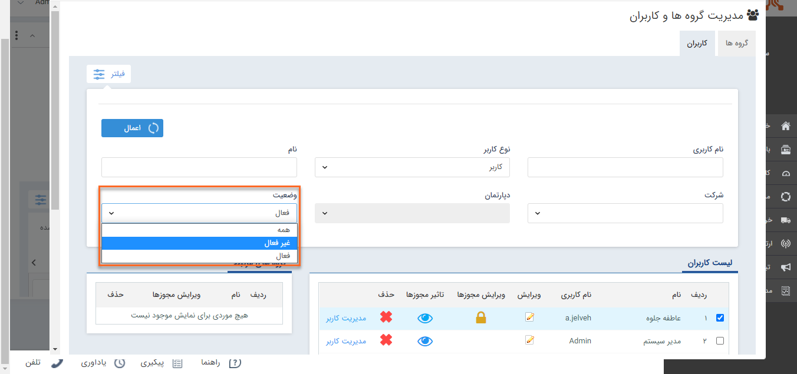
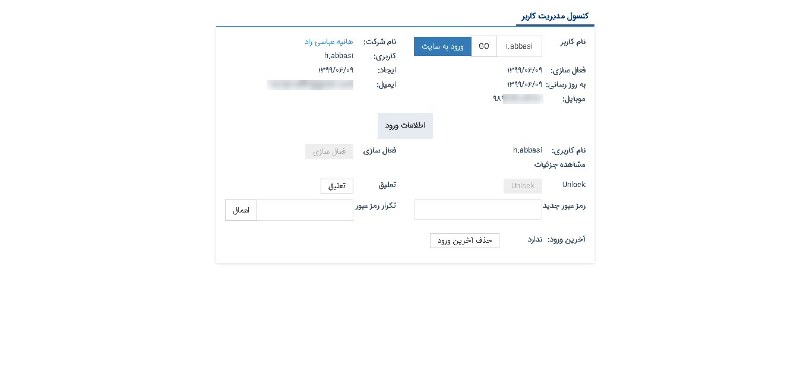

# به لیست کاربران برای استفاده از امکانات زیر مراجعه کنید

کاربران دارای دسترسی: **مدیرسیستم**/کاربر با **مجوز مدیریت کاربران**(برای مطالعه بیشتر به بخش **[تعیین مجوزها](%D8%AA%D8%B9%DB%8C%DB%8C%D9%86%20%D8%B3%D8%B7%D8%AD%20%D8%AF%D8%B3%D8%AA%D8%B1%D8%B3%DB%8C.md)** مراجعه کنید.)

1)   از منوی **تنظیمات**، بخش **مدیریت گروه‌ها و کاربران** را انتخاب کنید.

2)   سطح دسترسی کاربر به بخش‌های نرم‌افزار را می‌توانید در **ویرایش مجوزها** تعیین کنید.

3)   تعیین سطح دسترسی برای کاربر ممکن است از روش‌های مختلفی انجام شده باشد، با استفاده از **تاثیر مجوزها** می‌توانید مجوزهایی که در حال حاضر به کاربر اختصاص داده شده است را مشاهده کنید.

4)   امکان **حذف** کاربر در صورتی که سابقه ای در نرم‌افزار ایجاد کرده باشد وجود ندارد، درصورت نیاز می‌توانید از بخش **ویرایش**، آن کاربر را **غیرفعال** کنید.

5) برای مشاهده کاربران غیرفعال خود، می‌توانید از **فیلتر** براساس وضعیت استفاده کنید.

6)   از بخش **مدیریت کاربر** می‌توانید **رمزعبور** کاربر را ویرایش کنید، کاربر را به حالت **تعلیق** دربیاورید و یا با کلیک بر روی **ورود به سایت** از طریق کاربری او وارد نرم‌افزار شوید.

