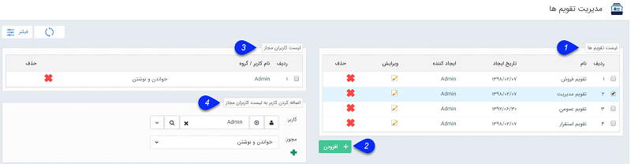
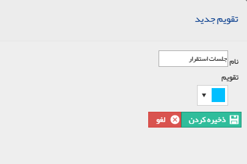

## مدیریت تقویم ها

> مسیر دسترسی:  **اطلاعات پایه** >**مدیریت تقویم‌ها** 

از این قسمت می توانید تقویم های متعددی را در نرم افزار پیام گستر تعریف نمایید و در هنگام تنظیم قرار ملاقات، تقویم مورد نظر خود را انتخاب کنید. مزیت تعریف کردن تقویم های متعدد این است که می توانید برای هر تقویم، کاربران مجاز برای مشاهده تقویم و تنظیم قرار ملاقات در آن را مشخص کنید و همچنین با تخصیص رنگ به هر تقویم، انواع قرارهای تنظیم شده را در تقویم کاری به راحتی تفکیک نمایید.

به طور مثال تقویم جلسات درون سازمانی، تقویم مدیریت و یا تقویم جلسات پرزنت فروش ....

هنگام ثبت قرار ملاقات جدید می توانید تقویم مورد نظر خود را از لیست تقویم هایی که مجوز تنظیم قرارملاقات در آن ها را دارید، انتخاب نمایید .

1. در این قسمت لیست تقویم های تعریف شده در نرم افزار را مشاهده می نمایید و می توانید هر تقویم را ویرایش و یا حذف کنید.

2. برای ساختن تقویم جدید بر روی دکمه اضافه کردن کلیک نمایید. در پنجره نمایش داده شده، نام تقویم و رنگ مورد نظر برای این تقویم را مشخص کرده و آن را ذخیره کنید.

3. در این قسمت لیست کاربران و گروه های مجاز برای دسترسی به تقویم و نحوه دسترسی آن ها (خواندن یا خواندن و نوشتن) قابل مشاهده است. در صورت نیاز می توانید مجوزهای تعریف شده را حذف نمایید.

4. برای تعریف دسترسی یک کاربر یا گروه جدید به این تقویم، ابتدا کاربر/گروه مورد نظر را انتخاب کرده، نوع دسترسی این کاربر/گروه (خواندن یا خواندن و نوشتن) را مشخص کرده و در انتها روی علامت پلاس کلیک کنید

کاربرانی که مجوز خواندن یک تقویم را داشته باشند، می توانند قرار ملاقات های تنظیم شده در آن تقویم را در قسمت تقویم کاری من مشاهده کنند

و کاربرانی که مجوز خواندن و نوشتن داشته باشند، علاوه بر مشاهده قرار های تنظیم شده، می توانند اقرار ملاقات جدید در آن تقویم تنظیم نمایند.
