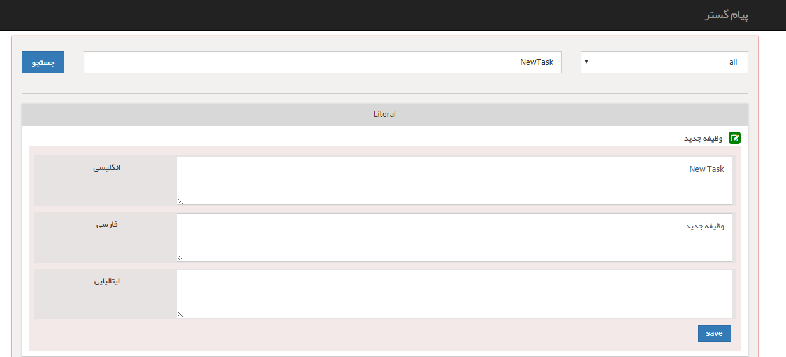

## ویرایش عبارت ها

>  مسیر دسترسی:  **اطلاعات پایه** >**مدیریت زبان‌ها** > **ویرایش عبارت‌ها** 

در این قسمت می توانید با استفاده از فیلتر جستجو، کلید متناظر با هریک از عبارت ها را وارد کرده و به راحتی عنوان متناظر با آن کلید را برای هریک از زبان ها ویرایش کنید. برای اطلاع از کلید هریک از عبارت ها می توانید در[ قسمت زبان سیستم](https://github.com/1stco/PayamGostarDocs/blob/master/help%202.5.4/Basic-Information/Language-management/System-language/System-language.md) ، فایل اکسل زبان ها را دانلود کنید.

توجه داشته باشید نیازی به وارد کردن کلید به صورت کامل نیست و در صورتی که قسمتی از کلید را نیز در این قسمت وارد کنید، می توانید در نتایج جستجو، عبارت مورد نظر خود را بیابید.

