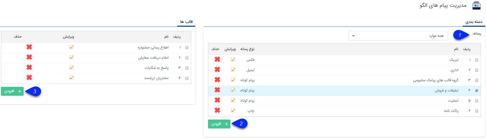
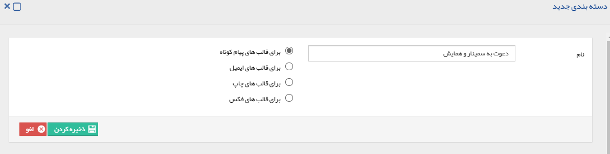
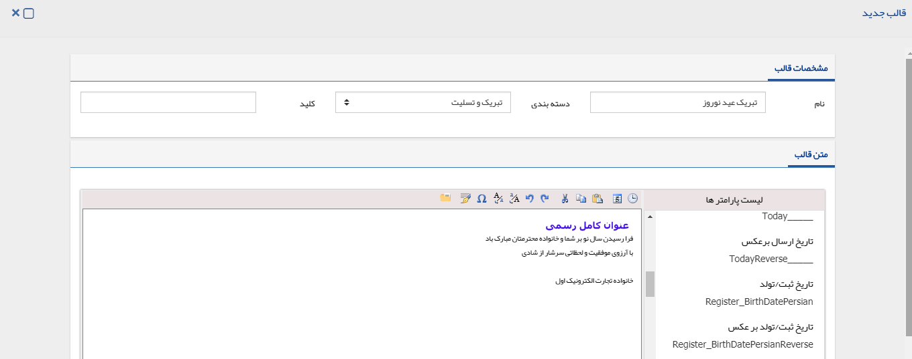
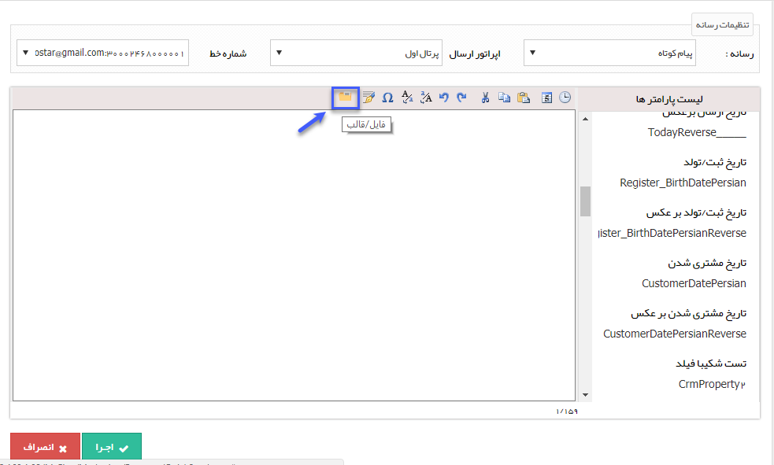
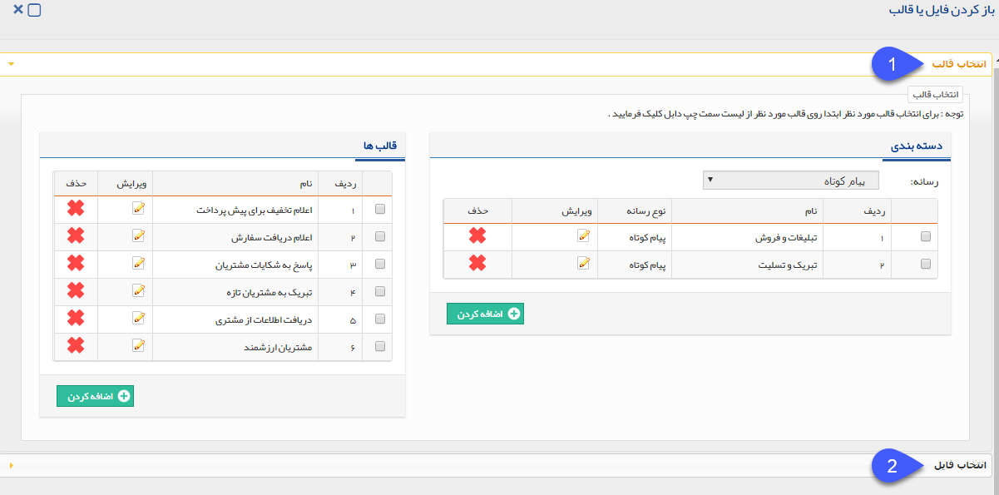

## مدیریت قالب پیام ها
> **مسیر دسترسی** :  **اطلاعات پایه** >**مدیریت پیامهای الگو**

در این بخش می توان با توجه به نیازی که در ارسال و یا چاپ متن ها و قالب های مختلف وجود دارد، قالب های پیش فرضی (Template) را برای استفاده توسط کاربران نرم افزار تنظیم نمایید. ( برای مثال آدرس و اطلاعات ارتباطی شرکت شما، نامه ها و قراردادهایی که به صورت مکرر از طریق فکس و یا چاپ ارسال می شوند.)

1. رسانه: می توانید دسته بندی رسانه ای را انتخاب کنید. (برای مثال دسته بندی پیامک ها)

2. افزودن : اولین مرحله برای ساخت قالب کلیک بر روی دکمه اضافه کردن دسته بندی جدید است. با زدن این دکمه صفحه ای نمایش داده می شود. در این صفحه ابتدا نامی را برای این دسته بندی انتخاب می نمایید و سپس مشخص می نمایید که این قالب در کدام یک از ابزارهای تبلیغات مورد استفاده قرار می گیرد

3. با قرار گرفتن روی نام هر قالب، در سمت راست صفحه در قسمت قالب ها با کلیک بر روی دکمه اضافه کردن، می توانید قالب های مورد نیاز خود را برای آن دسته بندی خاص بسازید. در صفحه ای که نمایش داده می شود با انتخاب نام قالب و دسته بندی قالب، چنانچه دسته ای که انتخاب کرده باشید برای ابزار پیام کوتاه مورد استفاده قرار گیرد فقط می تواند به صورت متن ساده تنظیم شود. در حالت کلی متن قالب بسته به نوع رسانه می تواند به صورت فایل  Word، HTML و متن ساده ذخیره شود.

برای آشنایی با نحوه استفاده از متن هوشمند به متن هوشمند مراجعه کنید.

برای توضیحات بیشتر می توانید به اطلاعات مشترک ابزارها مراجعه نمایید.

 
 استفاده از قالب های پیشفرض:

با استفاده از علامت پوشه در ارسال انواع رسانه ها می توان قالب های پیشفرض طراحی شده در این قسمت را بازخوانی کرد.

برای انتخاب قالب می توانید از دو گزینه مختلف اقدام کنید.

1. انتخاب قالب: می توانید قالب هایی که در این قسمت تهیه کرده اید را با توجه به رسانه مورد نظر انتخاب کنید. با دوبار کلیک کردن بر روی هر کدام از قالب ها، به صورت خودکار آن قالب را می توانید در محتوای ارسال پیام درج کنید.

2. انتخاب فایل: فایلی را که قبلا ذخیره کرده اید به عنوان قالب انتخاب کنید.

> نکته: این فایل باید به فرمت ورد (MS-WORD) باشد.

