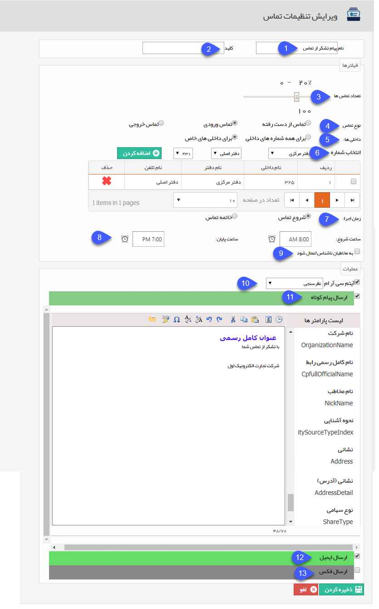

## افزودن رویداد تماس

> مسیر دسترسی:  **اطلاعات پایه** >**تنظیمات یادآوری تماس‌ها** > **افزودن** 

برای افزودن یک رویداد  جدید طبق مراحل زیر می توانید اقدام نمایید. 

1.	نام موردنظر را برای برنامه یادآوری خود تعریف کنید.

2.	کلید مورد نظر برای استفاده در وب سرویس را وارد نمایید.

3.	در این بخش امکان انتخاب تعداد تماس‌های که می خواهید شامل برنامه شوند وجود دارد.

4.	در این قسمت مشخص می‌شود این برنامه برای چه نوع تماس‌هایی اجرا شود.

5.	می توان انتخاب کرد که تماس مرتبط با همه داخلی ها در نظر گرفته شود و یا تماس‌های مربوط به داخلی مشخص.

6.	در صورت انتخاب داخلی خاص برای اجرای برنامه، این بخش برای مشخص کردن داخلی موردنظر نمایش داده می‌شود.

7. زمان اجرا: تعیین نمایید که رویدادهای این تماس در ابتدای شروع تماس ها رخ بدهند یا پس از پایان تماس. (برای مثال اگر می خواهید پیامکی بعد از قطع شدن تماس ارسال شود باید این

 گزینه بر روی "خاتمه تماس" باشد.)

توجه داشته باشید که در صورت انتخاب تماس های از دست رفته در قسمت نوع تماس، در این قسمت حتما باید خاتمه تماس را انتخاب نمایید.

8. بازه اجرا: در این قسمت می توانید ساعت شروع و پایان اجرای این رویداد را تعیین کنید. در صورتی که می خواهید این رویداد به صورت 24 ساعته اجرا شود، این فیلدها را خالی بگذارید.

9. اعمال برای مخاطبان ناشناس: در صورت غیر فعال بودن این گزینه، این رویداد فقط برای تماس هایی اجرا خواهد شد که شماره تماس گیرنده در پروفایل یکی از هویت های بانک اطلاعاتی

 ذخیره شده باشد.

10. آیتم سی آر ام: با فعال کردن این گزینه برای درصدی از تماس هایی که انتخاب کرده اید، یک فرم ایجاد می شود. باید از لیست این منو، نام فرم مورد نظر را انتخاب نمایید.

11. ارسال پیام کوتاه: با فعال کردن این گزینه برای درصدی از تماس هایی که انتخاب کرده اید، یک پیامک برای مخاطب آنها ارسال می شود.

12. ارسال ایمیل: با فعال کردن این گزینه برای درصدی از تماس هایی که انتخاب کرده اید، یک ایمیل برای مخاطب آنها ارسال می شود.

13. ارسال فکس: با فعال کردن این گزینه برای درصدی از تماس هایی که انتخاب کرده اید، یک فکس برای مخاطب آنها ارسال می شود.

