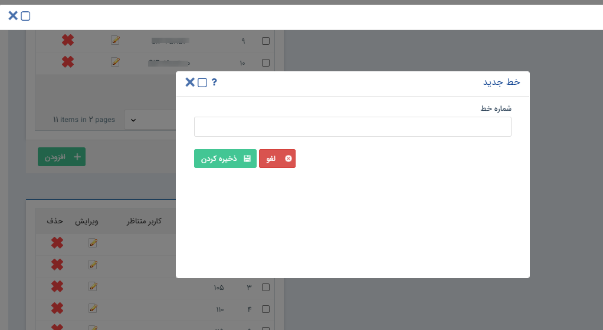

# تعریف خطوط تلفنی جدید 

1- در صفحه مدیریت سیستم‌های تلفنی، ابتدا شعبه مورد نظر خود را انتخاب کنید.

2- در بخش [سیستم‌های تلفنی] **سیستم تلفنی** مورد نظر خود را انتخاب کنید.

3- در بخش [خطوط] بر روی **افزودن** کلیک کنید.

4- **شماره تلفن** مورد نظر خود را وارد و ذخیره نمایید.

