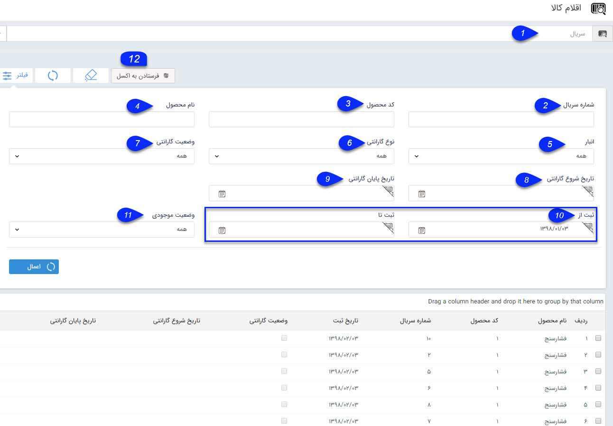
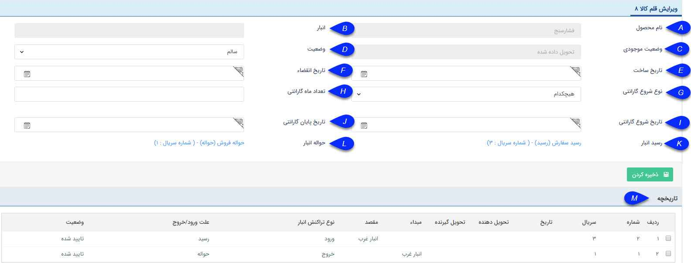

## جستجو قلم کالا

> مسیر دسترسی:  **خرید، فروش و انبار** >**جستجو قلم کالا** 

با استفاده از این قسمت می توانید سریال های تعریف شده برای محصولات در انبار را مشاهده کرد و گزارش گرفت.

سریال های موجود در این قسمت بر اساس سریال های تعریف شده در  رسید هایی که کالاهای انبار به وسیله آن ها تامین شده است نمایش داده می شود و با استفاده از این قسمت امکان مشاهده تراکنش های انباری ثبت شده برای هر سریال و مشاهده وضعیت موجود بودن و یا نبودن سریال محصولات  وجود دارد .

1 . جستجوی سریال : با وارد کردن قسمتی از سریال کالا، سریال های مشابه با آن نمایش داده می شود و با کلیک بر روی هر کدام از آنها صفحه ویرایش آن قلم کالا و تراکنش های انباری ثبت شده برای اون سریال نمایش  داده می شود. اطلاعاتی که در هنگام ثبت قلم کالا در رسید وارد کرده اید نمایش داده می شوند و در صورت نیاز می توانید برخی از آنها را طبق توضیحات زیر تغییر دهید

A. نام محصول: نام محصول انتخاب شده را نمایش می دهد.

B. انبار:نام انباری که این کالا در آن قرار دارد نمایش داده خواهد شد. در صورتی که کالا از انبار خارج شده باشد (سریال آن در یکی از حواله ها ثبت شده باشد) این فیلد با مقدار خالی نمایش داده می شود.

C. وضعیت موجودی: مشخص می کند که کالا در انبار است یا حواله شده است.

D. وضعیت: می توانید وضعیت سلامت این قلم کالا در انبار را مشخص کنید

E. تاریخ ساخت: تاریخ ساخت این قلم کالا را در این فیلد درج نمایید.

F. تاریخ انقضا: در صورتی که این کالا منقضی شونده است، تاریخ انقضای آن را در این فیلد درج نمایید.

G. نوع شروع گارانتی: تعیین نمایید که گارانتی از تاریخ مشخصی شروع می شود یا بر اساس تاریخ حواله، تاریخ ثبت یا هنگام تایید اصالت کالا شروع می گردد.

H. تعداد ماه گارانتی: تعداد ماه هایی که این قلم کالا شامل گارانتی است را مشخص نمایید.

I. تاریخ شروع گارانتی: تاریخ شروع گارانتی را تعیین نمایید.

G. تاریخ پایان گارانتی: تاریخ تمام شدن گارانتی را مشخص نمایید.

K. رسید انبار: لینک رسیدی که بوسیله آن این قلم کالا به انبار اضافه شده است، در این قسمت نمایش داده می شود.

L. حواله انبار: لینک حواله ای که بوسیله آن این قلم کالا از انبار خارج گردیده است در این قسمت نمایش داده می شود.

M. تاریخچه: در این قسمت تاریخچه تراکنش های انباری که این محصول در آن ها وارد شده، نمایش داده می شود. می توانید با دوبار کلیک بر روی هر کدام از تراکنش ها، جزئیات آن ها را مشاهده کنید.

2. شماره سریال: می توانید شماره سریال یا بخشی از شماره سریال کالا یا کالاهایی که قصد جستجوی آن ها را دارید، در این قسمت وارد کنید.

3. کد محصول: کد محصولی که در[ مدیریت محصولات](https://github.com/1stco/PayamGostarDocs/blob/master/help%202.5.4/Basic-Information/Product%20management/Product-management.md)   درج کرده اید را در این قسمت برای جستجو وارد کنید.

4. نام محصول: نام یا بخشی از نام محصولی که  در مدیریت محصولات تعریف شده  و قصد جستجوی آن را دارید در این قسمت وارد کنید.

5. انبار:  می توان انبار مورد نظر را برای مشاهده قلم کالاها انتخاب نمود .

6. نوع گارانتی: می توان از بین گزینه های موجود، نوع گارانتی(هنگام ثبت، هنگام حواله، تایید اصالت کالا) مورد نظر خود را انتخاب کنید.

7. وضعیت گارانتی: فعال یا غیر فعال بودن گارانتی قلم کالای مورد نظر خود را مشخص کنید.

8. تاریخ شروع گارانتی: تاریخ شروع گارانتی قلم کالای مورد نظر خود را وارد کنید.

9. تاریخ پایان گارانتی: تاریخ پایان گارانتی قلم کالای مورد نظر خود را وارد کنید.

10. بازه ثبت: میتوانید یک تاریخ شروع و پایان به عنوان بازه ی ثبت رسید انبار کالاهای مورد نظر خود وارد کنید.

11. وضعیت موجودی: می توان موجود بودن یا عدم موجودی کالا یا کالاهای مورد نظر خود را مشخص کنید.

12. خروجی اکسل: می توانید از جزئیات کالاهای فیلتر شده خروجی اکسل دریافت کنید.