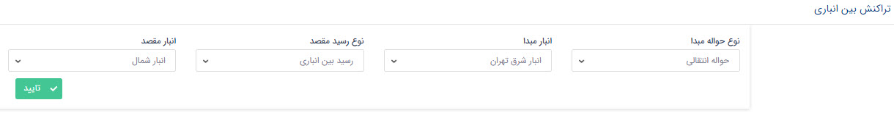
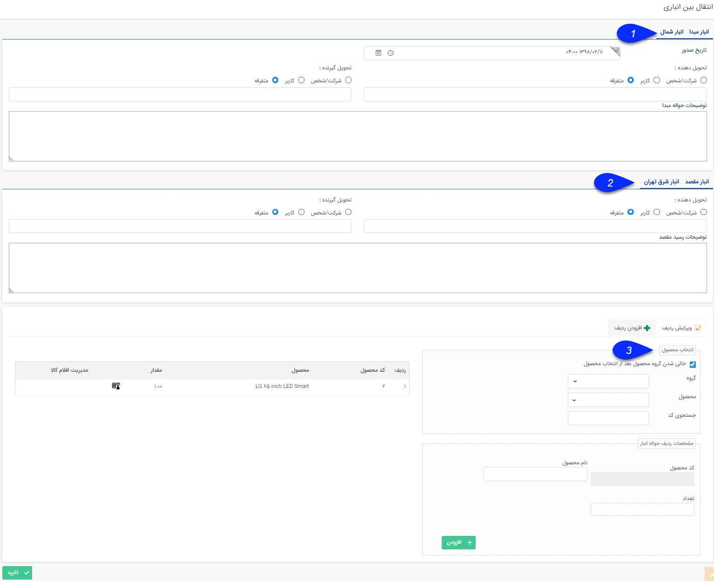

## تراکنش های انبار

در تراکنش بین انباری، کالا از انباری به انبار دیگر منتقل می شود. پس از ثبت انتقال بین انباری، سیستم یک حواله در انبار مبداء و یک رسید در انبار مقصد ثبت خواهد کرد.

پس از انتخاب انبار مبدا و مقصد و مشخص کردن نوع حواله و رسید صفحه زیر باز می شود

1 . انبار مبدا: در این قسمت انبار مبدا نمایش داده می شود.

2  . انبار مقصد: در این قسمت انبار مقصد نمایش داده می شود.

3 . انتخاب محصول: در این قسمت محصولاتی که قصد انتقال آن ها را دارید را انتخاب کنید.

