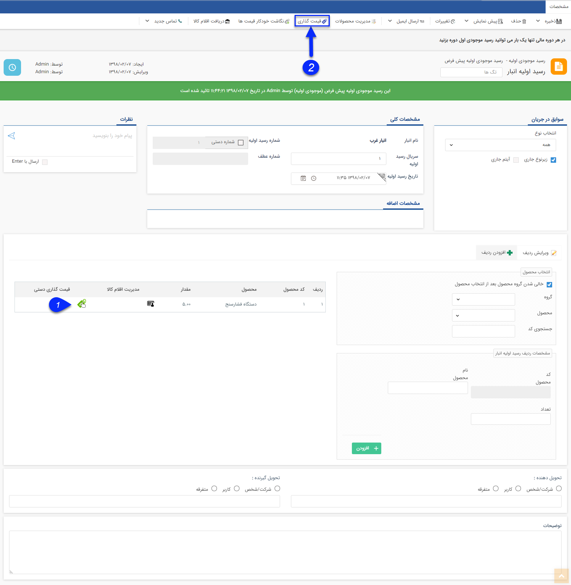
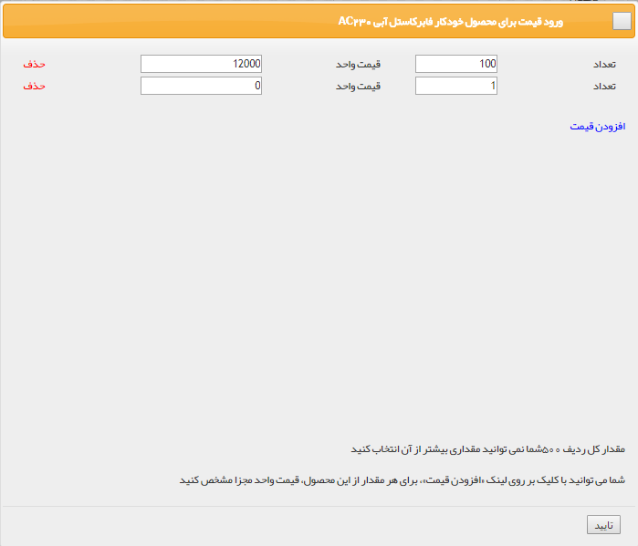
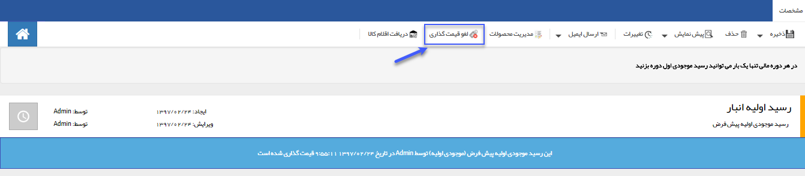

## قیمت گذاری رسید موجودی اولیه

> مسیر دسترسی:  **خرید، فروش و انبار** >**انبارها** > **رسید موجودی اولیه** 

قیمت گذاری رسید موجود اولیه باید به صورت دستی برای هر ردیف کالا انجام شود.

1. قیمت گذاری دستی: در هر ردیف  با انتخاب کلید قیمت گذاری دستی می توانید تعداد کالا و قیمت آن را تعیین کنید.

میتوانید برای تعداد دلخواه قیمت متفاوت اعمال کنید. (برای مثال در تصویر 100 تا از کالاها قیمت 12000 ریال دارند در حالی که سایر آن ها می توانند با مبلغ متفاوتی قیمت گذاری شوند.)

2. دکمه قیمت گذاری: پس از قیمت گذاری برای تمام ردیف های کالا، با کلیک بر روی این علامت قیمت گذاری روی رسید انجام می شود. توجه داشته باشید در صورتی که قیمت گذاری برای تمام ردیف های کالا انجام نشود، امکان قیمت گذاری و استفاده از این دکمه وجود ندارد.

> نکته : پس از قیمت گذاری ردیف ها حتما باید دکمه قیمت گذاری زده شود در غیر این صورت قیمت گذاری انجام نشده است .

پس از انجام قیمت گذاری، می توانید با استفاده از دکمه لغو قیمت گذاری، تراکنش را به حالت قیمت گذاری نشده برگردانید.

